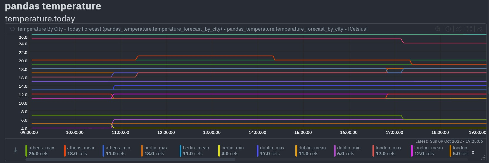

test


Netdata just got a <a href="https://learn.netdata.cloud/docs/agent/collectors/python.d.plugin/pandas" target="_blank" rel="noopener">Pandas collector</a>. 

<!--truncate-->

Pandas is a de-facto standard in reading and processing most types of structured data in Python so if you have some csv/json/xml data, either locally or via some HTTP endpoint, containing metrics you'd like to monitor, chances are you can now easily do this by leveraging the Pandas collector without having to develop your own custom collector as you might have in the past.

Let's take a look at a realistic example where we have some HTTP or API that returns json from which we would like to extract some metrics.

## Monitoring weather data

We will use the awesome free api from <a href="https://open-meteo.com/" target="_blank" rel="noopener">Open-Meteo</a> and the Pandas collector to pull some temperature forecasts for today across a range of cities and store the mean, min, and max for today in Netdata.

With the Pandas collector a user just needs to define a sequence of `df_steps` as part of their collector configuration. Below is the configuration used in this example. We will focus mostly on the `df_steps` parameter as that's really where all the logic lives.

```yaml
# example pulling some hourly temperature data
temperature:
    name: "temperature"
    update_every: 3
    chart_configs:
      - name: "temperature_by_city"
        title: "Temperature By City"
        family: "temperature.today"
        context: "temperature"
        type: "line"
        units: "Celsius"
        df_steps: >
          pd.DataFrame.from_dict(
            {city: requests.get(
                f'https://api.open-meteo.com/v1/forecast?latitude={lat}&amp;longitude={lng}&amp;hourly=temperature_2m'
                ).json()['hourly']['temperature_2m'] 
            for (city,lat,lng) 
            in [
                ('dublin', 53.3441, -6.2675),
                ('athens', 37.9792, 23.7166),
                ('london', 51.5002, -0.1262),
                ('berlin', 52.5235, 13.4115),
                ('paris', 48.8567, 2.3510),
                ]
            }
            );                                                         # use dictionary comprehension to make multiple requests;
          df.describe();                                               # get aggregate stats for each city;
          df.transpose()[['mean', 'max', 'min']].reset_index();        # just take mean, min, max;
          df.rename(columns={'index':'city'});                         # some column renaming;
          df.pivot(columns='city').mean().to_frame().reset_index();    # force to be one row per city;
          df.rename(columns={0:'degrees'});                            # some column renaming;
          pd.concat([df, df['city']+'_'+df['level_0']], axis=1);       # add new column combining city and summary measurement label;
          df.rename(columns={0:'measurement'});                        # some column renaming;
          df[['measurement', 'degrees']].set_index('measurement');     # just take two columns we want;
          df.sort_index();                                             # sort by city name;
          df.transpose();                                              # transpose so its just one wide row;
```

To make developing your own <code>df_steps</code> as easy as possible we have created <a href="https://colab.research.google.com/drive/1VYrddSegZqGtkWGFuiUbMbUk5f3rW6Hi?usp=sharing" target="_blank" rel="noopener">this Google Colab notebook</a> that lets you iterate and build up your code step by step, printing the output of each step along the way. There are some more examples in this notebook so feel free to duplicate it to work on your own use case.

## Step by step
Each step needs to result in a Pandas DataFrame. This is a common pattern in data pipelining whereby we chain a series of transformations together, each step taking in a dataframe and outputting a transformed dataframe.

First we loop over a number of api calls to pull hourly temperature forecasts for each city in a starting dataframe.

```python
pd.DataFrame.from_dict(
    {city: requests.get(
        f'https://api.open-meteo.com/v1/forecast?latitude={lat}&amp;longitude={lng}&amp;hourly=temperature_2m'
        ).json()['hourly']['temperature_2m'] 
    for (city,lat,lng) 
    in [
        ('dublin', 53.3441, -6.2675),
        ('athens', 37.9792, 23.7166),
        ('london', 51.5002, -0.1262),
        ('berlin', 52.5235, 13.4115),
        ('paris', 48.8567, 2.3510),
        ]
    }
  ) 
# =
#      dublin  athens  london  berlin  paris
# 0      14.0    17.8    12.5     7.9    9.1
# 1      14.0    17.7    12.6     7.3    8.0
# 2      13.9    17.9    12.6     6.9    6.1
# 3      14.0    17.7    12.8     6.1    5.8
# 4      14.0    17.6    12.7     5.9    5.7
# ..      ...     ...     ...     ...    ...
# 163    13.2    19.3    15.5    11.7   15.1
# 164    12.8    19.0    15.0    11.5   14.0
# 165    12.6    18.6    14.6    11.1   12.6
# 166    12.8    18.3    14.4    10.6   11.8
# 167    13.3    18.0    14.3    10.2   11.0
# 
# [168 rows x 5 columns] 
```

Next we aggregate this data to get summary statistics per city.

```python
df.describe() 
# =
#            Dublin      athens      london      berlin       paris
# count  168.000000  168.000000  168.000000  168.000000  168.000000
# mean    12.008929   19.459524   12.513690   10.798214   12.059524
# std      2.442361    4.037315    3.044617    3.286672    4.046204
# min      6.600000   12.200000    5.200000    5.700000    4.800000
# 25%     10.675000   16.700000    9.775000    7.900000    8.475000
# 50%     12.800000   18.900000   12.550000   10.400000   11.750000
# 75%     13.900000   23.125000   14.900000   13.700000   15.825000
# max     15.300000   26.200000   18.900000   17.600000   19.300000 
```

The next two steps filter to the metrics we want, reshape and rename some columns.

```python
df.transpose()[['mean', 'max', 'min']].reset_index() 
# =
#     index       mean   max   min
# 0  dublin  12.008929  15.3   6.6
# 1  athens  19.459524  26.2  12.2
# 2  London  12.513690  18.9   5.2
# 3  berlin  10.798214  17.6   5.7
# 4   paris  12.059524  19.3   4.8 

df.rename(columns={'index':'city'}) 
# =
#      city       mean   max   min
# 0  dublin  12.008929  15.3   6.6
# 1  athens  19.459524  26.2  12.2
# 2  London  12.513690  18.9   5.2
# 3  berlin  10.798214  17.6   5.7
# 4   paris  12.059524  19.3   4.8 
```

Now we have a table of data that's what we want, the next steps are about reshaping this data to end up as one "wide" single row of data as that is what the collector expects to result from the last step.

```python
df.pivot(columns='city').mean().to_frame().reset_index() 
# =
#    level_0    city          0
# 0     mean  Athens  19.459524
# 1     mean  berlin  10.798214
# 2     mean  Dublin  12.008929
# 3     mean  London  12.513690
# 4     mean   paris  12.059524
# 5      max  Athens  26.200000
# 6      max  berlin  17.600000
# 7      max  dublin  15.300000
# 8      max  London  18.900000
# 9      max   paris  19.300000
# 10     min  Athens  12.200000
# 11     min  berlin   5.700000
# 12     min  dublin   6.600000
# 13     min  London   5.200000
# 14     min   paris   4.800000 

df.rename(columns={0:'degrees'}) 
# =
#    level_0    city    degrees
# 0     mean  Athens  19.459524
# 1     mean  berlin  10.798214
# 2     mean  Dublin  12.008929
# 3     mean  London  12.513690
# 4     mean   paris  12.059524
# 5      max  Athens  26.200000
# 6      max  berlin  17.600000
# 7      max  Dublin  15.300000
# 8      max  London  18.900000
# 9      max   paris  19.300000
# 10     min  athens  12.200000
# 11     min  berlin   5.700000
# 12     min  Dublin   6.600000
# 13     min  london   5.200000
# 14     min   paris   4.800000 

pd.concat([df, df['city']+'_'+df['level_0']], axis=1) 
# =
#    level_0    city    degrees            0
# 0     mean  Athens  19.459524  athens_mean
# 1     mean  berlin  10.798214  berlin_mean
# 2     mean  dublin  12.008929  dublin_mean
# 3     mean  London  12.513690  london_mean
# 4     mean   paris  12.059524   paris_mean
# 5      max  Athens  26.200000   athens_max
# 6      max  berlin  17.600000   berlin_max
# 7      max  Dublin  15.300000   dublin_max
# 8      max  london  18.900000   london_max
# 9      max   paris  19.300000    paris_max
# 10     min  Athens  12.200000   athens_min
# 11     min  berlin   5.700000   berlin_min
# 12     min  dublin   6.600000   dublin_min
# 13     min  London   5.200000   london_min
# 14     min   paris   4.800000    paris_min 

df.rename(columns={0:'measurement'}) 
# =
#    level_0    city    degrees  measurement
# 0     mean  athens  19.459524  athens_mean
# 1     mean  berlin  10.798214  berlin_mean
# 2     mean  dublin  12.008929  dublin_mean
# 3     mean  London  12.513690  london_mean
# 4     mean   paris  12.059524   paris_mean
# 5      max  athens  26.200000   athens_max
# 6      max  berlin  17.600000   berlin_max
# 7      max  Dublin  15.300000   dublin_max
# 8      max  London  18.900000   london_max
# 9      max   paris  19.300000    paris_max
# 10     min  Athens  12.200000   athens_min
# 11     min  berlin   5.700000   berlin_min
# 12     min  Dublin   6.600000   dublin_min
# 13     min  London   5.200000   london_min
# 14     min   paris   4.800000    paris_min 

df[['measurement', 'degrees']].set_index('measurement') 
# =
#                degrees
# measurement           
# athens_mean  19.459524
# berlin_mean  10.798214
# dublin_mean  12.008929
# london_mean  12.513690
# paris_mean   12.059524
# athens_max   26.200000
# berlin_max   17.600000
# dublin_max   15.300000
# london_max   18.900000
# paris_max    19.300000
# athens_min   12.200000
# berlin_min    5.700000
# dublin_min    6.600000
# london_min    5.200000
# paris_min     4.800000 
```

Next we sort the data.

```python
df.sort_index() 
# =
#                degrees
# measurement           
# athens_max   26.200000
# athens_mean  19.459524
# athens_min   12.200000
# berlin_max   17.600000
# berlin_mean  10.798214
# berlin_min    5.700000
# dublin_max   15.300000
# dublin_mean  12.008929
# dublin_min    6.600000
# london_max   18.900000
# london_mean  12.513690
# london_min    5.200000
# paris_max    19.300000
# paris_mean   12.059524
# paris_min     4.800000
```

And finally we do one last transpose to go from a long format to a wide format of one row where is column is a metric we want Netdata to collect.

```python
df.transpose() 
# =
# measurement  athens_max  athens_mean  athens_min  berlin_max  berlin_mean  \
# degrees            26.2    19.459524        12.2        17.6    10.798214   
# 
# measurement  berlin_min  dublin_max  dublin_mean  dublin_min  london_max  \
# degrees             5.7        15.3    12.008929         6.6        18.9   
# 
# measurement  london_mean  london_min  paris_max  paris_mean  paris_min  
# degrees         12.51369         5.2       19.3   12.059524        4.8   
```

This row is then converted (by the collector internally) into a python dictionary of key value pairs.

```javascript
{'athens_max': 26.2, 'athens_mean': 19.45952380952381, 'athens_min': 12.2, 'berlin_max': 17.6, 'berlin_mean': 10.798214285714286, 'berlin_min': 5.7, 'dublin_max': 15.3, 'dublin_mean': 12.008928571428571, 'dublin_min': 6.6, 'london_max': 18.9, 'london_mean': 12.513690476190478, 'london_min': 5.2, 'paris_max': 19.3, 'paris_mean': 12.059523809523808, 'paris_min': 4.8}
```

And that's it, this should end up in a chart in Netdata like below.



## Try it yourself

Pandas is a truly amazing library that can usually accomplish almost any data processing task, so if you have some custom data you would like to monitor with Netdata but do not quite feel ready yet to develop your own custom collector - give the Pandas collector a go!

If you haven’t already, <a href="https://app.netdata.cloud/">sign up now for a free Netdata account!</a>

We’d love to hear from you – if you have any questions, complaints or feedback please reach out to us on <a href="https://discord.com/invite/mPZ6WZKKG2">Discord</a> or <a href="https://github.com/netdata/netdata/">Github</a>.