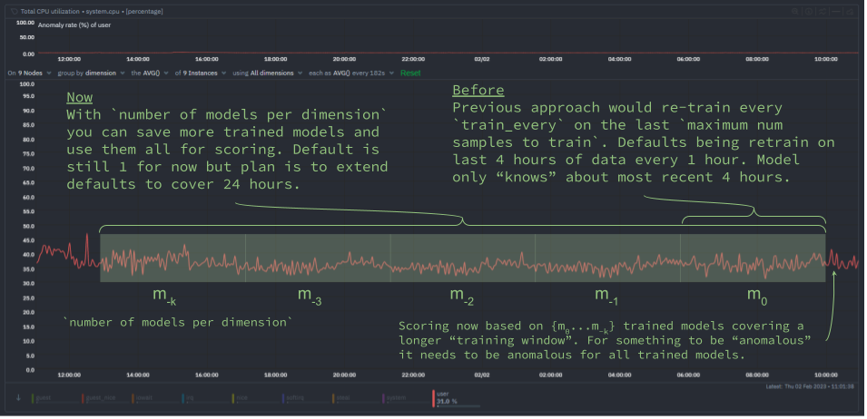
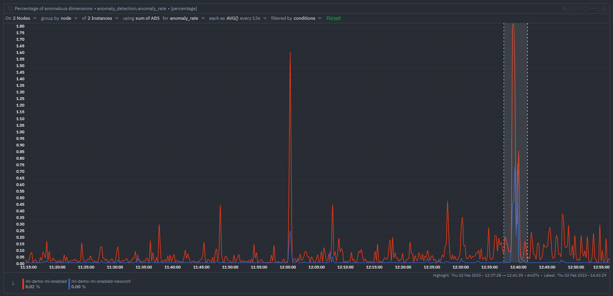

We have been busy at work under the hood of the Netdata agent to introduce new capabilities that let you extend the "training window" used by Netdata's [native anomaly detection capabilities](https://learn.netdata.cloud/docs/nightly/setup/configure-machine-learning-ml-powered-anomaly-detection). 

This blog post will discuss one of these improvements to help you reduce ["false positives"](https://en.wikipedia.org/wiki/False_positives_and_false_negatives#False_positive_error) by essentially extending the training window by using the new (totally obviously named by an engineer) `number of models per dimension` configuration parameter.

<!--truncate-->

## Background

One of the most important considerations of our native anomaly detection capabilities is the overhead of running the training and scoring computations required to train thousands of models (one per metric) and produce [anomaly bits](https://learn.netdata.cloud/docs/nightly/setup/configure-machine-learning-ml-powered-anomaly-detection#anomaly-bit) every second based on those trained models.

> 📑 Read more about [our approach to machine learning](https://blog.netdata.cloud/our-approach-to-machine-learning/) or [how our anomaly detection actually works](https://blog.netdata.cloud/how-netdatas-machine-learning-works/).

### Training window

It is in this context that most of our design and implementation decisions have been made. One very important one has been on the amount of data to train on at any one time. We need to be careful not to try train on too large a chunk of data at any one time since reading, pre-processing and then training on that data could have too noticeable impact on CPU overhead.

So we started as simple as possible by continually training and retraining on the most recent 4 hours of metrics data by default. Users can extend this easily if they want the model to learn over a longer window but in terms of having to pick some default we thought this gave the best balance between a reasonable window of time to learn what might be considered "normal" patterns vs the overhead cost of the training step itself.

### False positives

While we and many in the community have found the more short term anomaly detection capabilities very useful, especially in spotting sudden changes when things go wrong, there can of course still be false positives for behaviors or patterns that might just be somewhat rare and might just not happen enough in any random 4 hour window. For example this could be something like common but irregular workloads or cron jobs that maybe happen a few times a day or at irregular intervals. They still would be considered normal behavior on the system but for a model training only on the last 4 hours where this pattern has never occurred they of course look anomalous.

So it was clear we needed to in some way extend the amount of training data used while still being very careful not to impact training overhead on the system.

> 📑 If your are curious about some of our thinking and approaches here feel free to check out [this GitHub discussion](https://github.com/netdata/netdata/discussions/12763) where we explored various ideas and approaches.

To get the best of both worlds we decided that instead of just throwing away previous models once a new one has been trained that instead we should hold on to them and then use them when scoring in addition to the most recently trained model.

Each trained model is essentially a compressed representation of the training data it was trained on so using more "reference" models during scoring should allow us to capture the wider range of "normal" patterns on a system really without any additional training overhead, we just need a little more space to store them and perhaps a very small performance impact during scoring but there are ways to try be clever there by only scoring on more models as needed.

## Whats changed?

To this end we have introduced a new ML parameter called `number of models per dimension` (you can read more detail about it [here](https://learn.netdata.cloud/docs/nightly/setup/configure-machine-learning-ml-powered-anomaly-detection#descriptions-minmax)) which will control the number of most recently trained models used during scoring.

Below is some pseudo code of how the trained models are actually used in producing [anomaly bits](https://learn.netdata.cloud/docs/nightly/setup/configure-machine-learning-ml-powered-anomaly-detection#anomaly-bit) (which give you an "[anomaly rate](https://learn.netdata.cloud/docs/nightly/setup/configure-machine-learning-ml-powered-anomaly-detection#anomaly-rate)" over any window of time) each second.

```python
# preprocess recent observations into a "feature vector"
latest_feature_vector = preprocess_data([recent_data])

# loop over each trained model
for model in models:
    # if recent feature vector is considered normal by any model, stop scoring
    if model.score(latest_feature_vector) < dimension_anomaly_score_threshold:
        anomaly_bit = 0
        break
    else:
        # only if all models agree the feature vector is anomalous is it considered anomalous by netdata
        anomaly_bit = 1
```

The aim here is to only use those additional stored models when we need to. So essentially once one model suggests a feature vector looks anomalous we check all saved models and only when they all agree that something is anomalous does the anomaly bit get to be finally set to 1 to signal that netdata considered the most recent feature vector unlike anything seen in all the models (spanning a wider training window) checked.

## Impact on anomaly rates

Below is a typical impact of this change and the proposed new defaults mentioned below. In this set up both nodes are running the same workloads. 

We can see that the overall node anomaly rate (blue line) for the `ml-demo-ml-enabled-newconf` node is consistency below that of the current default represented by `ml-demo-ml-enabled` (red line). 

In the highlighted period to the right of the chart we triggered a true anomaly on both nodes. You can see both nodes "react" with an increased node anomaly rate as we would hope.



Some main takeways here are that:

1. using more models during scoring will tend to suppress overall node anomaly rates a little.
1. when anomalies are detected the overall node anomaly rate will still tend to be a little lower than before.
1. when something is considered anomalous by Netdata we might have more confidence that it really is more likely to be some strange unseen pattern regarldess of if its actually something you need to react to or not.
1. overall this should help reduce "false positives".

## Next steps

To begin with the default for `number of models per dimension` is `1` such that the new functionality collapse to the previous default of just using the single most recently trained model.

The plan from here is to dogfood further internally and with the wider community while we work on two other "foundational" pieces of ML functionality:

1. [[Feat]: have ml work on any `update_every`](https://github.com/netdata/netdata/issues/14218) - ability to have anomaly detection work across all metrics regardless of their `update_every`. This will greatly increase the coverage of ML to more metrics by default.
1. [[Feat]: persist trained ML models to db](https://github.com/netdata/netdata/issues/14217) - save the stored ML models to disk so that they are robust to agent restarts or machine reboots, currently in such cases all training needs to restart as models are stored in RAM.

Once these two features have been implemented and also dogfooded internally and by early adopters in the community we will move forward with this "[update ml defaults and readme](https://github.com/netdata/netdata/pull/14222)" PR to update Netdata's ML config defaults to something like below such that by default roughly the last 24 hours would be trained on.

```bash
[ml]
    # train on 6 hours
    maximum num samples to train = 21600
    # train every 3 hours
    train every = 10800
    number of models per dimension = 9
```

## Try it yourself! 

As of Netdata version [`v1.37.2`](https://github.com/netdata/netdata/releases/tag/v1.37.2) the new `number of models per dimension` parameter is available. You could try a configuration like above and see the impact it has on the anomaly rate across your infrastructure.

## We love feedback!

We’d love to hear any and all feedback you have about this feature. This is very much an initial iteration and we are hoping to continually improve the ML under the hood in the agent and the overall UX experience as users share their thoughts with us.

🚧 Note: This functionality is still under active development. We dogfood it internally and among early adopters within the Netdata community. If you would like to get involved and help us with some feedback, email us at analytics-ml-team@netdata.cloud, create a thread in the [Netdata Community Forums](https://community.netdata.cloud/), or come join us in the [🤖-ml-powered-monitoring](https://discord.gg/4eRSEUpJnc) channel of the Netdata discord, or open a [discussion in GitHub](https://github.com/netdata/netdata/discussions?discussions_q=label%3Aarea%2Fml) if that’s more your thing.

## Learn more

If you’d like to dive deeper and learn a little more about exactly how it all works, please feel free to check out some of the resources below.

- All our [machine learning](https://blog.netdata.cloud/tags/machine-learning/) related blog posts.
- Anomaly Advisor [documentation](https://learn.netdata.cloud/docs/cloud/insights/anomaly-advisor).
- Netdata agent ML [reference documentation](https://learn.netdata.cloud/docs/configure/machine-learning).
- [CNCF Live session](https://community.cncf.io/events/details/cncf-cncf-online-programs-presents-cloud-native-live-power-up-your-machine-learning-automated-anomaly-detection/) with [recording on YouTube](https://www.youtube.com/watch?v=pI-MUupmD64) ([deck](https://docs.google.com/presentation/d/1n8ZAlD0n1_clryezT_L7MhLvyR6wPgfQRyGwZWC_LTc/edit?usp=sharing)).
- [Anomaly Advisor playlist](https://youtube.com/playlist?list=PL-P-gAHfL2KPeUcCKmNHXC-LX-FfdO43j) on the Netdata YouTube channel.
- [The code itself](https://github.com/netdata/netdata/tree/master/ml) in the [Netdata Agent GitHub repo](https://github.com/netdata/netdata), along with a Google Collab ready [notebook based Python implementation](https://github.com/netdata/netdata/blob/master/ml/notebooks/netdata_anomaly_detection_deepdive.ipynb) to help those interested understand how it all works under the hood, the main concepts and some illustrated explanations.
- Yet [another presentation](https://docs.google.com/presentation/d/18zkCvU3nKP-Bw_nQZuXTEa4PIVM6wppH3VUnAauq-RU/edit?usp=sharing) that tries to explain the main concepts and moving parts.