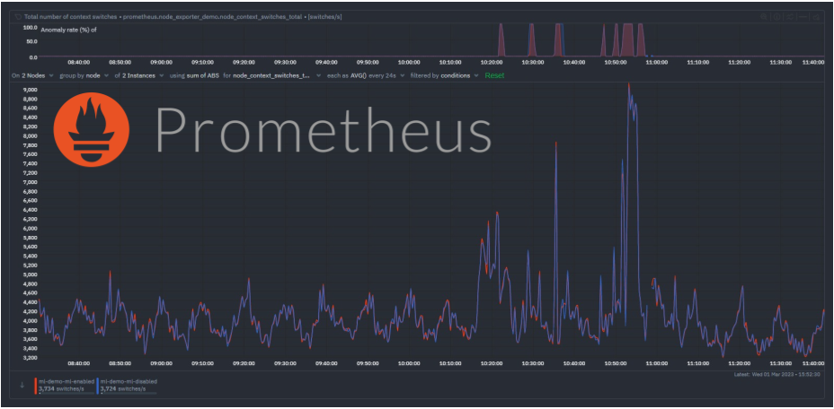
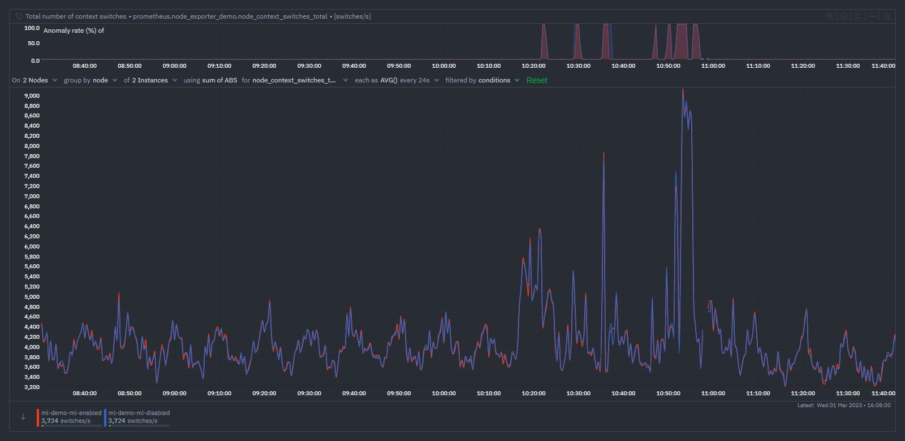
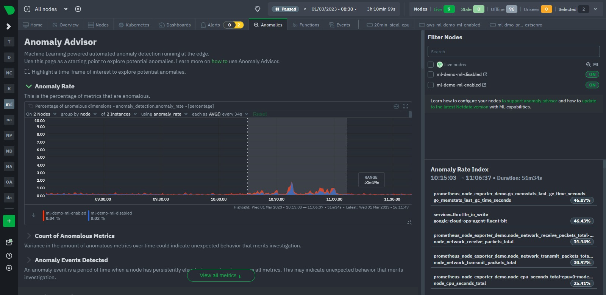
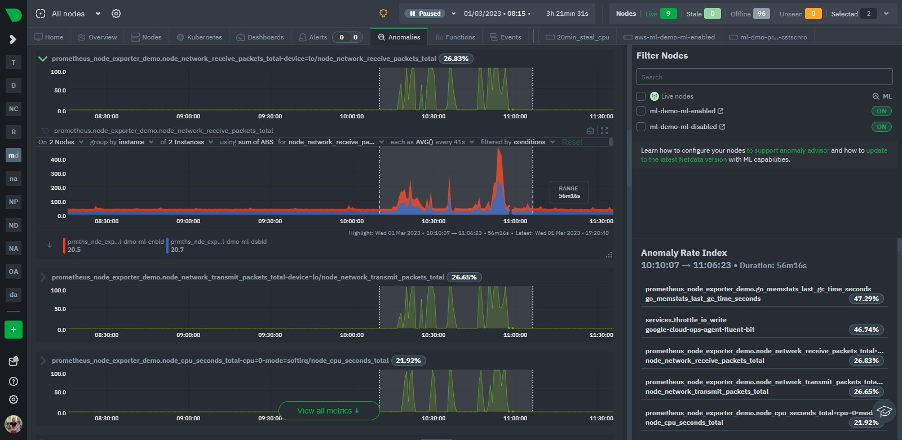

We have recently extended the native ML based anomaly detection capabilities of Netdata to [support all metrics](https://github.com/netdata/netdata/issues/14218), regardless on their collection frequency (`update every`).

Previously only metrics collected every second were supported, but now Netdata can run anomaly detection out of the box with zero config on metrics with any collection frequency.

This post will illustrate an example of what this means using [Prometheus](https://prometheus.io/) metrics (via the [Netdata Prometheus collector](https://learn.netdata.cloud/docs/agent/collectors/go.d.plugin/modules/prometheus#gsc.tab=0)) since they typically have a default collection frequency of 10 seconds.

<!--truncate-->

## Background

The initial implementation of the native ML based unsupervised anomaly detection functionality within Netdata only focused on metrics with `update every` of 1 second for simplicity.

This was a great starting point and helped keep things simple to reason about in the early days as we dogfooded(fed?) the functionality internally and with the wider Netdata community.

> 💡 Check out [community launch post](https://community.netdata.cloud/t/anomaly-advisor-beta-launch/2717/1) from last March for more background.

However not all metrics are captured every second by default and often some of those that might be most important to you are not.

This is typically the case with metrics scraped from Prometheus endpoints, often they might be some of the most important metrics, but they are not collected every second by default. So its crucial the Netdata's anomaly detection "just work" with these metrics too.

## Example using Prometheus metrics

As an example of how this now might look, on two of our ml demo nodes we added an example Prometheus scrape job to the Netdata Prometheus collector like below. This just scrapes metrics from the demo prometheus node exporter instance at `node.demo.do.prometheus.io`.

```yaml title="/etc/netdata/go.d/prometheus.yml"
jobs:
  - name: node_exporter_demo
    url: https://node.demo.do.prometheus.io/metrics
```

Once sufficient time has passed such that additional ML models can be trained for each new Prometheus metric (by default at least `minimum num samples to train = 3600` observations are required before training can begin), we can see the anomaly detection functionality working as expected when we see a sudden spike in the `node_context_switched_total` metric below for example.



In the example above we have the same prometheus scrape job configured on both nodes just for illustration. We see that as the metric becomes a bit more "spikey", the anomaly rate on the top chart activates for each node.

Indeed, if we take a more global look via the Anomaly Advisor tab for the same period we see some bumps in the overall node anomaly rates. Once we highlight the area of interest we can see its mostly the Prometheus metrics that were anomalous during this window even though they just represent a small fraction of the metrics covered by these nodes.





## Conclusion

Thats it really, just a short post to show how Netdata's native [ML based anomaly detection functionality](https://learn.netdata.cloud/guides/monitor/anomaly-detection) now works with all metrics regardless of their collection frequency. This is a great step forward for Netdata and we are excited to see how the community uses this functionality.

Next up we will be looking to [[Feat]: persist trained ML models to db](https://github.com/netdata/netdata/issues/14217) such that the trained models persist across restarts and upgrades. Following that we hope to [update ml defaults](https://github.com/netdata/netdata/pull/14222) to extend the default training windows used by the anomaly detection functionality to roughly 24 hours out of the box.

## Feedback!

A lot of the ML based features in Netdata are new and evolving so we would love any and all feedback from the community.

If you have ideas or requests for other features that you'd like to see on Netdata, you can create a [GitHub Discussion](https://github.com/netdata/netdata/discussions), open a [Feature request](https://github.com/netdata/netdata-cloud/issues/new?assignees=&labels=feature+request%2Cneeds+triage&template=FEAT_REQUEST.yml&title=%5BFeat%5D%3A+) on our Netdata Cloud repository or engage with the community on the [Netdata Discord](https://discord.com/invite/mPZ6WZKKG2), [community forums](https://community.netdata.cloud/) or just drop a comment on in the [giscus](https://giscus.app/) below this post!
