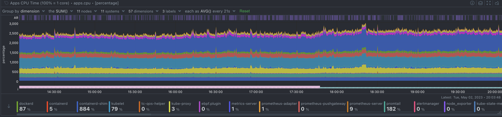
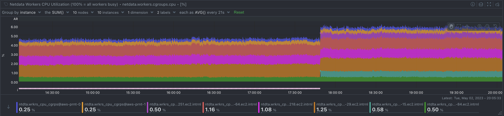

As a system administrator, understanding how your Linux system's CPU is being utilized is crucial for identifying bottlenecks and optimizing performance. In this blog post, we'll dive deep into the world of Linux CPU consumption, load, and pressure, and discuss how to use these metrics effectively to identify issues and improve your system's performance.

<!-- truncate -->

## CPU Consumption and Utilization

CPU consumption refers to the amount of processing power being used by applications running on your system.  The `system.cpu` chart in Netdata represents the Total CPU utilization of your Linux system, broken down into different dimensions. Each dimension provides insight into how the CPU is being used by various tasks and processes. Here's a brief explanation of each dimension:

1. **user**: This dimension represents the percentage of CPU time spent executing user-level applications or processes (i.e., non-kernel code). It indicates the share of time the CPU is busy running tasks initiated by users.

2. **system**: This dimension represents the percentage of CPU time spent executing kernel-level processes, such as handling system calls, managing memory, or controlling hardware. It reflects the share of time the CPU is busy with system-level tasks.

3. **nice**: This dimension represents the percentage of CPU time spent executing user-level processes with a positive nice value, which indicates a lower priority. A high nice value can suggest that lower-priority tasks are consuming a significant portion of the CPU time.

4. **iowait**: This dimension represents the percentage of CPU time spent waiting for input/output (I/O) operations to complete, such as disk or network access. High iowait values can indicate I/O-bound tasks, slow storage devices, or storage subsystem issues.

5. **irq**: This dimension represents the percentage of CPU time spent handling hardware interrupt requests (IRQs), which are signals sent by hardware devices to the CPU to request attention. High irq values can suggest that the system is spending a significant amount of time responding to hardware events.

6. **softirq**: This dimension represents the percentage of CPU time spent handling software interrupt requests (soft IRQs), which are kernel-level processes that handle specific hardware-related tasks, such as network packet processing. High softirq values can indicate that the system is spending a considerable amount of time processing software interrupts.

7. **steal**: This dimension represents the percentage of CPU time that is "stolen" by the hypervisor (in virtualized environments) for other virtual machines (VMs) running on the same physical host. High steal values can indicate resource contention among VMs or insufficient resources allocated to your VM.

8. **guest**: This dimension represents the percentage of CPU time spent on running virtual CPU processes for guest VMs in a virtualized environment. High guest values indicate that the host system is dedicating a significant portion of CPU time to running guest VMs.

9. **guest_nice**: This dimension represents the percentage of CPU time spent on running virtual CPU processes for guest VMs with a positive nice value, indicating lower priority.

Internally in Netdata there is another dimension: `idle`, that represents the percentage of time that the CPU is not executing any process and is available for other tasks. `iowait` is also another dimension that represents idle CPU time, but in this case it also means reduced performance due to I/O and this is why they are separate.

Keep in mind that Linux supports different schedulers and priority mechanisms apart from the nice value, such as the Completely Fair Scheduler (CFS), real-time schedulers (SCHED_FIFO and SCHED_RR), and the deadline scheduler (SCHED_DEADLINE). Each of these schedulers and priorities influences the dimensions in the `system.cpu` chart differently:

- **Completely Fair Scheduler (CFS)**: CFS is the default scheduler used in most Linux systems for normal, non-real-time tasks. It attempts to distribute CPU time fairly among all processes based on their assigned "weight" or "niceness". While CFS doesn't introduce additional dimensions to the `system.cpu` chart, it affects the distribution of CPU time between the `user`, `system`, and `nice` dimensions.

- **Real-time schedulers (SCHED_FIFO and SCHED_RR)**: Real-time schedulers are designed for time-critical tasks and can preempt other processes to ensure that high-priority real-time tasks receive the CPU time they need. When real-time tasks are running, they can increase the user or system dimensions in the `system.cpu` chart, depending on whether they are user-level or kernel-level tasks. Real-time tasks may cause other, lower-priority tasks to be delayed or starved for CPU time, which can lead to lower values in the `nice` dimension or increased `iowait` if they are waiting for I/O operations to complete.

- **Deadline scheduler (SCHED_DEADLINE)**: The deadline scheduler assigns a deadline to each task and prioritizes them based on these deadlines. Tasks that are running with the deadline scheduler will also contribute to the user or system dimensions in the system.cpu chart. The deadline scheduler can affect the distribution of CPU time among tasks and may cause lower-priority tasks to experience increased iowait or decreased nice values if they are being preempted by higher-priority deadline tasks.

The "CPUs" section in Netdata provides per-core utilization (cpu.cpu) with the same dimensions as system.cpu, but for each CPU core individually. Per core utilization is important in several scenarios, and monitoring it can provide valuable insights into your system's performance. Here's are a few scenarios per core CPU utilization may help:

1. **Identifying Core-Specific Issues**: If you notice performance issues on your system but don't see high overall CPU utilization, it's possible that a single core is experiencing high load or contention, while the others are idle or underutilized. Monitoring per core utilization can help you identify these issues and take corrective actions, such as adjusting process affinity or tweaking application settings to better distribute the load.

2. **Ensuring Balanced Workloads**: In multi-core systems, it's essential to maintain a balanced workload across all cores for optimal performance. Monitoring per core utilization can help you detect any imbalances and take necessary steps to distribute workloads evenly. This can be particularly important for applications that are designed to take advantage of multiple cores, such as parallel processing or multi-threaded applications.

3. **Optimizing Multi-Threaded Applications**: When developing or optimizing multi-threaded applications, it's important to ensure that each thread runs efficiently and doesn't cause unnecessary contention for resources. By monitoring per core utilization, you can assess how well your application is utilizing available cores and identify opportunities to improve its performance through better thread management or parallelism.

4. **Detecting Thermal Throttling**: High CPU core utilization can lead to increased temperatures, causing thermal throttling to kick in and reduce the core's performance to prevent overheating. Monitoring per core utilization can help you identify cores that are consistently running hot, which may indicate a need for better cooling solutions or adjustments to your system's power management settings. Keep in mind that when Netdata runs in bare metal systems, it also monitors CPU throttling events (cpu.core_throttling) per core.

5. **Capacity Planning**: Monitoring per core utilization can provide valuable data for capacity planning purposes. By understanding how each core is utilized, you can make more informed decisions about hardware upgrades or resource allocation, ensuring that your system remains capable of handling current and future workloads.

## CPU Load

CPU load is a measure of the number of processes that are either using the CPU or waiting for system resources, such as CPU and disk. The "System Load Average" (system.load) chart in Netdata displays three dimensions: load1, load5, and load15, representing the average number of processes in the system load over the past 1, 5, and 15 minutes, respectively.

A high CPU load can indicate that your system is experiencing resource contention or that processes are waiting for resources to become available. It's essential to keep an eye on your system load and investigate any sudden spikes or consistently high values, as these can be signs of performance issues or bottlenecks.

## CPU Pressure
CPU pressure is a relatively new concept in Linux, introduced by the Pressure Stall Information (PSI) feature in kernel 4.20. It provides information about the share of time in which tasks are stalled on the CPU, either partially (some) or fully (all non-idle tasks). 

Netdata displays this information in the "CPU some pressure" (system.cpu_some_pressure) and "CPU full pressure" (system.cpu_full_pressure) charts, each with dimensions representing recent trends over 10, 60, and 300-second windows. In both of these charts, the value shown represents the percentage of time over these windows that some or all tasks have been waiting for CPU resources due to CPU congestion.

The system.cpu_some_pressure_stall_time and system.cpu_full_pressure_stall_time chart charts display the amount of time some or all processes have been waiting for CPU time due to CPU congestion within the Netdata sampling frequency (2-seconds for both of the charts). 

When interpreting these charts, it's important to look at the values of both the some and the full together, to get a complete picture of CPU pressure. If you see high values for some and low values for full, it may indicate that only some processes are experiencing delays due to CPU congestion, while others may be executing normally. This could happen, for example, if some processes are using a lot of CPU resources while others are idle.

If you see high values for both the some and the full, it indicates that all processes are experiencing delays due to CPU congestion. This could happen if the CPU is overloaded with too many processes or if some processes are using a lot of CPU resources for extended periods of time.

These metrics provide valuable information about how long processes are waiting for CPU resources due to CPU congestion and can help identify cases of CPU saturation and contention.

## Applications CPU Utilization
Netdata also provides CPU utilization breakdown per application, user and group.

The apps.cpu chart displays the total CPU utilization per application group. 100% on this chart means 1 core. So, applications can exceed 100% when they utilize more than 1 CPU core. In Netdata, application groups are defined in /etc/netdata/apps_groups.conf, and by default, Netdata comes preconfigured with a lot of popular applications. If Netdata is not configured to track the CPU consumption of some application, its utilization is tracked in a dimension called other.

The users.cpu chart displays CPU consumption by the system user (uid) the applications are running. Netdata automatically picks the username to prettify the output, and no additional configuration is required. Again, 100% = 1 core in this chart.

The groups.cpu chart displays CPU consumption by the system group (gid) the applications are running. Netdata automatically picks the groupname to prettify the output, and no additional configuration is required. 100% = 1 core in this chart too.

By monitoring these charts over time, you can identify patterns and trends in CPU usage for different applications, users, and groups and use this information to optimize system performance.

## Systemd Services CPU Utilization
Systemd services are configured to run as cgroups in the default namespace by default, which allows for full tracking of CPU utilization for each service. The services.cpu chart in Netdata tracks the CPU utilization of each systemd service individually, providing a breakdown of the total CPU utilization within the system-wide CPU resources (all cores) for each service running on the system. So, unlike apps.cpu, 100% on this chart means all the CPU resources available.

The chart tracks the amount of time spent by tasks of the cgroup in user and kernel modes, and provides a view of the CPU usage for each service in a separate dimension. This can be useful in identifying which systemd services are consuming the most CPU resources and can help to optimize system performance by limiting the CPU usage of certain services.

To use the services.cpu chart in Netdata, systemd must be running on the system. The chart may not be available on systems that use other init systems. Additionally, it's important to note that systemd services may not necessarily correspond directly to specific applications or processes, but may instead represent more abstract system components or functions.

## Containers and VMs CPU Utilization
Netdata is able to track both v1 and v2 cgroups, allowing you to monitor CPU utilization for applications running in both types of cgroups, created by any container or VM orchestrator, including Docker, LXC and LXD, Kubernetes, KVM, LibVirt, Qemu, Proxmox, Mesos, Nomad, Docker Swarm, OpenShift, Rancher, etc.

By monitoring the cgroups.cpu chart in Netdata for both v1 and v2 cgroups, you can gain a more comprehensive understanding of CPU utilization across different types of cgroups and use this information to optimize system performance over time.

It's worth noting that cgroups v2 provides additional features and improvements over cgroups v1, including a simpler interface, better scalability, and improved performance. If possible, it may be beneficial to use cgroups v2 on your system to take advantage of these improvements.

## Finding the Root Cause of High CPU Utilization
To find the root cause of high CPU utilization in Netdata, you can use a combination of different charts to get a comprehensive view of how the CPU is being used on your system. Here are some steps you can take:

First verify that the system is under high CPU utilization:

- **Check the system.cpu chart**: Start by checking the system.cpu chart to see how the CPU is being utilized overall.

- **Check the CPU pressure charts**: Check the CPU pressure charts to see if any tasks are stalled on the CPU due to CPU congestion. High values in the some and full charts can indicate that processes are waiting for CPU resources to become available, potentially causing high CPU utilization.

- **Check the system load chart**: It displays the average number of processes in the run queue over the past 1, 5, and 15 minutes. High load values can indicate a CPU bottleneck and can help identify performance issues that need further investigation.
  
  Once you have verified the high CPU utilization on the system, you can identify the processes causing it, using the following:

- **Check the apps.cpu chart**: Next, check the apps.cpu chart to see which applications or groups of applications are using the most CPU resources. 
If you get high cpu usage on the dimension `other` of the `apps.cpu` chart, you are running an application that Netdata does not know. You can check which processes are accumulated into dimension `other` using the function “Processes” on Netdata Cloud. Once you have identified the processes that need to be monitored, edit `/etc/netdata/apps_groups.conf` to add your application and restart Netdata to start monitoring its resource consumption. 
You may also consult the users.cpu and the group.cpu charts. These charts do not require any configuration, so as long as your application runs under its own user or user group, these charts will automatically monitor it.

- **Check the services.cpu chart**: If you're using systemd, check the services.cpu chart to see which systemd services are consuming the most CPU resources. This can help you identify which system components or functions are causing high CPU utilization.

- **Check the cgroups.cpu charts**: If you're using containers or virtual machines, check the cgroups.cpu chart to see how CPU resources are being utilized by different cgroups. This can help you identify any issues with container or VM performance that may be contributing to high CPU utilization.

By using these charts in Netdata, you can get a comprehensive view of how the CPU is being used on your systems and identify the root cause of high CPU utilization.

## Netdata Functions: Processes

Netdata Function “Processes” provides also an alternative way of checking the current CPU utilization of processes on any Netdata monitored system.

Function “Processes” provides a top-like view, listing and sorting individual processes based on their CPU consumption, memory consumption, I/O and more.

Although Functions cannot provide historical data, it can be a great tool for identifying the specific processes that currently cause high CPU utilization.
