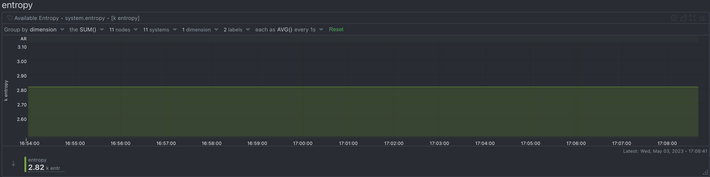

[Entropy](https://en.wikipedia.org/wiki/Entropy_(computing)) is a measure of the randomness or unpredictability of data. In the context of cryptography, entropy is used to generate random numbers or keys that are essential for secure communication and encryption. Without a good source of entropy, cryptographic protocols can become vulnerable to attacks that exploit the predictability of the generated keys.

<!-- truncate -->

## What is Entropy?

In most operating systems, entropy is generated by collecting random events from various sources, such as hardware interrupts, mouse movements, keyboard presses, and disk activity. These events are fed into a pool of entropy, which is then used to generate random numbers when needed.

The `/dev/random` device in Linux is one such source of entropy, and it provides an interface for programs to access the pool of entropy. When a program requests random numbers, it reads from the `/dev/random` device, which blocks until enough entropy is available to generate the requested numbers. This ensures that the generated numbers are truly random and not predictable.

However, if the pool of entropy gets depleted, the `/dev/random` device may block indefinitely, causing programs that rely on random numbers to slow down or even freeze. This is especially problematic for cryptographic protocols that require a continuous stream of random numbers, such as SSL/TLS and SSH.

To avoid this issue, some systems use a hardware random number generator (RNG) to generate high-quality entropy. A hardware RNG generates random numbers by measuring physical phenomena, such as thermal noise or radioactive decay. These sources of randomness are considered to be more reliable and unpredictable than software-based sources.

One such hardware RNG is the [Trusted Platform Module (TPM)](https://support.microsoft.com/en-us/topic/what-is-tpm-705f241d-025d-4470-80c5-4feeb24fa1ee), which is a dedicated hardware chip that is used for cryptographic operations and secure boot. The TPM contains a built-in hardware RNG that generates high-quality entropy, which can be used to seed the pool of entropy in the operating system.

Alternatively, software-based solutions such as [Haveged](https://wiki.archlinux.org/title/Haveged) can be used to generate additional entropy by exploiting sources of randomness in the system, such as CPU utilization and network traffic. These solutions can help to mitigate the risk of entropy depletion, but they may not be as reliable as hardware-based solutions.

In summary, entropy is a crucial component of cryptography, and a reliable source of high-quality entropy is essential for secure communication and encryption. Systems with high entropy demands should ideally use a hardware RNG such as TPM, while software-based solutions can be used as a fallback option.

## How does the Linux kernel replenish entropy?

The Linux kernel replenishes the entropy pool by collecting random events from various sources and adding them to the pool. The kernel uses a combination of hardware and software sources to generate entropy, including:

- **Hardware interrupts** from devices such as the keyboard, mouse, and disk controller

- **Thermal noise and other physical phenomena** measured by the hardware random number generator (RNG)

- **Network traffic and other software events** that produce unpredictable data

The kernel also includes a number of entropy-gathering algorithms that are used to process the raw data collected from these sources and produce a pool of random numbers that can be used by applications. These algorithms include [SHA-1](https://en.wikipedia.org/wiki/SHA-1) and [SHA-2](https://en.wikipedia.org/wiki/SHA-2) hashing, as well as the [Yarrow](https://en.wikipedia.org/wiki/Yarrow_algorithm) and [Fortuna](https://en.wikipedia.org/wiki/Fortuna_(PRNG)) PRNGs (Pseudo Random Number Generators).

## Which applications usually use entropy?

There are many applications that rely on entropy to generate random numbers, keys, or other cryptographic elements.

### Cryptographic protocols

Cryptographic protocols, such as SSL/TLS, SSH, and IPsec rely heavily on entropy to generate random numbers and keys for encryption, authentication, and integrity protection.

The randomness of these numbers is crucial for the security of the communication. If an attacker can predict the random numbers used in a cryptographic protocol, they can potentially compromise the confidentiality, integrity, or authenticity of the communication.

For example, in SSL/TLS, the server generates a random number called the "pre-master secret" and sends it to the client encrypted with the public key of the server's certificate. The client then decrypts the pre-master secret with its own private key and uses it to generate the "master secret," which is used to derive the session keys for encryption and authentication.

If the pre-master secret is predictable or biased, an attacker can potentially intercept the encrypted message, decrypt it, and gain access to the session keys. This would allow the attacker to eavesdrop on the communication, modify the data, or impersonate the server.

To prevent this type of attack, SSL/TLS requires a sufficient amount of high-quality entropy to generate the pre-master secret. The server generates the pre-master secret by combining random data from various sources, such as hardware interrupts, keyboard presses, and mouse movements. This ensures that the pre-master secret is unpredictable and random.

Similarly, in SSH, the client and server generate random numbers to establish a shared secret key for encryption and authentication. If the random numbers are predictable or biased, an attacker can potentially intercept the communication and compromise its security.

To prevent this type of attack, SSH requires a sufficient amount of high-quality entropy to generate the random numbers. The client and server generate the random numbers by combining random data from various sources, such as hardware interrupts, keyboard presses, and mouse movements. This ensures that the random numbers are unpredictable and random.

### Database servers

Database servers can use entropy in various ways, depending on the specific database system and its configuration. Here are some examples:

- **Encryption:** Many database systems support encryption of data-at-rest or data-in-transit, which relies on random numbers for generating encryption keys, initialization vectors, and other cryptographic elements. For example, Microsoft SQL Server provides Transparent Data Encryption (TDE), which encrypts the data stored on disk, and uses a random number generator to create the encryption key.

- **Random sampling:** Some database systems use random sampling as a way of generating statistically significant results, such as in the case of database queries or data analytics. For example, Oracle Database provides the DBMS_RANDOM package, which includes functions for generating random numbers based on the entropy pool of the operating system.

- **Indexing:** Some database systems use random numbers as a way of generating unique keys or IDs for indexing purposes. For example, MongoDB uses a 12-byte ObjectID that includes a random value, a timestamp, and other information as a unique identifier for each document.

- **Unique values:** Some database systems use random numbers as a way of generating unique values for primary keys or other constraints. For example, PostgreSQL provides the uuid-ossp extension, which includes functions for generating UUIDs using random numbers as a source of entropy.

In summary, the use of entropy in database systems varies depending on the specific use case and implementation.

### Kubernetes

Kubernetes can use entropy in various ways, depending on the specific use case and configuration. Here are some examples:

- **Encryption:** Kubernetes can encrypt sensitive data, such as secrets and configuration files, using encryption keys that rely on random numbers as a source of entropy. By default, Kubernetes uses AES-256 encryption for data at rest and TLS encryption for data in transit.

- **Random number generation:** Kubernetes can generate random numbers for various purposes, such as generating unique IDs for resources or generating tokens for authentication and authorization. For example, Kubernetes uses random numbers to generate session tokens for user authentication in its dashboard.

- **Load balancing:** Kubernetes can use random numbers as part of its load balancing algorithms, such as when distributing traffic across multiple replicas of a service.

- **Scaling:** Kubernetes can use random numbers as part of its scaling algorithms, such as when selecting nodes for scaling or selecting replicas for scaling.

In general, Kubernetes relies on a sufficient amount of high-quality entropy to ensure the security and reliability of its operations, especially for encryption and authentication.

## Entropy in Cloud VMs

Cloud-provided VMs typically have access to hardware-generated entropy, but the specific implementation depends on the cloud provider and the underlying infrastructure.

Most cloud providers recognize the importance of hardware-generated entropy for their customers' cryptographic operations and security needs. They often utilize hardware random number generators (HRNGs) or hardware security modules (HSMs) in their infrastructure to provide a reliable source of entropy.

In general, cloud providers expose this entropy to VMs through virtual devices or interfaces. This allows VMs to access the hardware-generated entropy as if it were a local resource.

- **AWS (Amazon Web Services):**
    AWS uses its Nitro System, which includes a dedicated hardware random number generator (HRNG), to provide hardware-generated entropy to the VMs (EC2 instances). In Linux-based EC2 instances, the HRNG is exposed through the /dev/hwrng device file. The guest OS can then use this source of entropy to seed its own random number generator.

- **GCP (Google Cloud Platform):**
    GCP offers access to hardware-generated entropy through a service called Virtio RNG (Random Number Generator). This service is enabled by default for Linux-based VMs running on the platform. The guest OS can access the hardware-generated entropy through the /dev/hwrng device file, similar to AWS.

- **Azure (Microsoft Azure):**
    Azure also provides hardware-generated entropy to its VMs. For Linux-based VMs, Azure exposes the hardware-generated entropy through the /dev/hwrng device file. In the case of Windows-based VMs, Azure provides the hardware-generated entropy through the Cryptographic API (CryptoAPI) and Cryptography API: Next Generation (CNG).

## Entropy in KVM VMs

When a KVM-based virtual machine (VM) is created on a host with a hardware entropy generator, the VM can potentially inherit the host's entropy pool, depending on how the VM is configured.

By default, KVM virtual machines use a software-based random number generator, which may not provide the same level of security as a hardware-based RNG. However, it's possible to configure KVM to use a hardware-based RNG for the virtual machine.

One way to configure KVM to use a hardware-based RNG is to use the virtio-rng device, which allows the virtual machine to access a random number generator on the host system. The virtio-rng device provides access to the host's entropy pool, which can improve the quality and unpredictability of the random numbers generated by the virtual machine.

To use the virtio-rng device in a KVM virtual machine, you need to add the device to the VM's configuration file and configure the guest operating system to use it. Once the device is configured, the virtual machine can use the host's entropy pool to generate random numbers.

However, it's important to note that not all virtual machine configurations will allow the guest to inherit the host's entropy pool. In some cases, the virtual machine may have its own independent entropy pool, which may be generated using a software-based RNG. In other cases, the virtual machine may not have access to a random number generator at all.

## Entropy in Containers

Containers share the hardware-provided entropy of the host they run on. Containers are essentially lightweight, isolated environments running on a single host operating system. They share the kernel and other resources, including the host's entropy pool.

## How to monitor Entropy with Netdata

Netdata provides a built-in chart for monitoring the available entropy on a Linux system. The chart is named `system.entropy` and displays the current level of available entropy.

To view the system.entropy chart in Netdata, follow these steps:

1. Navigate to the Netdata dashboard for the system you want to monitor.
2. In the right sidebar, click on the `System Overview` section.
3. Scroll down to the Entropy section and click it.
4. The Available Entropy (`system.entropy`) chart displays the current level of available entropy, along with a history of the entropy level over time. The chart is updated in real-time, allowing you to monitor changes in the available entropy level as they occur.

Netdata automatically attaches an alert on this chart that monitors the minimum available entropy over the last 5 minutes and triggers a warning when it gets below 100 entries. The alert is smart enough to stay in the warning state until the minimum available entropy of the last 5 minutes gets above 200 entries and has a hysteresis on recovery of 1 to 2 hours to avoid frequent flip-flop when the entropy is close to these limits.

