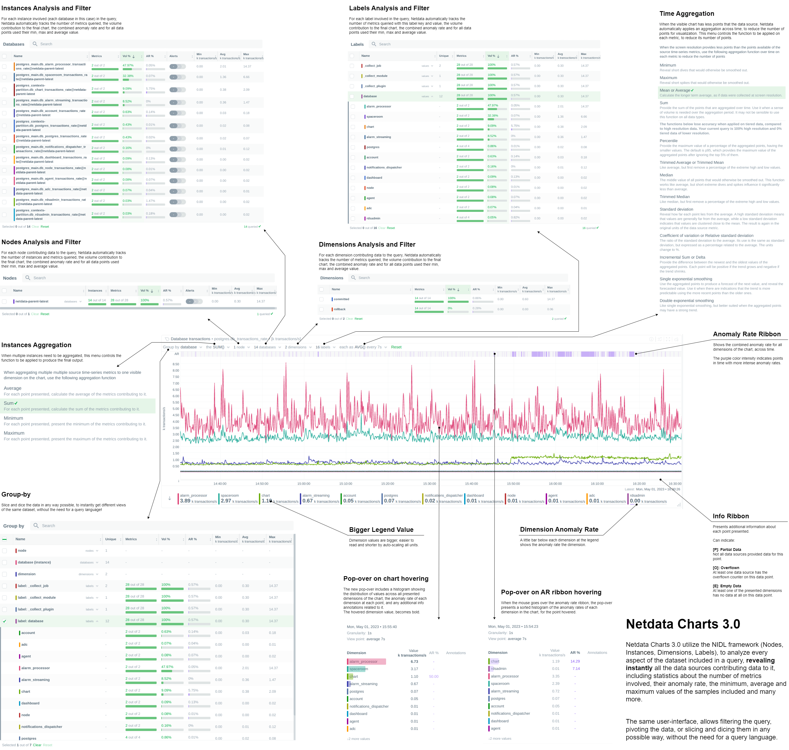

import ReactPlayer from 'react-player'

Another release of the Netdata Monitoring solution is here!

<ReactPlayer controls width='100%' url='https://www.youtube.com/embed/dU4GJjpeb3I'/>

<!--truncate-->

- [Netdata open-source growth](#v1390-netdata-open-source-growth)
- [Release highlights](#release-highlights)
    - **[Netdata Charts v3.0](#netdata-charts-v30)**
	  A new era for monitoring charts. Powerful, fast, easy to use. Instantly understand the dataset behind any chart. Slice, dice, filter and pivot the data in any way possible!
    - **[Windows support](#windows-support)**
	  Windows hosts are now first-class citizens. You can now enjoy out-of-the-box monitoring of over 200 metrics from your Windows systems and the services that run on them.
    - [Virtual nodes and custom labels](#virtual-nodes-and-custom-labels)
    You now have access to more monitoring superpowers for managing medium to large infrastructures. With custom labels and virtual hosts, you can easily organize your infrastructure and ensure that troubleshooting is more efficient.
    - [Major upcoming changes](#major-upcoming-changes)
    Separate packages for data collection plugins, mandatory `zlib`, no upgrades of existing installs from versions prior to v1.11.
    - [Bar charts for functions](#bar-charts-for-functions)
    - [Opsgenie notifications for Business Plan users](#opsgenie-notifications-for-business-plan-users)
    Business plan users can now seamlessly integrate Netdata with their Atlassian Opsgenie alerting and on call management system.
- [Data Collection](#data-collection)
    - [Containers and VMs CGROUPS](#containers-and-vms-cgroups)
    - [Docker](#docker)
    - [Kubernetes](#kubernetes)
    - [Kernel traces/metrics eBPF](#kernel-tracesmetrics-ebpf)
    - [Disk Space Monitoring](#disk-space-monitoring)
    - [OS Provided Metrics proc.plugin](#os-provided-metrics-procplugin)
    - [PostgreSQL](#postgresql)
    - [DNS Query](#dns-query)
    - [HTTP endpoint check](#http-endpoint-check)
    - [Elasticsearch and OpenSearch](#elasticsearch-and-opensearch)
    - [Dnsmasq DNS Forwarder](#dnsmasq-dns-forwarder)
    - [Envoy](#envoy)
    - [Files and directories](#files-and-directories)
    - [RabbitMQ](#rabbitmq)
    - [charts.d.plugin](#chartsdplugin)
    - [Anomalies](#anomalies)
    - [Generic structured data with Pandas](#generic-structured-data-pandas)
    - [Generic Prometheus collector](#generic-prometheus-collector)
- [Alerts and Notifications](#alerts-and-notifications)
    - [Notifications](#notifications)
        - [Improved email alert notifications](#improved-email-alert-notifications)
        - [Receive only notifications for unreachable nodes](#receive-only-notifications-for-unreachable-nodes)
        - [ntfy agent alert notifications](#ntfy-agent-alert-notifications)
    - [Enhanced Real-Time Alert Synchronization on Netdata Cloud](#enhanced-real-time-alert-synchronization-on-netdata-cloud)
- [Visualizations / Charts and Dashboards](#visualizations--charts-and-dashboards)
    - [Events Feed](#events-feed)
- [Machine Learning](#machine-learning)
- [Installation and Packaging](#installation-and-packaging)
    - [Improved Linux compatibility](#improved-linux-compatibility)
- [Administration](#administration)
    - [New way to retrieve netdata.conf](#new-way-to-retrieve-netdataconf)
- [Documentation and Demos](#documentation-and-demos)
- [Deprecation notice](#deprecation-notice)
    - [Deprecated in this release](#deprecated-in-this-release)
- [Netdata Agent Release Meetup](#netdata-agent-release-meetup)
- [Support options](#support-options)
- [Running survey](#running-survey)
- [Acknowledgements](#acknowledgements)

## Netdata open-source growth

<!-- Retrieve most of these stats from netdata/netdata/README.md badges -->
- Over 62,000 GitHub Stars
- Over 1.5 million online nodes
- Almost 92 million sessions served
- Over 600 thousand total nodes in Netdata Cloud

## Release highlights

### Netdata Charts v3.0

We are excited to announce Netdata Charts v3.0 and the NIDL framework. These are currently available at Netdata Cloud. At the next Netdata release, the agent dashboard will be replaced to also use the same charts.

One of the key obstacles in understanding an infrastructure and troubleshooting issues, is making sense of the data we see on charts. Most monitoring solutions assume that the users have a deep understanding of the underlying data, so during visualization they actually do nothing to help users comprehend the data easier or faster. The problem becomes even more apparent when the users troubleshooting infrastructure problems are the not the ones who developed the dashboards. In these cases all kinds of misunderstandings are possible, resulting in bad decisions and slower time to resolution.

To help users instantly understand and validate the data they see on charts, we developed the NIDL (Nodes, Instances, Dimensions, Labels) framework and we changed all the Netdata query engines, at both the agent and the cloud, to enrich the returned data with additional information. This information is then visualized on all charts.

Click to read more about the changes

#### Embedded Machine Learning for every metric

Netdata's unsupervised machine learning algorithm creates a unique model for each metric collected by your agents, using exclusively the metric's past data. We don't train ML models on a lab, or on aggregated sample data. We then use these unique models during data collection to predict the value that should be collected and check if the collected value is within the range of acceptable values based on past patterns and behavior. If the value collected is an outlier, we mark it as anomalous. This unmatched capability of real-time predictions as data is collected allows you to **detect anomalies for potentially millions of metrics across your entire infrastructure within a second of occurrence**.

Before this release, users had to either go to the "Anomalies" tab, or enable anomaly rate information from a button on the charts to access the anomaly rate. We found that this was not very helpful, since a lot of users were not aware of this functionality, or they were forgetting to check it. So, we decided that the best use of this information is to visualize it by default on all charts, so that users will instantly see if the AI algorithm in Netdata believes the values are not following past behavior.

In addition to the summarized tables and chart overlay, a new anomaly rate ribbon on top of each chart visualizes the combined anomaly rate of all the underlying data, highlighting areas of interest that may not be easily visible to the naked eye.

Hovering over the anomaly rate ribbon provides a histogram of the anomaly rates per dimension presented, for the specific point in time.

Anomaly rate visualization does not make Netdata slower. Anomaly rate is saved in the the Netdata database, together with metric values, and due to the smart design of Netdata, it does not even incur a disk footprint penalty.

#### Introducing chart annotations for comprehensive context

Chart annotations have arrived! When hovering over the chart, the overlay may display an indication in the "Info" column. 

Currently, annotations are used to inform users of any data collection issues that might affect the chart. Below each chart, we added an information ribbon. This ribbon currently shows 3 states related to the points presented in the chart:

1. **[P]: Partial Data**
   At least one of the dimensions in the chart has partial data, meaning that not all instances available contributed data to this point. This can happen when a container is stopped, or when a node is restarted. This indicator helps to gain confidence of the dataset, in situations when unusual spikes or dives appear due to infrastructure maintenance, or due to failures to part of the infrastructure.

2. **[O]: Overflowed**
   At least one of the datasources included in the chart was a counter that has overflowed exactly that point.

3. **[E]: Empty Data**
   At least one of the dimensions included in the chart has no data at all for the given points.

All these indicators are also visualized per dimension, in the pop-over that appears when hovering the chart.

#### New hover pop-over

Hovering over any point in the chart now reveals a more informative overlay. This includes a bar indicating the volume percentage of each time series compared to the total, the anomaly rate, and a notification if there are data collection issues (annotations from the info ribbon).

The pop-over sorts all dimensions by value, makes bold the closest dimension to the mouse and presents a histogram based on the values of the dimensions.

When hovering the anomaly ribbon, the pop-over sorts all dimensions by anomaly rate, and presents a histogram of these anomaly rates.

#### NIDL framework

You can now rapidly access condensed information for collected metrics, grouped by node, monitored instance, dimension, or any label key/value pair. Above all charts, there are a few drop-down menus. These drop-down menus have 2 functions:

1. Provide additional information about the visualized chart, to help us understand the data we see.
2. Provide filtering and grouping capabilities, altering the query on the fly, to help us get different views of the dataset.

In this release, we extended the query engines of Netdata (both at the agent and the cloud), to include comprehensive statistical data to help us understand what we see on the chart. We developed the NIDL framework to standardize this presentation across all charts.

The NIDL framework attaches the following metadata to every metric we collect:

1. The Node each metric comes from
2. The Instance each metric belongs to. An instance can be container, a disk, a network interface, a database server, a table in a given data server, etc. The instance describes which exactly component of our infrastructure we monitor. At the charts, we replaced the word "instance" with the proper name of that instance. So, when the instance is a disk, we see "disks". When it is a container, we see "containers", etc.
3. The Dimensions are the individual metrics related to an instance under a specific context.
4. The Labels are all the labels that are available for each metric, that many or may not be related to the node or the instance of them metric.

Since all our metrics now have these metadata, we are use them at query time, to provide for each of them the following consolidated data for the visible time frame:

1. The volume contribution of each of them into the final query. So even if a query comes from 1000 nodes, we can instantly see the contribution of each node in the result. The same for instances, dimensions and labels. Especially for labels, Netdata also provides the volume contribution of each label `key:value` pair to the final query, so that we can immediately see for all label values involved in the query how much they affected the chart.
2. The anomaly rate of each of them for the time-frame of the query. This is used to quickly spot which of the nodes, instances, dimensions or labels have anomalies in the requested time-frame.
3. The minimum, average and maximum values of all the points used for the query. This is used to quickly spot which of the nodes, instances, dimensions or labels are responsible for a spike or a dive in the chart.

All of these drop-down menus can now be used for instantly filtering the dataset, by including or excluding specific nodes, instances, dimensions or labels. Directly from the drop-down menu, without the need to edit a query string and without any additional knowledge of the underlying data.

#### Multiple Group-by

At the same time, the new query engine of Netdata has been enhanced to support multiple group-by at once. The "Group by" drop-down menu allows selecting 1 or more groupings to be applied at once on the same dataset. Currently it supports:

1. Group by Node, to summarize the data of each node, and provide one dimension on the chart for each of the nodes involved. Filtering nodes is supported at the same time, using the nodes drop-down menu.
2. Group by Instance, to summarize the data of each instance and provide one dimension on the chart for each of the instances involved. Filtering instances is supported at the same time, using the instances drop-down menu.
3. Group by Dimension
4. Group by Label, to summarize the data for each label value. Multiple label keys can be selected at the same time.

Using this menu, you can slice and dice the data in any possible way, to quickly get different views of them, without the need to edit a query string and without any need to better understand the format of the underlying data. Netdata will do its by itself.

### Windows support

We are excited to announce that our Windows monitoring capabilities have been greatly improved with the addition of over 170 new system, network, and application metrics. This includes out-of-the-box support for MS Exchange, MS SQL, IIS, Active Directory (including AD Certificate and AD Federation Services).

To try out Netdata directly on your Windows machine, our `.msi` [installer](https://github.com/netdata/msi-installer) allows for quick and easy installation with a Netdata WSL distribution. However, for production deployments, one or more Linux nodes are still required to run Netdata and store your metrics, as shown in the provided diagram.

To fully support this architecture, we have added the ability to declare each Windows host as a Netdata node. You can learn more about this feature in the [virtual nodes](#org) section.

Click to read more about the changes

We continue to rely on the native [Prometheus node_exporter](https://github.com/prometheus/node_exporter) running on each Windows VM or physical machine, as we support a FOSS ecosystem with the best-in-class software for each role. Although node_exporter does not support per-second resolution like Netdata offers in Linux systems, we are working towards providing the ability to install Netdata directly on Windows machines without the need for containers or dedicated Linux VMs. In the meantime, we believe that our suggested architecture allows for quick and easy monitoring of Windows systems and applications.

For more information, please check out our high-level introduction to 
[Windows monitoring](https://www.netdata.cloud/windows-monitoring/), our [demo](https://app.netdata.cloud/spaces/netdata-demo/rooms/windows/overview), or our [Windows collector documentation](https://learn.netdata.cloud/docs/data-collection/monitor-anything/system%20metrics/windows-machines/).

### Virtual nodes and custom labels

Netdata provides powerful tools for organizing hundreds of thousands of metrics collected every second in large infrastructures. From the automated organization into sections of related out-of-the-box aggregate charts, to concepts like spaces and war rooms that connect the metrics with the people who need to use them, scale is no problem. Easily slicing and dicing the metrics via grouping and filtering in our charts is also essential for exploration and troubleshooting, which is why we in the past we introduced host labels and default metric labels. To complete the available tool set, Netdata now offers the ability to define custom metric labels and virtual nodes. You can read how everything fits together in [our documentation](https://learn.netdata.cloud/docs/deployment-in-production/organize-systems-metrics-and-alerts).

You can use custom labels to group and filter metrics in the Netdata Cloud aggregate charts. Virtual nodes work like normal Netdata Cloud nodes for the metrics you assign to them and can be added to any room. 

Click to read more about the changes

Custom metric labels let you group or filter by dimensions that make sense to you and your team. This feature has been available since v1.36.0, but was previously considered experimental and not well-documented. We have now made it extremely simple to [add custom labels](https://learn.netdata.cloud/docs/deployment-in-production/organize-systems-metrics-and-alerts) to `go.d.plugin` data collection jobs.

The ability to define a virtual node is a new feature that is essential for monitoring remote Windows hosts, but has many other potential uses. For example, you may have a central monitoring node collecting data from many remote database hosts that you aren't allowed to install software on. You may also use the [HTTP endpoint collector](https://learn.netdata.cloud/docs/data-collection/monitor-anything/networking/http-endpoints/) to check the availability and latency of APIs on multiple remote endpoints. 

Defining virtual nodes lets you substantiate those entities that have no Netdata running on them, so they can appear in Netdata Cloud, be placed in rooms, filtered and grouped easily, and have their virtual node name displayed in alerts. Learn how to [configure virtual nodes](https://learn.netdata.cloud/docs/deployment-in-production/organize-systems-metrics-and-alerts#virtual-nodes) for any go.d.plugin data collection job.

### Major upcoming changes

Please read carefully through the following planned changes in our packaging, support of existing installs and required dependencies, as they may impact you. We are committed to providing the most up-to-date and reliable software, and we believe that the changes outlined below will help us achieve this goal more efficiently. As always, we are happy to provide any assistance needed during this transition.

Click to read more about the changes

#### Upcoming collector packaging changes

As previously discussed on our blog, we will be changing how we package our external data collection plugins in the coming weeks. This change will be reflected in nightly builds a few weeks after this release, and in stable releases starting with v1.40.0. Please note that any patch releases for v1.39.0 will _not_ include this change.

For detailed information on this change and how it may impact you, please refer to our blog post titled [Upcoming Changes to Plugins in Native Packages](https://blog.netdata.cloud/split-plugin-packages/). 

#### Upcoming end of support for upgrading very old installs

Beginning shortly after this release, we will no longer be providing support for upgrading existing installs from versions prior to Netdata v1.11.0. It is highly unlikely that this change will affect any existing users, as v1.11.0 was released in 2018. However, this change is important in the long-term, as it will allow us to make our installer and updater code more portable.

#### Upcoming mandatory dependency on zlib

In the near future, we will be making a significant change to the Netdata agent by making `zlib` a mandatory dependency. Although we have not treated it as a mandatory dependency in the past, a number of features that we consider core parts of the agent rely on `zlib`. Given that `zlib` is ubiquitous across almost every platform, there is little to no benefit to it being an optional dependency. As such, this change is unlikely to have a significant impact on the vast majority of our users.

The change will be implemented in nightly builds shortly after this release and in stable releases starting with v1.40.0. Please note that any patch releases for v1.39.0 will _not_ include this change. 

### Bar charts for functions

In v1.38, we introduced real-time [functions](https://github.com/netdata/netdata/releases/tag/v1.38.0#v1380-functions) that enable you to trigger specific routines to be executed by a given Agent on demand. Our initial function provided detailed information on currently running processes on the node, effectively replacing `top` and `iotop`.

We have now expanded the versatility of functions by incorporating configurable bar charts above the table displaying detailed data. These charts will be a standard feature in all future functions, granting you the ability to manipulate and analyze the retrieved data as needed.

### Opsgenie notifications for Business Plan users

Ensuring the reliable delivery of alert notifications is crucial for maintaining the reliability of your services. While individual Netdata agents were already able to send alert notifications to Atlassian's Opsgenie, Netdata Cloud adds centralized control and more robust retry and failure handling mechanisms to improve the reliability of the notification delivery process.

Business Plan users can now configure Netdata Cloud to send alert notifications to their Atlassian Opsgenie platform, using our centralized alert dispatching feature. This feature helps to ensure the reliable delivery of notifications, even in cases where individual agents are offline or experiencing issues.

We are committed to continually extending the capabilities of Netdata Cloud, and our focus on centralized alert dispatching is just one example of this. By adding more centralized dispatching options, we can further increase the reliability of notification delivery and help our users maintain the highest levels of service reliability possible.

## Data Collection

### Containers and VMs (CGROUPS)

The [cgroups plugin](https://learn.netdata.cloud/docs/data-collection/monitor-anything/Virtualized%20Environments/Containers-and-VMs-cgroups) reads information on Linux Control Groups to monitor containers, virtual machines and systemd services.

Previously, we identified individual Docker containers solely through their container ID, which may not always provide adequate information to identify potential issues with your infrastructure. However, we've made significant improvements to our system by incorporating labels containing the [image](https://github.com/netdata/netdata/pull/14872) and the [name](https://github.com/netdata/netdata/pull/14856) of each container to all the collected metrics. These features allows you to group and filter the containers in a more efficient and effective manner, enabling you to quickly pinpoint and troubleshoot any issues that may arise

We always strive to provide the most informative chart titles and descriptions. The title of all our container CPU usage charts explain that 100% utilization means 1 CPU core, which also means you can exceed 100% when you add the utilization of multiple cores. This logic is a bit foreign to Kubernetes monitoring, where `mCPU` is clearer. So we [modified the chart title](https://github.com/netdata/netdata/pull/14791) to state that 100% utilization is equivalent to 1000 mCPUs.  

We place great importance on delivering the most informative chart titles and descriptions to our users. Our container CPU usage charts are no exception. We understand that the concept of 100% CPU utilization equating to 1 CPU core, and the ability to exceed 100% by adding the utilization of multiple cores may seem a bit unfamiliar to those using Kubernetes monitoring. In light of this, we have taken steps to modify our chart title by [incorporating mCPU](https://github.com/netdata/netdata/pull/14791), which provides greater clarity. The title now indicates that 100% utilization equates to 1000 mCPUs in k8s. We hope this change will help you better understand and interpret our container CPU usage charts.

### Docker

Netdata [monitors the Docker engine](https://learn.netdata.cloud/docs/data-collection/monitor-anything/virtualized-environments/docker) to automatically generate charts for container health and state, and image size and state.

Previously, this collector only retrieved aggregate metrics for the containers managed by the Docker engine. We started a major change 
in the way we collect metrics from Docker so that [we can now present the health of each container separately](https://github.com/netdata/go.d.plugin/pull/1148), or grouped by the container name and image labels. Some teething issues with this change were fixed quickly with [#1160](https://github.com/netdata/go.d.plugin/pull/1160).

We recently increased the client version of our collector, which started causing issues with older Docker engine servers. We resolved these issues by [adding client version negotiation](https://github.com/netdata/go.d.plugin/pull/1136) to our Docker collector.

### Kubernetes

Monitoring Kubernetes clusters can be challenging due to the intricate nature of the infrastructure. Identifying crucial aspects to monitor necessitates considerable expertise, which Netdata provides out-of-the-box through dedicated collectors for every layer of your Kubernetes infrastructure. 

One key area to keep an eye on is the overall cluster state, which we address using the [Kubernetes Cluster State Collector](https://learn.netdata.cloud/docs/data-collection/monitor-anything/virtualized-environments/kubernetes-cluster-state). This collector generates automated dashboards for 37 metrics encompassing overall node and pod resource limits and allocations, as well as pod and container readiness, health, and container restarts. Initially, we displayed the rate of container restarts, as we did with numerous other events. However, restarts are infrequent occurrences in many infrastructures. Displaying the rate of sparse events can lead to suboptimal charts for troubleshooting purposes. To address this, we have modified the logic and now [present the absolute count of container restarts](https://github.com/netdata/go.d.plugin/pull/1141) for enhanced clarity.

Kubernetes monitoring also relies on the [cgroups plugin](https://learn.netdata.cloud/docs/data-collection/monitor-anything/Virtualized%20Environments/Containers-and-VMs-cgroups) for container and pod monitoring. To properly label k8s containers, the `cgroup` plugin makes calls to the k8s API server to retrieve pod metadata. In large clusters and under certain conditions (e.g. starting all the agents at once), these requests can potentially cause serious stress on the API server, or even a denial of service incident. To address this issue we have provided an alternative to querying the API server. We [now allow querying the local kubelet server](https://github.com/netdata/netdata/pull/14891) for the same information. However, since the Kubelet's `/pods` endpoint is not well documented and should probably not be relied on (see [1](https://github.com/fluent/fluent-bit/issues/1948#issuecomment-680291735), [2](https://github.com/fluent/fluent-bit/issues/1948#issuecomment-691219053)), we still query the API server by default. To switch to querying Kubelet, you can set the `child.podsMetadata.useKubelet` and `child.podsMetadata.kubeletUrl` variables that [were added to our Helm chart](https://github.com/netdata/helmchart/pull/349).

### Kernel traces/metrics (eBPF)

The [eBPF Collector](https://learn.netdata.cloud/docs/data-collection/monitor-anything/system-metrics/kernel-traces-metrics-ebpf) offers numerous eBPF programs to assist you in troubleshooting and analyzing how applications interact with the Linux kernel. By utilizing [tracepoints, trampoline, and kprobes](#how-netdata-collects-data-using-probes-and-tracepoints), we gather a wide range of valuable data about the host that would otherwise be unattainable.

We recently addressed some significant issues with SIGABRT crashes on some systems. These crashes were caused by problems with memory allocation and deallocation functions, which resulted in unstable system behavior and prevented users from effectively monitoring their systems. To resolve these issues, we [made some significant changes](https://github.com/netdata/netdata/pull/14591) to our memory allocation and deallocation functions. Specifically, we replaced these functions with more reliable alternatives and began using vector allocation where possible. 

We later identified issues with memory corruption, `Oracle Linux` ported codes and `OOMKill`, which were all resolved with [#14869](https://github.com/netdata/netdata/pull/14869). 

Finally, issues with CPU usage on EC2 instances appeared in a nightly release and were resolved with [some changes](https://github.com/netdata/netdata/pull/14902) that speed up the plugin clean up process and also prevent some possible `SIGABRT` and `SIGSEGV` crashes.

These changes helped to reduce the likelihood of crashes occurring and improved the overall stability and reliability of the eBPF collector.

In some environments, the collector demanded substantial memory resources. To address this, we introduced [charts to monitor its memory usage](https://github.com/netdata/netdata/pull/14623) and implemented initial optimizations to [decrease the RAM requirements](https://github.com/netdata/netdata/pull/14462). We will continue this work in future releases, to bring you even
more eBPF observability superpowers, with minimal resource needs. 

### Disk Space Monitoring

The [disk space plugin](https://learn.netdata.cloud/docs/data-collection/monitor-anything/system-metrics/disks) is designed to monitor disk space usage and inode usage for mounted disks in Linux. However, because `msdos`/`FAT` file systems don't use inodes, the plugin would often generate false positives, leading to inaccurate results. To fix this, we've [disabled inode data collection for these file systems](https://github.com/netdata/netdata/pull/14809), using the `exclude inode metrics on filesystems` configuration option. This option has a default value of `msdosfs msdos vfat overlayfs aufs* *unionfs`.

### OS Provided Metrics (proc.plugin)

Our [proc plugin](https://learn.netdata.cloud/docs/data-collection/monitor-anything/system-metrics/os-provided-metrics-proc.plugin) is responsible for gathering system metrics from various endpoints, including `/proc` and `/sys` folders in Linux systems. It is an essential part of our monitoring tool, providing insights into system performance. 

When running the Netdata agent in a Docker container, we encountered an issue where `zram` memory metrics were not being displayed. To solve this, [we made changes](https://github.com/netdata/netdata/pull/14759) to the `zram` collector code, respecting the `/host` prefix added to the directories mounted from the host to the container. Now, our monitoring tool can collect `zram` memory metrics even when running in a Docker container.

We also improved the `zfs` storage pool monitoring code, by [adding](https://github.com/netdata/netdata/pull/14934) the state `suspended` to the list of monitored states. 

Finally, [we added](https://github.com/netdata/netdata/pull/14636) new metrics for BTRFS commits and device errors. 

### PostgreSQL

Our [PostgreSQL collector](https://learn.netdata.cloud/docs/data-collection/monitor-anything/Databases/PostgresSQL) is a highly advanced application collector, offering 70 out-of-the-box charts and 14 alerts to help users monitor their PostgreSQL databases with ease.

We recently discovered an issue in our documentation where we were instructing users to create a `netdata` user, even though our data collection job was using the `postgres` user. To address this issue, we [have now added](https://github.com/netdata/go.d.plugin/pull/1104) the `netdata` user as an additional option to our data collection jobs. With this enhancement, users can now use either the `postgres` user or the newly added `netdata` user to collect data from their PostgreSQL databases, ensuring a more seamless and accurate monitoring experience.

Netdata automatically generates several charts for PostreSQL write-ahead logs (WAL). We recently discovered that 
`wal_files_count`, `wal_archiving_files_count` and `replication_slot_files_count` require superuser access, so we 
[added a check](https://github.com/netdata/go.d.plugin/pull/1122) on whether the collection job has superuser access, before 
attempting to collect these WAL metrics.

Finally, [we fixed a bug with the bloat size calculation](https://github.com/netdata/go.d.plugin/pull/1094) that used to erroneously return zeroes for some indexes. 

### DNS Query

The [DNS query collector](https://learn.netdata.cloud/docs/data-collection/monitor-anything/Dns/DNS-queries) is a crucial tool that ensures optimal system performance by monitoring the liveness and latency of DNS queries. This tool is simple yet essential, as it attempts to resolve any hostname you provide and creates metrics for the response time and success or failure of each request/response.

Previously, we only measured the response time for successful queries. However, we have now enhanced the DNS query collector by [collecting latency data for failed queries as well](https://github.com/netdata/go.d.plugin/pull/1112). This improvement enables us to identify and troubleshoot DNS errors more effectively, which ultimately leads to improved system reliability and performance.

### HTTP endpoint check

Modern endpoint monitoring should include periodic checks on all your internal and public web applications, regardless of their traffic patterns. Automated and continuous tests can proactively identify issues, allowing them to be resolved before any users are affected.

Netdata's [HTTP endpoint collector](https://learn.netdata.cloud/docs/data-collection/monitor-anything/networking/http-endpoints/) is a powerful tool that enables users to monitor the response status, latency, and content of any URL provided. While the collector has always supported basic authentication via a provided username and password, we have recently introduced a new enhancement that allows for more complex authentication flows. With the addition of the [ability to include a cookie in the request](https://github.com/netdata/go.d.plugin/pull/1133), users can now authenticate and monitor more advanced applications, ensuring more comprehensive and accurate monitoring capabilities. 

All you need to do is to add `cookie: <filename>` to your data collection job and the collector will issue the request will the contents of that file. 

### Elasticsearch and OpenSearch

Our [Elasticsearch Collector](https://learn.netdata.cloud/docs/data-collection/monitor-anything/search/elasticsearch) seamlessly generates visualizations for 47 metrics, drawing from 4 endpoints of the renowned search engine.

The original Elasticsearch project evolved into an open-source initiative called [OpenSearch](https://opensearch.org/), spearheaded by Amazon. However, our collector [did not automatically connect to OpenSearch instances](https://community.netdata.cloud/t/opensearch-elasticsearch-alternative-does-not-appear-automatically/3995) due to their default security settings with TLS and authentication.

Although it is possible to disable security by adding `plugins.security.disabled: true` to `/etc/opensearch/opensearch.yml`, which allows the default data collection job to function, we deemed it more prudent to [introduce an OpenSearch-specific data collection job](https://github.com/netdata/go.d.plugin/pull/1140). This addition explicitly enables TLS and highlights the necessity of a username and password for secure access.

### Dnsmasq DNS Forwarder

[`Dnsmasq`](http://www.thekelleys.org.uk/dnsmasq/doc.html) is a lightweight and easy-to-configure DNS forwarder that is specifically designed to offer DNS, DHCP, and TFTP services to small-scale networks. Netdata provides comprehensive monitoring of `Dnsmasq` by collecting metrics for both the [DHCP server](https://learn.netdata.cloud/docs/data-collection/monitor-anything/dns/dnsmasq-dhcp) and [DNS forwarder](https://learn.netdata.cloud/docs/data-collection/monitor-anything/dns/dnsmasq-dns-forwarder).

Recently, we made a minor but important improvement to the order in which the DNS forwarder cache charts are displayed. With this update, the most critical information regarding cache utilization [is now presented first](https://github.com/netdata/go.d.plugin/pull/1125), providing users with more efficient access to essential data. By constantly improving and refining our monitoring capabilities, we aim to provide our users with the most accurate and useful insights into their network performance.

### Envoy

[Envoy](https://www.envoyproxy.io/docs/envoy/latest/intro/what_is_envoy) is an L7 proxy and communication bus designed for large modern service oriented architectures. 

Our [new](https://github.com/netdata/go.d.plugin/pull/1142) [Envoy collector](https://learn.netdata.cloud/docs/data-collection/monitor-anything/Proxies/Envoy) automatically generates charts for over 50 metrics.

### Files and directories

The [files and directories collector](https://learn.netdata.cloud/docs/data-collection/monitor-anything/system-metrics/files-and-dirs) monitors existence, last update and size of any files or directories you specify.

The collector was not sanitizing file and directory names, causing issues with metric collection. The issue was specific to paths with 
spaces in them and is [now fixed](https://github.com/netdata/go.d.plugin/pull/1158).

### RabbitMQ

The Netdata agent includes a [RabbitMQ collector](https://learn.netdata.cloud/docs/agent/collectors/go.d.plugin/modules/rabbitmq) that tracks the performance of this open-source message broker. This collector queries RabbitMQ's HTTP endpoints, including `overview`, `node`, and `vhosts`, to provide you with detailed metrics on your RabbitMQ instance. Recently, [we fixed an issue](https://github.com/netdata/go.d.plugin/pull/1114) that prevented our collector from properly collecting metrics on 32-bit systems.

### charts.d.plugin

The [charts.d plugin](https://learn.netdata.cloud/docs/improving-netdata---developers/external-plugins/charts.d.plugin/) is an external plugin for Netdata. It's responsible for orchestrating data collection modules written in `BASH` v4+ to gather and visualize metrics. 

Recently, we fixed an issue with the plugin's restarts that sometimes caused the connection to Netdata to be lost. Specifically, there was a chance for charts.d processes to die at the exact same time when the Netdata binary tried to read from them using `fgets`. This caused Netdata to hang, as `fgets` never returned. To fix this issue, [we added](https://github.com/netdata/netdata/pull/14680) a "last will" `EOF` to the exit process of the plugin. This ensures that the fgets call has something to receive before the plugin exits, preventing Netdata from hanging.

With this issue resolved, the charts.d plugin can now continue to provide seamless data collection and visualization for your Netdata instance without any disruptions.

### Anomalies 

Our [anomaly collector](https://learn.netdata.cloud/docs/data-collection/monitor-anything/any-application---generic-collectors/anomalies) is a powerful tool that uses the `PyOD` library in Python to perform unsupervised anomaly detection on your Netdata metrics. With this collector, you can easily identify unusual patterns in your data that might indicate issues with your system or applications.

Recently, we discovered an issue with the collector's Python version check. Specifically, the check was incorrectly rejecting Python 3.10 and higher versions due to how the `float()` function was casting "10" to "1". This resulted in an inaccurate check that prevented some users from using the anomaly collector with the latest versions of Python.

To resolve this issue, [we fixed the Python version check](https://github.com/netdata/netdata/pull/14616) to work properly with Python 3.10 and above. With this fix in place, all users can now take advantage of the anomaly collector's powerful anomaly detection capabilities regardless of the version of Python they are using.

### Generic structured data (Pandas)

[Pandas](https://pandas.pydata.org/) is a de-facto standard in reading and processing most types of structured data in Python. If you have metrics appearing in a CSV, JSON, XML, HTML, or [other supported format](https://pandas.pydata.org/docs/user_guide/io.html), 
either locally or via some HTTP endpoint, you can easily ingest and present those metrics in Netdata, by leveraging the [Pandas collector](https://learn.netdata.cloud/docs/data-collection/monitor-anything/any-application---generic-collectors/structured-data-pandas). We [fixed an issue](https://github.com/netdata/netdata/pull/14736) we had logging some collector errors.  

### Generic Prometheus collector

Our [Generic Prometheus Collector](https://learn.netdata.cloud/docs/agent/collectors/go.d.plugin/modules/prometheus) gathers metrics from any [Prometheus](https://prometheus.io/) endpoint that uses the [OpenMetrics exposition format](https://prometheus.io/docs/instrumenting/exposition_formats/).

In version 1.38, we made some significant changes to how we generate charts with labels per label set. [These changes](https://github.com/netdata/go.d.plugin/pull/1004) resulted in a drastic increase in the length of generated chart IDs, which posed some challenges for users with a large number of label key/value pairs. In some cases, the length of the type.id` string could easily exceed the previous limit of 200 characters, which prevented users from effectively monitoring their systems.

To resolve this issue, we took action to [increase the chart ID limit](https://github.com/netdata/go.d.plugin/pull/1126) from 200 to 1000 characters. This change provides you with more flexibility when it comes to labeling their charts and ensures that you can effectively monitor their systems regardless of the number of label key/value pairs you use.

## Alerts and Notifications

### Notifications

#### Improved email alert notifications

We recently made some significant improvements to our email notification templates. These changes include adding the chart context, Space name, and War Room(s) with navigation links. We also updated the way the subject is built to ensure it's consistent with our other templates.

These improvements help to provide users with more context around their alert notifications, making it easier to quickly understand the nature of the issue and take appropriate action. By including chart context, Space name, and War Room(s) information, users can more easily identify the source of the problem and coordinate a response with their team members.

#### Receive only notifications for unreachable nodes

We've also enhanced our personal notification level settings to include an "Unreachable only" option. This option allows you to receive only reachability notifications for nodes disconnected from Netdata cloud. Previously this capability was only available combined with "All alerts". With this enhancement, you can now further customize you notification settings to more effectively manage your alerts and reduce notification fatigue.

#### ntfy agent alert notifications

The Netdata agent can now send alerts to [ntfy](https://ntfy.sh/) servers. `ntfy` (pronounced "notify") is a simple HTTP-based [pub-sub](https://en.wikipedia.org/wiki/Publish%E2%80%93subscribe_pattern) notification service. It allows you to send notifications to your phone or desktop via scripts from any computer, entirely without sign-up, cost or setup. It's also [open source](https://github.com/binwiederhier/ntfy) if you want to run your own server. 

You can learn how to send `ntfy` alert notifications from a Netdata agent in [our documentation](https://learn.netdata.cloud/docs/alerts-and-notifications/notifications/agent-alert-notifications/ntfy).

### Enhanced Real-Time Alert Synchronization on Netdata Cloud

Cloud to manage millions of alert state transitions daily. These transitions are transmitted from each connected agent through the agent-Cloud Link ([ACLK](https://learn.netdata.cloud/docs/deployment-in-production/secure-your-nodes/agent-cloud-link-aclk)). As with any communication channel, occasional data loss is unavoidable. Therefore, swiftly detecting missing transitions and reconciling discrepancies is crucial for maintaining real-time observability, regardless of scale.

We are thrilled to introduce a significant enhancement to our alert synchronization protocol between Netdata Agents and Netdata Cloud. This upgrade ensures faster transmission of alert states and prompt resolution of any temporary inconsistencies.

Click to read more 

In the past, whenever a state transition change occurred, a message with a sequencing number was sent from the Agent to the Cloud. This method resulted in numerous read/write operations, generating excessive load on our Alerts database in the Cloud. Furthermore, it assumed that all messages had to be processed sequentially, imposing unnecessary constraints and restricting our scaling options for message brokers.

Our revamped protocol implements a far more efficient method. Instead of relying on sequencing numbers, we now use a checksum value calculated by both the Cloud and the Agent to verify synchronization. This approach not only lessens the burden on our Alerts database but also eliminates the dependency on sequential message processing, permitting out-of-order message delivery.

The enhanced synchronization and scaling capabilities allow us to address certain edge cases where users experienced out-of-sync alerts on the Cloud. Consequently, we can now deliver a superior service to our users.

## Visualizations / Charts and Dashboards

### Events Feed

We're committed to continually improving our [Events Feed](https://learn.netdata.cloud/docs/troubleshooting-and-machine-learning events-feed), which we introduced in version 1.38. We've made several user experience (UX) improvements to make the Events Feed even more useful for troubleshooting purposes.

One of the key improvements we made was the addition of a bar chart showing the distribution of events over time. This chart helps users quickly identify interesting time periods to focus on during troubleshooting. By visualizing the distribution of events across time, users can more easily spot patterns or trends that may be relevant to their troubleshooting efforts.

These improvements help to make the Events Feed an even more valuable tool, helping you troubleshoot issues more quickly and effectively. We will continue to explore ways to enhance the Events Feed and other features of our monitoring tool to provide the best possible user experience.

## Machine Learning

As part of our [Machine Learning Roadmap](https://github.com/orgs/netdata/projects/54) we have been working to [persist trained models to the db](https://github.com/netdata/netdata/issues/14217) so that the models used in Netdata's [native anomaly detection capabilities](https://learn.netdata.cloud/docs/troubleshooting-and-machine-learning/machine-learning-ml-powered-anomaly-detection) will not be lost on restarts and instead be persisted to the database. This is an important step on the way to [extending the ML defaults](https://github.com/netdata/netdata/pull/14222) to train on the last 24 hours by default in the near future (as discussed more in [this blog post](https://blog.netdata.cloud/extending-anomaly-detection-training-window/)). This will help improve anomaly detection performance, reducing false positives and making anomaly rates more robust to system and netdata restarts where previously models would need to be fully re-trained. 

This is an area of quite active development right now and there are still a few more pieces of work to be done in coming releases. If interested you can follow along with any `area/ML` [issues in `netdata/netdata-cloud`](https://github.com/netdata/netdata-cloud/issues?q=is%3Aissue+is%3Aopen+label%3Aarea%2Fml) or [`netdata/netdata`](https://github.com/netdata/netdata/issues?q=is%3Aissue+is%3Aopen+label%3Aarea%2Fml) and check out active PR's [here](https://github.com/netdata/netdata/pulls?q=is%3Apr+is%3Aopen+label%3Aarea%2Fml).

## Installation and Packaging

### Improved Linux compatibility

We have updated the bundled version of makeself used to create static builds, which was almost six years out of date, to sync it with the latest upstream release. This update should significantly improve compatibility on more exotic Linux systems.

We have also updated the metadata embedded in the archive to better reflect the current state of the project. This ensures that the project is up to date and accurately represented, providing users with the most relevant and useful information.

You can find more details about these updates in [our Github repository](https://github.com/netdata/netdata/pull/14822). 

## Administration

### New way to retrieve netdata.conf

Previously, the only way to get a default `netdata.conf` file was to start the agent and query the `/netdata.conf` API endpoint. This worked well enough for checking the effective configuration of a running agent, but it also meant that `edit-config netdata.conf` didn't work as users expect, if there is no `netdata.conf` file. It also meant that you couldn't check the effective configuration if you have the web server disabled.

We [have now added](https://github.com/netdata/netdata/pull/14906) the `netdatacli dumpconfig` command, which outputs the current 
`netdata.conf`, exactly like the web API endpoint does. In the future we will look into making the `edit-config` command a bit smarter,
so that it can provide the option to automatically retrieve the live `netdata.conf`.

## Documentation and Demos

We're excited to announce the completion of a radical overhaul of our documentation site, available at [learn.netdata.cloud](https://learn.netdata.cloud). Our new site features a much clearer organization of content, a streamlined publishing process, and a powerful Google search bar that searches all available resources for articles matching your queries.

We've restructured and improved dozens of articles, updating or eliminating obsolete content and deduplicating similar or identical content. These changes help to ensure that our documentation remains up-to-date and easy to navigate.

Even seasoned Netdata power users should take a look at our new [Deployment in Production](https://learn.netdata.cloud/docs/deployment-in-production/) section, which includes features and suggestions that you may have missed in the past.

We're committed to maintaining the highest standards for our documentation and invite our users to assist us in this effort. The "Edit this page" button, available on all published articles, allows you to suggest updates or improvements by directly editing the source file.

We hope that our new documentation site helps you more effectively use and understand our monitoring tool, and we'll continue to make improvements and updates based on your feedback.

## Deprecation notice

The following items will be removed in our next minor release (v1.40.0):

> Patch releases (if any) will not be affected.

| Component                                                                                                    |   Type    |                                   Will be replaced by                                    |
|--------------------------------------------------------------------------------------------------------------|:---------:|:----------------------------------------------------------------------------------------:|
| [python.d/nvidia_smi](https://github.com/netdata/netdata/tree/v1.37.1/collectors/python.d.plugin/nvidia_smi) | collector | [go.d/nvidia_smi](https://github.com/netdata/go.d.plugin/tree/master/modules/nvidia_smi) |

### Deprecated in this release

In accordance with our previous [deprecation notice](https://github.com/netdata/netdata/releases/tag/v1.38.0#v1380-deprecation), the following items [have been removed](https://github.com/netdata/netdata/pull/14454) in this release:

| Component                                                                                                    |   Type    |                                   Replaced by                                    |
|--------------------------------------------------------------------------------------------------------------|:---------:|:----------------------------------------------------------------------------------------:|
| [python.d/ntpd](https://github.com/netdata/netdata/tree/v1.37.1/collectors/python.d.plugin/ntpd)             | collector |       [go.d/ntpd](https://github.com/netdata/go.d.plugin/tree/master/modules/ntpd)       |
| [python.d/proxysql](https://github.com/netdata/netdata/tree/v1.37.1/collectors/python.d.plugin/proxysql)     | collector |   [go.d/proxysql](https://github.com/netdata/go.d.plugin/tree/master/modules/proxysql)   |
| [python.d/rabbitmq](https://github.com/netdata/netdata/tree/v1.37.1/collectors/python.d.plugin/rabbitmq)     | collector |   [go.d/rabbitmq](https://github.com/netdata/go.d.plugin/tree/master/modules/rabbitmq)   |

## Netdata Release Meetup

Join the Netdata team on the **9th of May, at 16:00 UTC** for the [Netdata Release Meetup](https://discord.gg/YzjpEZtE?event=1102951879954137148).

Together we’ll cover:

- Release Highlights.
- Acknowledgements.
- Q&A with the community.

[RSVP now](https://www.meetup.com/netdata-infrastructure-monitoring-meetup-group/events/293274898/) - we look forward to meeting you.

## Support options

As we grow, we stay committed to providing the best support ever seen from an open-source solution. Should you encounter an issue with any of the changes made in this release or any feature in the Netdata Agent, feel free to contact us through one of the following channels:

- [Netdata Learn](https://learn.netdata.cloud): Find documentation, guides, and reference material for monitoring and troubleshooting your systems with Netdata.
- [GitHub Issues](https://github.com/netdata/netdata/issues): Make use of the Netdata repository to report bugs or open a new feature request.
- [GitHub Discussions](https://github.com/netdata/netdata/discussions): Join the conversation around the Netdata development process and be a part of it.
- [Community Forums](https://community.netdata.cloud/): Visit the Community Forums and contribute to the collaborative knowledge base.
- [Discord Server](https://discord.gg/2eduZdSeC7): Jump into the Netdata Discord and hang out with like-minded sysadmins, DevOps, SREs, and other troubleshooters. More than 1400 engineers are already using it!

## Running survey

Helps us make Netdata even greater! We are trying to gather valuable information that is key for us to better position Netdata and ensure we keep bringing more value to you.

We would appreciate if you could take some time to answer [this short survey (4 questions only)](https://forms.gle/oCJo4WDJfqfvBZi17).

## Acknowledgements

We would like to thank our dedicated, talented contributors that make up this amazing community. The time and expertise that you volunteer are essential to our success. We thank you and look forward to continuing to grow together to build a remarkable product.

- [@farax4de](https://github.com/farax4de) for [fixing an exception](https://github.com/netdata/netdata/pull/14844) in the [CEPH collector](https://learn.netdata.cloud/docs/data-collection/monitor-anything/Storage/CEPH). 
- [@ghanapunq](https://github.com/ghanapunq) for [adding ethtool](https://github.com/netdata/netdata/pull/14753) to [the list of third-party collectors](https://learn.netdata.cloud/docs/data-collection/monitor-anything/#third-party-collectors).
- [@intelfx](https://github.com/intelfx) for [fixing the accounting of Btrfs unallocated space](https://github.com/netdata/netdata/pull/14824) in the [proc plugin](https://learn.netdata.cloud/docs/data-collection/monitor-anything/System%20Metrics/OS-provided-metrics-proc.plugin).
- [@k0ste](https://github.com/k0ste) for [fixing an issue with x86_64 RPM builds with eBPF](https://github.com/netdata/netdata/pull/14552).
- [@slavox](https://github.com/slavox) for [fixing a typo in the documentation](https://github.com/netdata/netdata/pull/14854).
- [@vobruba-martin](https://github.com/vobruba-martin) for [fixing](https://github.com/netdata/netdata/pull/14424) the `--release-channel` and `--nightly-channel` options in `kickstart.sh`.
- [@bompus](https://github.com/bompus) for [fixing an issue preventing non-interactive installs of our static builds from fully automatic](https://github.com/netdata/netdata/pull/14950).
- [@D34DC3N73R](https://github.com/D34DC3N73R) for [adding Docker instructions to enable NVIDIA GPUs](https://github.com/netdata/netdata/pull/14924)
