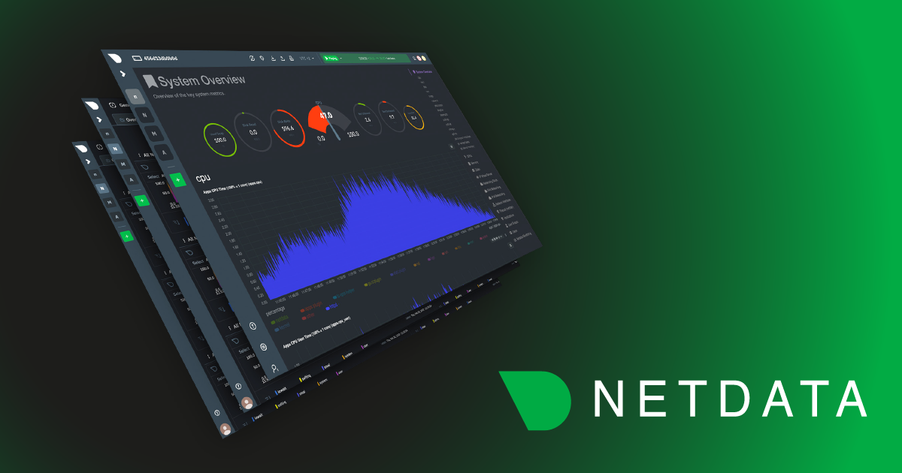

In today's fast-paced digital landscape, 24-hour operations centers play a crucial role in managing and monitoring large-scale infrastructures. These centers must be equipped with an effective monitoring solution that addresses their unique needs, enabling them to respond quickly to incidents and maintain optimal system performance. Netdata, a comprehensive monitoring solution, has been designed to meet these critical requirements with its advanced capabilities and recent enhancements.

In this article, we will explore how Netdata's powerful features can transform the way 24-hour operations centers monitor and manage their complex environments, leading to improved incident detection, faster troubleshooting, and better overall system performance.

<!--truncate-->

## The importance of real-time monitoring in Operations Centers

Real-time monitoring and alerting are crucial for 24-hour operations centers to detect and respond to incidents promptly, ensuring the optimal performance of their infrastructures. Netdata has been designed with a strong focus on real-time capabilities, making it an ideal choice for demanding operations centers across various industries, including healthcare, finance and trading, industrial, and more.

Netdata's unified, high-performance metrics processing pipeline allows for seamless integration between data collection, visualization, anomaly detection, metric correlation, and health checks, enhancing efficiency and providing continuous monitoring.

1. **1-second granularity**

    Netdata collects and stores metrics at a standard 1-second granularity, providing detailed insights into system and application performance with high precision.

2. **Low-latency data collection and visualization**

    Netdata provides a 1-second latency from data collection to visualization even when millions of samples per second are collected, enabling operations center engineers to access up-to-date information on their infrastructures' status and promptly identify and resolve issues.

3. **Real-time anomaly detection and prediction**

    Netdata offers real-time anomaly detection and prediction for all metrics, allowing users to spot anomalies immediately (just 1 second after collection) based on past behavior of the same metric.

4. **Real-time data manipulation without a query language**

    Netdata dashboards provide the ability to slice and dice data in real-time without the need for a query language, allowing operations center engineers to focus on analyzing data and troubleshooting issues quickly, without requiring additional skills to edit or improve the dashboards during crises.

5. **Real-time metric correlations**

    Netdata enables users to correlate metrics in real-time, identifying metrics that behave similarly or seem to depend on each other. This feature aids in discovering relationships between different system components and assists in root cause analysis.

6. **Real-time health checks**

    Netdata supports real-time health checks with per-second granularity, ensuring continuous monitoring of system performance and prompt detection of potential issues.

7. **Real-time Netdata functions**

    Netdata functions allow the on-demand real-time execution of standardized and custom functions to gain non-metric insights from the monitored systems. Using these functions Operations Centers can get details on the queries running on a relational database server, the processes running on a system, or even custom actions to be performed to solve common issues, like restarting a process, or even rebooting a server.

8. **Real-time streaming and centralization**

    Netdata supports real-time streaming of metrics to centralization points, allowing dedicated operations center parent servers to have all the retention they need and work autonomously. This feature enhances the flexibility and efficiency of monitoring large-scale environments.

9. **Stream architecture**

    With all functions integrated into a single processing pipeline, Netdata simplifies deployment, maintenance, and scaling, making it easier for operations center engineers to manage their monitoring solution.

    Netdata's commitment to real-time monitoring and alerting across all its aspects, along with its efficient use of resources, makes it an ideal monitoring solution for various demanding operations centers. By providing high-resolution data and powerful real-time features, Netdata empowers operations center engineers to maintain constant vigilance over their infrastructures, respond quickly to potential issues, and minimize the impact of incidents on system performance and end-user experience.

## Scalability, Reliability, and Comprehensive Visibility with Netdata

For 24-hour operations centers, scalability, reliability, and comprehensive visibility are vital aspects of a monitoring solution. Netdata's recent advancements and design principles address these needs, providing a powerful and robust monitoring solution that can adapt to the growing demands of modern infrastructures.

1. **Vertical Scalability**

    Netdata's internal database engine offers impressive vertical scalability, achieved through a highly optimized data collection methodology based on the NIDL (Nodes, Instances, Dimensions, Labels) framework. This design separates metadata transmission and metric values ingestion, resulting in unparalleled performance in data collection, even for large-scale infrastructures.

2. **Distributed Data Ingestion and Storage**

    The streaming protocol of Netdata agents supports high-performance distributed data ingestion rates of several million points per second, allowing users to create multiple metrics centralization points within their infrastructure. This distributed architecture also enables partitioning of the infrastructure and promotes the efficient storage of metrics across the network, resulting in a distributed database that ensures high availability and fault tolerance.

3. **Horizontal Scalability**

    Netdata Cloud provides extreme horizontal scalability by breaking down queries into smaller pieces that individual agents or centralization points (called "parents") can perform using their dataset. Netdata Cloud then merges all responses together to provide a comprehensive view of the infrastructure.

4. **Infrastructure Segmentation and Role-based Control**

    Netdata Cloud allows segmenting the infrastructure into rooms, which can represent individual customers, services, or components of the infrastructure. Role-based access control ensures that only authorized users can access these rooms, maintaining the security and privacy of the monitoring data.

5. **Database Tiering and Unlimited Retention**

    Netdata can downsample metric samples over time, save space, and increase retention while maintaining the essential details of the original dataset. This feature allows Netdata to support virtually unlimited retention, provided there is enough disk space.

6. **Comprehensive Visibility**

    With hundreds of data collection integrations, Netdata offers extensive coverage for monitoring various systems and applications, including Linux, FreeBSD, macOS, Kubernetes, Docker, and Windows systems. With support for monitoring web servers, database servers, message brokers, storage systems, even Windows applications like Active Directory, IIS, and MSSQL, Netdata ensures that operations center engineers have visibility into all critical components of their infrastructure.

7. **Multi-tenancy and Audit Logs**

    Netdata Cloud has been enhanced to support multi-tenancy, allowing organizations to manage multiple tenants within a single monitoring solution. Additionally, audit logs for users and systems enable effective tracking and management of access and activities within the monitoring environment.

8. **Infrastructure-wide Dashboards**

    Netdata Cloud can serve as a multi-node, infrastructure-wide dashboard, providing automated and real-time insights across the entire infrastructure, which is essential for maintaining a holistic view of system performance.

    By addressing the needs of scalability, reliability, and comprehensive visibility, Netdata offers a robust monitoring solution that can adapt to the growing demands of modern infrastructures. This ensures that 24-hour operations centers can effectively manage and monitor their complex environments, leading to improved incident detection, faster troubleshooting, and better overall system performance.

## Intelligent Alerting and Incident Prioritization with Netdata

Efficient incident management is critical for 24-hour operations centers, and intelligent alerting and incident prioritization play a vital role in ensuring prompt and effective response to issues. Netdata's sophisticated alerting mechanisms and anomaly detection capabilities enable operations center engineers to focus on the most pressing problems, reducing time to resolution and minimizing the impact on system performance.

1. **Predefined Alerts**

    Netdata comes with hundreds of predefined alerts, battle-tested by the community, which cover a wide range of common issues and performance bottlenecks. These alerts are designed to help operations center engineers quickly identify and address potential problems in their infrastructure.

2. **Dynamic Alert Thresholds**

    Almost all predefined alerts shipped with Netdata avoid fixed thresholds, relying instead on rolling windows or anomaly detection. This dynamic approach to alerting ensures that alerts remain relevant and effective in the ever-changing landscape of modern infrastructure.

3. **Alert Templates**

    Netdata supports alert templates that can be automatically applied to instances of applications or components monitored. Operations centers can create templates for various services, such as PostgreSQL servers, databases, tables, network interfaces, containers, nodes, system services and virtually any infrastructure component. These templates enable streamlined and consistent alerting across the entire infrastructure, ensuring comprehensive monitoring.

4. **Real-time Anomaly Detection**

    Netdata's real-time anomaly detection identifies deviations from normal behavior for all metrics, allowing engineers to spot potential issues as they emerge. This timely identification of anomalies helps prioritize incidents, ensuring rapid response and preventing issues from escalating.

5. **Machine Learning-based Prediction**

    Netdata employs cutting-edge machine learning models to predict the future behavior of each metric, further enhancing incident prioritization. By identifying metrics with high chances of anomalous behavior, engineers can proactively address issues before they lead to service degradation or downtime.

6. **Customizable Alerts**

    In addition to predefined alerts and alert templates, Netdata allows operations center engineers to create custom alerts tailored to their specific infrastructure needs, ensuring that they receive notifications for events that are truly important. This flexibility in alert configuration helps prevent alert fatigue and keeps the focus on incidents that require immediate attention.

7. **Metrics Correlations** 

    Netdata's real-time metric correlation feature helps engineers identify relationships between different system components and metrics that behave similarly or seem to depend on each other. This information aids in root cause analysis and incident prioritization, ensuring that engineers can quickly address the underlying causes of performance issues.

8. **Automated Troubleshooting Assistance**

    Netdata's anomaly advisor and metrics correlation features provide automated assistance for troubleshooting, helping operations center engineers identify potential issues and solutions faster. This automation reduces the time spent on manual analysis and speeds up incident resolution.

9. **Integration with Incident Management Tools**

    Netdata can integrate with popular incident management tools, ensuring seamless communication and collaboration between operations center engineers and other teams within the organization. This integration streamlines the incident response process and facilitates faster resolution of issues.

    By offering intelligent alerting and incident prioritization capabilities, Netdata empowers 24-hour operations centers to efficiently manage incidents, respond rapidly to critical issues, and minimize the impact on system performance and end-user experience. With Netdata, operations center engineers can focus on the most pressing problems, ensuring timely resolution and maintaining the reliability and performance of their infrastructure.

## Empowering Non-Expert Staff with Netdata

### User-friendly interface and contextual insights

Netdata is designed with a user-friendly interface that makes it accessible to non-expert staff, enabling them to effectively monitor and manage system performance. Contextual insights provided by Netdata help staff understand the meaning behind metrics and alerts, making it easier for them to diagnose and address issues. By offering intuitive visualizations and dashboards that provide all the necessary means to slice and dice the data via a simple UI without the need to use a query language, Netdata ensures that non-expert staff can quickly grasp complex system information and make informed decisions.

### Intelligent alerting and guided troubleshooting features

Netdata's intelligent alerting system helps non-expert staff prioritize and respond to incidents efficiently. By reducing alert fatigue and ensuring that only actionable issues are brought to their attention, staff can focus on resolving problems and maintaining system stability. Additionally, Netdata's guided troubleshooting features offer step-by-step assistance, empowering non-expert staff to identify root causes and implement solutions without the need for escalation to senior team members.

### Seamless integration with third-party services and automation capabilities

Netdata's ability to seamlessly integrate with a wide range of third-party services further simplifies the monitoring process for non-expert staff. This integration allows them to manage multiple services and tools from a single platform, streamlining their workflows and reducing the learning curve associated with multiple monitoring solutions. Furthermore, Netdata's automation capabilities help non-expert staff by automating repetitive tasks, enabling them to focus on more critical aspects of incident management and improving their overall efficiency.

## Netdata's Impact on Incident Response Times

### Decreasing mean time to resolution (MTTR) with real-time monitoring

Netdata's real-time monitoring capabilities have a significant impact on incident response times, as they enable non-expert staff to quickly identify and address issues. By providing instant access to crucial system performance data, Netdata allows staff to detect problems early and respond proactively, reducing the mean time to resolution (MTTR) for incidents. This prompt response helps minimize downtime, ensuring that system stability is maintained and users are not adversely affected.

### Enhancing staff efficiency and reducing the need for escalation

With its user-friendly interface, contextual insights, and guided troubleshooting features, Netdata empowers non-expert staff to handle incidents more effectively. This empowerment not only improves staff efficiency but also reduces the need for escalation to senior team members, freeing up valuable resources within the organization. As a result, operations centers can maintain high levels of system reliability with fewer resources, ultimately benefiting the entire organization.

## Conclusion

Netdata's real-time monitoring solution offers a range of benefits for operations centers, including rapid incident detection and response, improved system reliability, and the empowerment of non-expert staff to effectively manage incidents. By providing a user-friendly interface, contextual insights, and seamless integration with third-party services, Netdata enables non-expert staff to take control of system performance and maintain high levels of uptime and reliability.

Given its proven track record in enhancing incident response times and overall system reliability, Netdata is a game-changing tool for operations centers. Organizations seeking to optimize their monitoring processes and empower their non-expert staff should consider implementing Netdata as part of their monitoring strategy. By doing so, they can expect to experience significant improvements in system performance, staff efficiency, and overall organizational success.
