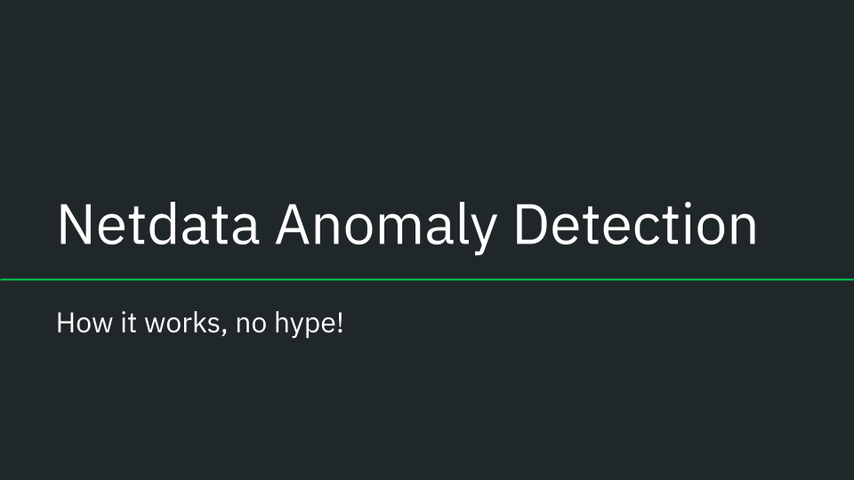

How does Netdata's [machine learning (ML) based anomaly detection](https://learn.netdata.cloud/docs/troubleshooting-and-machine-learning/machine-learning-ml-powered-anomaly-detection) actually work? Read on to find out!

<!--truncate-->

## Design considerations

Lets first start with some of the key design considerations and principles of Netdata's anomaly detection (_and some comments in parenthesis along the way_):

1. We don't have any labels or examples of previous anomalies. This means we are in an [unsupervised setting](https://en.wikipedia.org/wiki/Unsupervised_learning) (_best we can try to do is learn what "normal" data looks like assuming the collected data is "mostly" normal_).
1. Needs to be lightweight and run on the agent (_or a parent_).
   - Need to be very careful of impact on CPU overhead when training and scoring (_lots of cheap models are better than a few expensive and heavy ones_).
   - Models themselves need to be small so as to not drastically increase the agents memory footprint (_model objects need to be small for storage_).
   - This has implications for the ML formulation (_sorry - no deep learning models yet) and its implementation (we need to be surgical and optimized_).
1. Needs to scale for thousands of metrics and score in realtime every second as metrics are collected.
   - Typical Netdata nodes have thousands of metrics and we want to be able to score every metric every second with minimal latency overhead (_we need to use sensible approaches to training like spreading the training cost over a wide training window_).
1. Needs to be able to handle a wide variety of metrics.
   - There is no single perfect model or approach for all types of metrics so we need a good all rounder that can work well enough across any and all different types of time seres metrics (_for any given metric of course you could handcraft a better model but thats not feasible here, we need something like a "weak learners" approach of lots of generally useful models adding up to "more than the sum of their parts"_).
1. Needs to be written in C or C++ as that is the language of the Netdata agent (_We are using [dlib](https://github.com/davisking/dlib) for the current implementation_).
1. We Need to be very careful about taking big or complex dependencies if using third party libraries.
   - We want to be able to easily build and deploy Netdata on any Linux system without having to worry about installing or managing complex dependencies (_we need to be careful of more complex algorithms that would have larger dependencies and potentially limit where Netdata can run_).

The above considerations are important and useful to keep in mind as we explore the system in more detail.

## Two Important Concepts

Key to understanding how anomaly detection works in Netdata are two important concepts:

1. [Anomaly Bit](#anomaly-bit): The anomaly bit is the 0 (normal) or 1 (anomalous) generated each time a metric is collected.
1. [Anomaly Rate](#anomaly-rate): The anomaly rate is the percentage of anomaly bits that are 1 (anomalous) over a given time window and/or set of metrics.

### Anomaly Bit

The core concept underlying how anomaly detection works in Netdata is the "[Anomaly Bit](https://learn.netdata.cloud/docs/troubleshooting-and-machine-learning/machine-learning-ml-powered-anomaly-detection#anomaly-bit---100--anomalous-0--normal)". The anomaly bit is the basic lego block on which everything else is built.

The simplest way to think about the anomaly bit is that in addition to Netdata collecting a raw metric each second (e.g. cpu usage) if also generates a corresponding anomaly bit. The anomaly bit is a single bit (literally it is a bit in the [internal storage representation of the agent](https://github.com/netdata/netdata/blob/89f22f056ca2aae5d143da9a4e94fcab1f7ee1b8/libnetdata/storage_number/storage_number.c#L83)) that is either 0 (normal) or 1 (anomalous) based on the pattern of very recent last few collected values for the metric (more on this later).

To be as clear as possible - [here](https://london.my-netdata.io/api/v1/data?chart=system.cpu&dimensions=user&after=-10) you can see some recent raw `user` system cpu metrics from one of our [demo nodes](https://learn.netdata.cloud/docs/getting-started/live-demos). It should look something like this:

```json title='raw [user] metric from [system.cpu] chart'
{
        "labels":["time","user"],
        "data":[
            [1684852570,0.7518797],
            [1684852569,0.5076142],
            [1684852568,1.2531328],
            [1684852567,0.75],
            [1684852566,0.2518892],
            [1684852565,0.5050505],
            [1684852564,0.5076142],
            [1684852563,0.7575758],
            [1684852562,0.5089059],
            [1684852561,0.5089059]
        ]
    }
```

[Here](https://london.my-netdata.io/api/v1/data?chart=system.cpu&dimensions=user&after=-10&options=anomaly-bit) (by adding the `options=anomaly-bit` param) are the corresponding anomaly bits (probably mostly all `0` in this example):

```json title='[user] anomaly bit from [system.cpu] chart'
{
        "labels":["time","user"],
        "data":[
            [1684852570,0],
            [1684852569,0],
            [1684852568,0],
            [1684852567,0],
            [1684852566,0],
            [1684852565,0],
            [1684852564,0],
            [1684852563,0],
            [1684852562,0],
            [1684852561,0]
        ]
    }
```

### Anomaly Rate

The beauty of the anomaly bit is that as soon as we aggregate beyond 1 second in time (or for that matter if you aggregate across multiple metrics or nodes but for the same point in time, you can ignore this for now) the anomaly bit turns into an "[Anomaly Rate](https://learn.netdata.cloud/docs/troubleshooting-and-machine-learning/machine-learning-ml-powered-anomaly-detection#anomaly-rate---averageanomaly-bit)". 

It is literally the percentage of time in a window that the Netdata agent considered the raw metric values to be anomalous.

So in the same way that Netdata, in addition to collecting each raw metric also has a corresponding "Anomaly Bit", for each time series in Netdata there is also a corresponding "Anomaly Rate" time series for that metric.

Again an example might help - [here](https://london.my-netdata.io/api/v1/data?chart=system.cpu&dimensions=user&after=-60&before=0&points=6) is the same `user` system cpu metric from earlier for the last 60 seconds but aggregated to 10 second intervals.

```json title='10s [user] metric from [system.cpu] chart'
{
        "labels":["time","user"],
        "data":[
            [1684852770,0.5797338],
            [1684852760,0.7823281],
            [1684852750,0.6829874],
            [1684852740,0.7056189],
            [1684852730,0.9331536],
            [1684852720,0.681133]
        ]
    }
```

And [here](https://london.my-netdata.io/api/v1/data?chart=system.cpu&dimensions=user&after=-60&before=0&points=6&options=anomaly-bit) is the corresponding anomaly rate for this metric.

```json title='10s [user] anomaly rate from [system.cpu] chart'
{
        "labels":["time","user"],
        "data":[
            [1684852770,0],
            [1684852760,0],
            [1684852750,0],
            [1684852740,0],
            [1684852730,0],
            [1684852720,0]
        ]
    }
```

So the last building block then is the concept of the "Anomaly Rate" which really is just some (typically average) aggregation over a set of anomaly bits.

Congratulations! We now have all the building blocks needed to understand how anomaly detection works in Netdata.

## So how does the ML actually work then?

Now that we understand the anomaly bit and anomaly rate concepts, all that is left is to understand how the anomaly bit itself gets flipped from its default of 0 (normal) to 1 (anomalous). This is where the ML comes in.

As of writing (and we expect this will change over time as we work on the ML), Netdata uses an [unsupervised](https://en.wikipedia.org/wiki/Unsupervised_learning) anomaly detection approach based on [K-means clustering](https://en.wikipedia.org/wiki/K-means_clustering) under the hood (k=2 for the hard core ML folks reading this).

The basic idea is that we train (and regularly retrain) K-means model(s) for each metric. As raw metrics are collected they are scored against a set of trained models (spanning for example the last 24 hours - discussed in [this blog post](https://blog.netdata.cloud/extending-anomaly-detection-training-window/)), if a metric is anomalous on all trained models then the anomaly bit is flipped to 1 (anomalous). This is based on an internal score that essentially is the [euclidean distance](https://en.wikipedia.org/wiki/Euclidean_distance) of the most recent data to the cluster centers of the trained models.

:::note
If you would like to dive deeper checkout [this deepdive notebook](https://github.com/netdata/netdata/blob/master/ml/notebooks/netdata_anomaly_detection_deepdive.ipynb), [this slide deck](https://docs.google.com/presentation/d/18zkCvU3nKP-Bw_nQZuXTEa4PIVM6wppH3VUnAauq-RU/edit?usp=sharing) or [this YouTube Video](https://youtu.be/L1xleckyuDQ).
:::

<details>

<summary>Click see some slides illustrating going from raw metrics to anomaly rate.</summary>

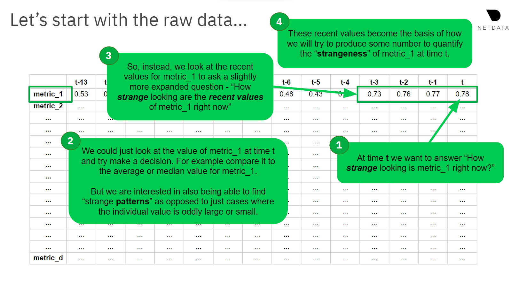

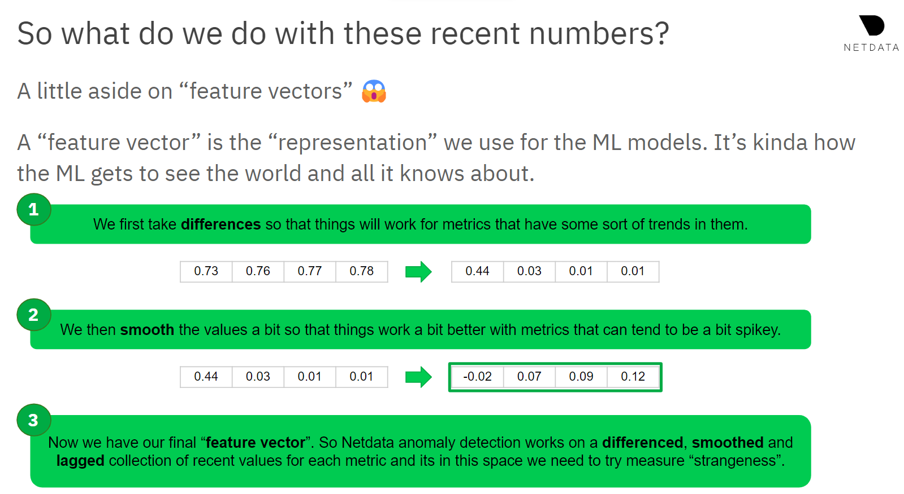

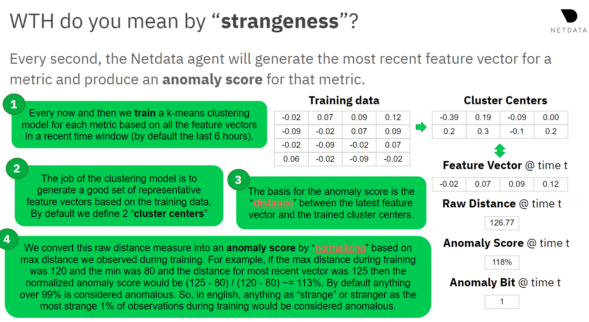

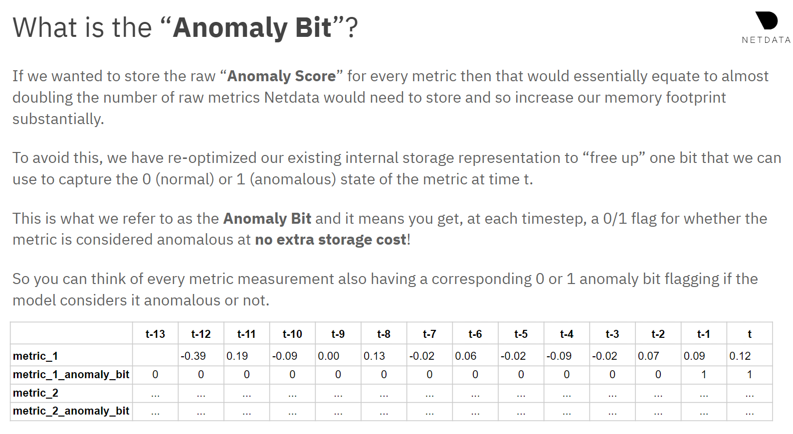

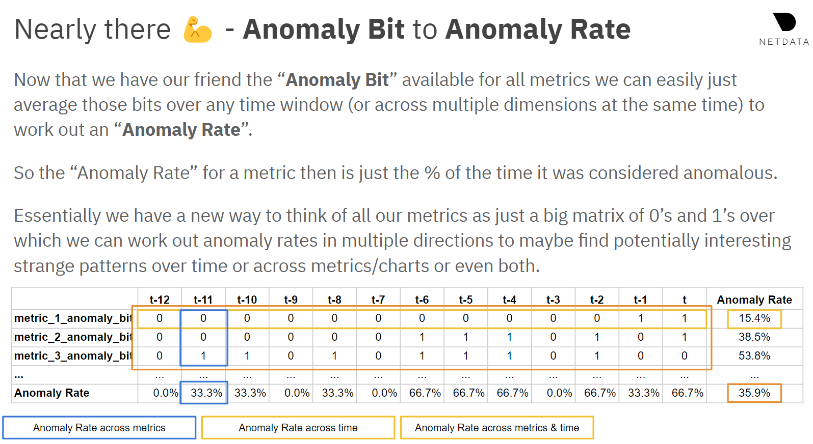

[Netdata Anomaly Detection - Slides](https://docs.google.com/presentation/d/18zkCvU3nKP-Bw_nQZuXTEa4PIVM6wppH3VUnAauq-RU/edit?usp=sharing)

</details>

## Putting it all together

So now we have all the pieces to understand how anomaly detection works in Netdata. Let's see where the various parts of the Netdata UI fit in.

### Anomaly Rate Ribbon

The [anomaly rate ribbon](https://learn.netdata.cloud/docs/getting-started/monitor-your-infrastructure/interact-with-charts#anomaly-rate-ribbon) sits at the top of every netdata chart. Brighter spots in the ribbon correspond to windows of time where one or more metrics on the chart were anomalous.

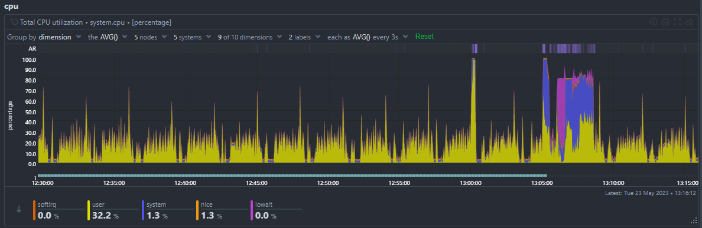

You can zoom and and hover on the ribbon to see what the AR% was for that window of time for each metric.

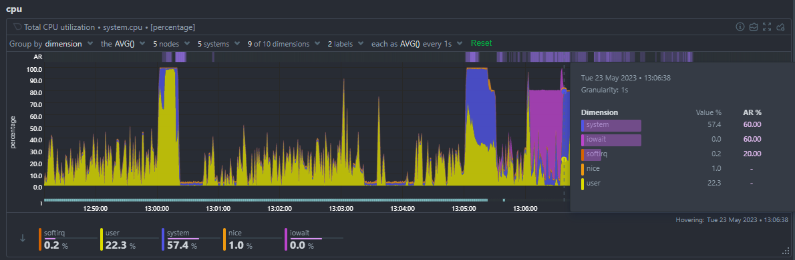

### Node Anomaly Rate Chart

The [node anomaly rate](https://learn.netdata.cloud/docs/troubleshooting-and-machine-learning/machine-learning-ml-powered-anomaly-detection#node-anomaly-rate) chart (`anomaly_detection.anomaly_rate`) gives an overall anomaly rate across all metrics and nodes as a single high level time series.

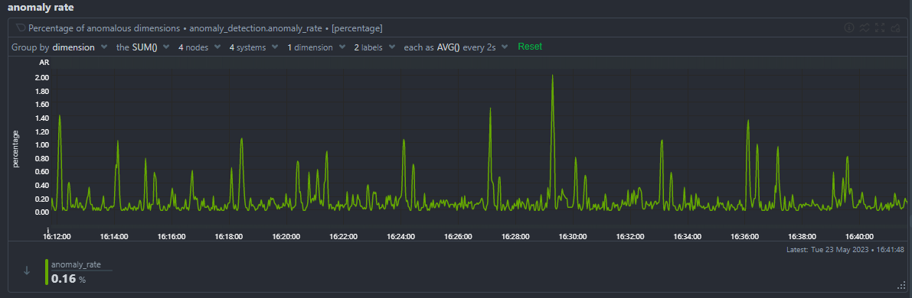

You can of course group by node to see the anomaly rate for each node.

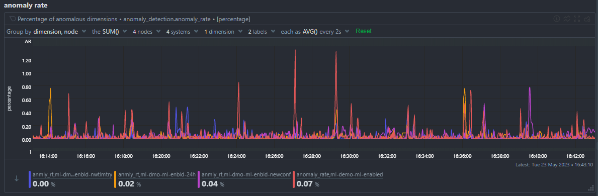

### Anomaly Advisor

The [Anomaly Advisor](https://learn.netdata.cloud/docs/troubleshooting-and-machine-learning/anomaly-advisor) (anomalies tab) builds on the node anomaly rate and lets you drill down into the metrics that are contributing to the overall anomaly rate.

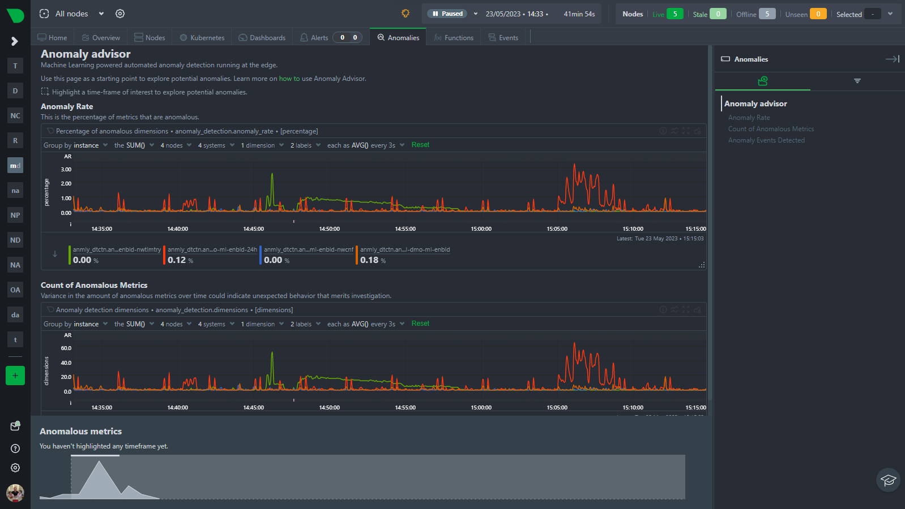

You can highlight and area to see an ordered list of the most anomalous metrics in that window of time.

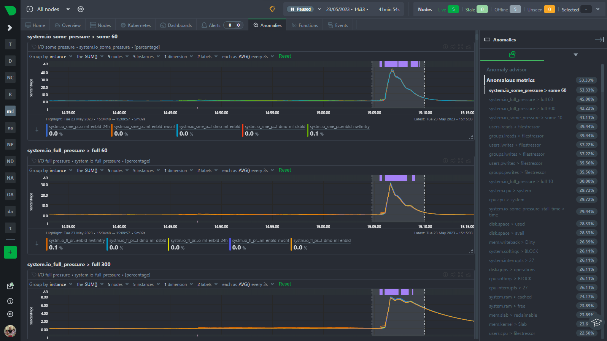

## Learn More!

Stay tuned as we plan on doing a series of posts like this to dive deeper into how ML works in Netdata and various related topics from tips and tricks to configuration options and more. In the meantime below is a list of useful links and resources you might be interested in if you have read this far 🙂

- [Netdata Learn ML Docs](https://learn.netdata.cloud/docs/troubleshooting-and-machine-learning/machine-learning-ml-powered-anomaly-detection).
- [Netdata Machine Learning Roadmap](https://github.com/orgs/netdata/projects/54/views/1).
- [Netdata YouTube ML Playlist](https://youtube.com/playlist?list=PL-P-gAHfL2KPeUcCKmNHXC-LX-FfdO43j).
- [All ML related blog posts](https://blog.netdata.cloud/tags/machine-learning/).
- [Netdata Anomaly Detection Deepdive Notebook](https://github.com/netdata/netdata/blob/master/ml/notebooks/netdata_anomaly_detection_deepdive.ipynb).
