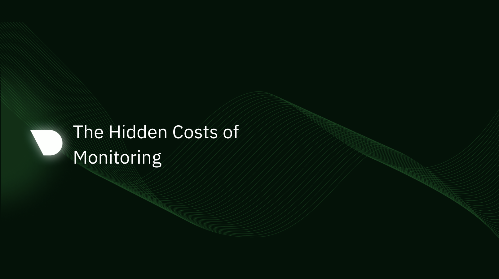

When it comes to monitoring IT infrastructure, the costs you see on the price tag of the tool are often just the tip of the iceberg. Below the waterline, a mass of hidden costs can lurk, which can significantly affect the total cost of ownership.

<!--truncate-->

In this blogpost we will cover the analysis of two traditional monitoring domains, Open Source observability and Commercial Centralized observability solutions, focusing the direct and indirect impacts when implementing these solution. In summary:
- IT teams face challenges with conventional monitoring tools due to their complexity, time-consuming setup procedures and steep learning curve. 
- Traditional monitoring systems often pose a balancing act between data quality and quantity vs system and cost overheads.
- Most commercial monitoring systems may result in unforeseen expenses due to data transfer egress costs associated with their operations.
- There also often an issue with the retention of data, as storing data for a longer period (on vendor's cloud) can result in elevated costs (leave alone the security aspect).
- Most commercial monitoring systems, charge a premium for using their advanced features and can burn a hole in your pockets. The cost of scaling your infrastructure may result in an exponential increase in the monitoring costs.
- Detailed monitoring acquired through granular, high-resolution metrics can improve the quality of insights and so reducing the time to troubleshoot. The cost of delayed RCAs can reach 6 digit figures in a matter of minutes.
- Tool with enhanced usability decrease the need of training or hiring specialized individuals, individuals with varying ranges of expertise should readily understand and use it.
- The adoption of an optimal tool can lead to significant cost savings, increased transparency, and improved system reliability.
- There is a need to adopt monitoring tools that are simple, customizable, and scalable to address these challenges and hidden costs.

## Prometheus & Grafana (Open Source Monitoring references)

While Prometheus and Grafana are both open-source, they come with considerable hidden costs, mainly due to their complexity and the time required to effectively set them up and maintain them.

Here's a closer look at these:

### Setup Complexity

Prometheus and Grafana are powerful, flexible tools, but this flexibility comes with a significant degree of complexity. They both require careful, manual setup and configuration to match your specific use case. Depending on the size and complexity of your environment, this setup could take a significant amount of time and require a high level of expertise, resulting in substantial initial costs.

### Maintenance Costs

These tools are not "set and forget". They require ongoing maintenance to ensure they're running correctly, are secure, and are kept up to date. If you don't have the in-house expertise, this could mean hiring new staff or training your existing team, which could lead to substantial long-term costs.

### Integration Costs

Getting Prometheus and Grafana to play nicely with all the systems and services you want to monitor might take significant time and effort. Each new service might require a new exporter to be installed and configured for Prometheus, increasing drastically the amount of moving parts in your monitoring stack. Also, monitoring more components and applications requires additional effort to set up visualizations and alerts for them.

### Scaling Costs

If your infrastructure grows, so too does the time and complexity required to maintain your Prometheus and Grafana setup. Although there are plenty of solutions that allow such a setup to scale, the complexity and the additional components required make it a lot more complex, adding significant to the overall cost.

### Opportunity Costs

The time your team spends setting up, configuring, and maintaining Prometheus and Grafana is time they can't spend on other tasks. This is a hidden cost that many companies overlook.

Prometheus and Grafana are robust tools that have been successfully employed by many organizations around the world, ranging from small businesses to large enterprises. When set up and configured correctly, they can provide comprehensive, detailed insights into your infrastructure and applications. However, their effectiveness, completeness, and efficiency often depend largely on the setup process and ongoing management.

Here are a few points to consider:

### Completeness

The level of detail and completeness you get from Prometheus largely depends on how thoroughly it's set up. You need to manually install and configure exporters for each system, component or service you want to monitor. If you miss a system or service, or if an exporter isn't available or misconfigured, you might end up with blind spots in your monitoring.
 
The task of creating dashboards in Grafana that provide a comprehensive view of a service or component can be time-consuming and requires a deep understanding of both the data being visualized and Grafana's capabilities. Each service or component could expose hundreds or even thousands of individual metrics, and each one of those could potentially need its own panel on a Grafana dashboard.

Often, organizations only create dashboards for the most critical or straightforward metrics due to the time and effort involved in creating and maintaining them. As a result, many potentially useful metrics might be collected by Prometheus but are never visualized or monitored effectively in Grafana. This could lead to a significant blind spot in your monitoring coverage, as important information might be missed. It could also mean that you're not making full use of the data you're collecting, reducing the return on your investment in your monitoring setup.

### Fit for Purpose

Prometheus and Grafana are flexible, powerful tools, so they can be configured to fit a wide variety of use cases. However, this flexibility comes at the cost of complexity. Achieving a setup that fits your exact needs often requires deep expertise and a significant time investment.

If the necessary Grafana dashboards haven't been set up in advance for all relevant metrics, incident resolution can be significantly slower than expected. Troubleshooting often involves exploring metrics that might not have seemed important or relevant before the incident. If the dashboards for these metrics aren't already set up in Grafana, teams might have to scramble to create them in the middle of an incident. This can slow down time-to-resolution and add stress to an already high-pressure situation.

While Grafana's flexibility allows it to create virtually any dashboard you can imagine, this requires foresight and manual effort. If you don't anticipate all the metrics you might need in a future incident, you could find yourself unprepared when one occurs.

Moreover, not all issues are predictable, and the metrics that might seem non-critical during a peaceful period might suddenly become important during an incident. Thus, a monitoring solution should ideally be comprehensive, and cover a broad range of metrics by default, to cater to these unpredictable scenarios.

### Efficiency & Effectiveness

Grafana allows users to create a large number of highly customizable dashboards, and each dashboard can have numerous panels. This flexibility is powerful, but without disciplined organization and naming conventions, things can quickly become confusing.

When multiple users or teams are creating dashboards, it's easy to end up with duplicates, slightly different versions of the same dashboard, or even experimental or 'quick-and-dirty' dashboards that were created for a specific purpose and then forgotten. Over time, this can lead to a cluttered and confusing environment, where finding the right dashboard becomes a task in itself.

While Grafana does provide features to manage this, such as folders and tags for dashboards, as well as permissions to control who can view or edit them, it relies heavily on user discipline to maintain an organized workspace. However, in a fast-paced environment, maintaining this discipline can be challenging. This could result in users struggling to find the right dashboards when they need them or even creating new ones because they can't find an existing one that suits their needs.

This underlines the importance of governance, clear conventions, and perhaps even periodic clean-ups to ensure Grafana remains efficient to navigate.

So, while Grafana can be highly efficient in terms of data visualization, maintaining organizational efficiency can be challenging, even for smaller organizations.

### Scalability

While Prometheus is designed to handle a large amount of data and has built-in support for high availability and federation, managing and maintaining this as your environment grows can be challenging and time-consuming.

Scaling Prometheus and Grafana is not a straightforward process. It requires planning and careful configuration. Sharding, Federation, and utilizing remote storage systems are possible strategies, but each adds its own complexity.

Additionally, prometheus is not designed to be a long-term data storage system. By default, it only stores data for 15 days. If you need longer data retention, you'll have to integrate Prometheus with a remote storage solution, which adds another layer of complexity.

If you take the simple path and set up multiple Prometheus servers to handle your environment's scale, you might lose a centralized view of your metrics unless you carefully configure federation or use a global view query layer like Thanos or Cortex.

It is common for a larger setup, to find yourself spending more time managing your monitoring system. For example, you'll need to configure and maintain each Prometheus instance, manage data retention policies, and ensure that your Grafana dashboards are kept up to date with any changes in your environment.

So, while Prometheus and Grafana are capable of scaling, it requires considerable effort, planning, and resources to do so effectively.

### Alerting

Both Prometheus and Grafana alerting systems are based on defining rules and conditions to trigger alerts, and these rules are separate from the dashboards you create for visualizing your data. In other words, you need to create all alerts, one by one, by hand, as you do for dashboards.

Is it easy to create an alert for any metric that Prometheus collects, whether you have a corresponding Grafana dashboard for it or not. This can lead to situations where you are alerted about a problem with a metric that you don't visualize making troubleshooting a lot more time-consuming as you might have to create a new panel or even a new dashboard to visualize the problematic metric and understand what's going wrong.

Striking the right balance with alerting is tricky - you don't want so many alerts that it creates noise and leads to alert fatigue, but at the same time, you don't want so few alerts that critical issues go unnoticed.

Engineers often take a conservative approach, where the fear of alert noise, the complexity and the time required to set up alerts, or even the lack of expertise, leads to under-monitoring. This can leave an infrastructure vulnerable and significantly increase the time it takes to detect and resolve issues, which can, in turn, impact service quality, customer experience, and even revenue.

In conclusion, while Prometheus and Grafana are powerful, comprehensive monitoring solutions, achieving a setup that is complete, fit for purpose, and efficient often requires considerable expertise, time, and ongoing effort.

## Datadog, Dynatrace, NewRelic (Commercial Centralized Monitoring references)

_"The DataDog pricing model is actually pretty easy. For 500 hosts or less, you just sign over your company and all its assets to them. If >500 hosts, you need to additionally raise VC money." - [wingerd33](https://www.reddit.com/r/devops/comments/13ky2iq/datadog_where_does_it_hurt/?utm_source=share&utm_medium=web2x&context=3) on reddit_

Commercial monitoring SaaS solutions can offer considerable benefits, including ease of use, reduced maintenance, seamless integrations, and access to advanced features. However, these benefits come with their own challenges, including potentially high costs, the risk of vendor lock-in, data ownership, and privacy concerns.

So, although a commercial solution is usually faster to deploy and easier to use, there are many hidden costs associated with them.

Let’s see a few of them:

### Complicated Cost Structure

Commercial solutions often come with substantial costs that scale with the size of your monitored environment. These costs can quickly add up, especially for larger infrastructures or for organizations that require access to high resolution data.

Usually, vendors use their pricing models for differentiating their offerings, ending up charging based on a variety of factors, such as the number of hosts, containers, or services being monitored; the volume of data ingested; the number of custom metrics; the number of high resolution metrics; the volume of data retention; and many more.

On top of this, it is usual for certain features or capabilities to be only available at a premium or additional charges, leading frequently to unexpected costs.

All these make it hard to predict your costs accurately. It's a common complaint among users that the pricing of monitoring providers makes it challenging to predict and control costs. This means that optimizing your monitoring for cost can require a considerable amount of effort and expertise. You'll need a deep understanding of the tool's pricing model and the specifics of your environment. And as your environment and monitoring needs evolve, you'll likely need to revisit these decisions regularly.

While these practices are not universal and many vendors strive to be transparent and fair in their pricing, they still are not rare. When using commercial monitoring providers, the process of cost optimization is an ongoing task that usually requires a level of effort and expertise comparable to maintaining an on-premises monitoring solution like Prometheus and Grafana.

### Hidden Indirect Costs

Egress cost (or data transfer cost) can be a substantial hidden cost when using cloud-based monitoring services. Egress costs are the charges that you incur when transferring data from your cloud environment to another location, such as the monitoring provider's servers.

Cloud providers like Amazon AWS, Google Cloud, or Microsoft Azure typically don't charge for inbound data transfer (ingress) but do charge for outbound data transfer (egress). The cost model may seem negligible at first, particularly if data volumes are low or if the cloud provider offers a certain amount of free outbound data transfer. However, when you're continuously streaming monitoring data out of your cloud environment to a SaaS monitoring solution, these costs can add up quickly.

The specific costs will vary based on the cloud provider, the amount of data being transferred, and the geographic locations of the data source and destination. In some cases, transferring data between regions or out of the cloud provider's network entirely can be more expensive.

These costs are typically separate from the fees charged by the monitoring solution itself. While the monitoring provider may charge based on the volume of data ingested or the number of hosts, services, or containers being monitored, they generally don't cover the costs of transferring the data to their service. That means you'll need to account for both the monitoring service's fees and your cloud provider's data transfer costs when calculating the total cost of the solution.

So, if your monitoring strategy involves sending large volumes of data from your cloud environment to a SaaS monitoring service, it's essential to factor in the potential egress costs. Otherwise, you may find yourself facing unexpectedly high cloud bills.

### Vendor Lock-In

Vendor lock-in is another significant consideration when evaluating monitoring solutions, as it can lead to hidden costs down the line. It happens when a business becomes overly reliant on a particular vendor and finds it difficult to switch to another solution due to technical, financial, or contractual constraints.

#### Technical Constraints

Technical constraints are often the most obvious form of vendor lock-in. These occur when a business's systems are so tightly integrated with a particular vendor's product that switching to a different solution would be technically challenging. Examples of technical constraints include:

* **Proprietary Technology**: If the vendor's product uses proprietary technology or standards, it might not be compatible with other systems or tools. This can make it difficult to switch vendors without undergoing a significant technical overhaul.
* **Data Portability**: If the vendor's product doesn't offer a way to easily export your data, or if it stores data in a proprietary format, moving that data to a new system could be a significant technical challenge.
* **System Complexity**: If your monitoring setup is complex or highly customized, replicating it in a new system could be technically challenging.

#### Financial Constraints

Financial constraints can also contribute to vendor lock-in. These are situations where the cost of switching vendors is prohibitively high. Examples of financial constraints include:

* **Upfront Costs**: Switching to a new vendor might require a significant upfront investment, for example, in new hardware or software.
* **Transition Costs**: These include the costs of migrating data, reconfiguring systems, and training staff to use the new product.
* **Penalties and Fees**: Some vendors may charge fees for early termination of a contract or for exceeding certain usage limits.

#### Contractual Constraints

Contractual constraints occur when the terms of a contract with a vendor make it difficult to switch to a different product. Examples of contractual constraints include:

* **Long-Term Contracts**: Some vendors might require you to commit to a multi-year contract, which can make it difficult to switch vendors before the contract term is up.
* **Termination Clauses**: Some contracts might include termination clauses that require you to pay a fee if you end the contract early.
* **Exclusivity Clauses**: Some contracts might prohibit you from using a competing product for a certain period of time.

In many cases, users fail to carefully consider these factors when choosing a vendor and usually don’t have a contingency plan in place for switching vendors if necessary.

## How can Netdata Help?

Netdata is designed with efficiency, scalability, and flexibility in mind, aiming to address most of the challenges associated with both open-source tools and commercial SaaS offerings.

### Rapid and Easy Setup

Netdata’s automated features allow for quick setup and minimal maintenance. Its auto-discovery capabilities identify metric data sources instantly, while its pre-configured alerts and AI-powered anomaly detection facilitate automated oversight. Furthermore, Netdata supports Infrastructure as Code (IaC) and offers templates for automated deployment of alerts, fostering an environment for advanced automation. This rapid setup minimizes the cost of infrastructure and time investment, eliminating the complexity associated with tools like Prometheus and Grafana, offering for free an experience that is similar to commercial solutions.

### Easy to Use, Opinionated

Unlike Prometheus and Grafana that you have to set up all dashboards metric by metric, Netdata visualizes every single metric collected, without exceptions. Metrics are also organized in a way that is easy to navigate and find any metric. Of course some level of familiarity is required to understand this organization. But this is only familiarity. No skills are required except a basic understanding of the table of contents and the search functionality.

### Easy Troubleshooting

While most tools, including commercial solutions, require extensive skills to create or modify dashboards, Netdata employees the NIDL (Nodes, Instances, Dimensions, and Labels) framework, to allow both newcomers and experts quickly filter, slice and dice any chart in all imaginable ways, in a point and click fashion. Furthermore Netdata comes with a unique scoring engine (used by metric correlations and anomaly advisor) to quickly reveal how different metrics relate and affect one another, minimizing time to resolution.

### Real-Time, High-Fidelity

Netdata's emphasis on real-time capabilities ensures rapid detection and response to incidents. Its high-resolution data with 1-second granularity allows you to uncover micro-behaviors of applications and services. The system's ability to collect and visualize data in less than a second significantly accelerates troubleshooting, offering significant time and cost efficiencies. Both of these features are offered as standard for every single metric, outperforming most other open-source and commercial solutions.

### Scalability and Flexibility

With Netdata, you're not bound by the size or complexity of your infrastructure. Its vertical and horizontal scalability capabilities can meet the most demanding environments. Additionally, the smart database storage management for long term retention and the ability to set up multiple centralization points offer both efficiency and geographical freedom, addressing data sovereignty concerns and eliminating traffic egress related costs. With Netdata your data is always managed by the open-source Netdata agents you install inside your infrastructure. Your data, your way.

### Customizable and User-Friendly

Netdata provides extensive customization options, from a wide range of integrations to the ability to segment infrastructure into rooms and assign user roles and permissions. Additionally, Netdata is designed to be user-friendly, catering to both novice users and experts. The learning curve is gentle, requiring only familiarization with the organization of the dashboard and the configuration methodology.

### Secure and Private

Netdata prioritizes user data protection, being designed with a security-first approach. Its adherence to Open Source Security Foundation Best Practices ensures reliable and private operations, countering data privacy and security concerns often associated with commercial SaaS solutions. Even when users use Netdata Cloud, their metric data is not transferred and is not stored in the cloud. Metric data pass-through Netdata Cloud for the needs of visualizations only when users view Netdata Cloud dashboards, and only for the charts they view.

By combining all the above, Netdata not only meets but often exceeds the capabilities of other tools at a fraction of the cost.
