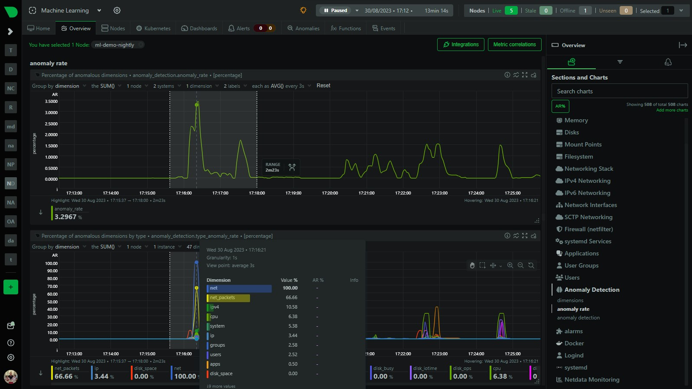
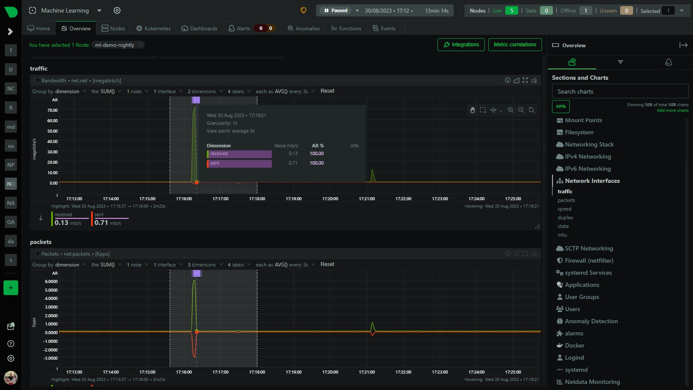
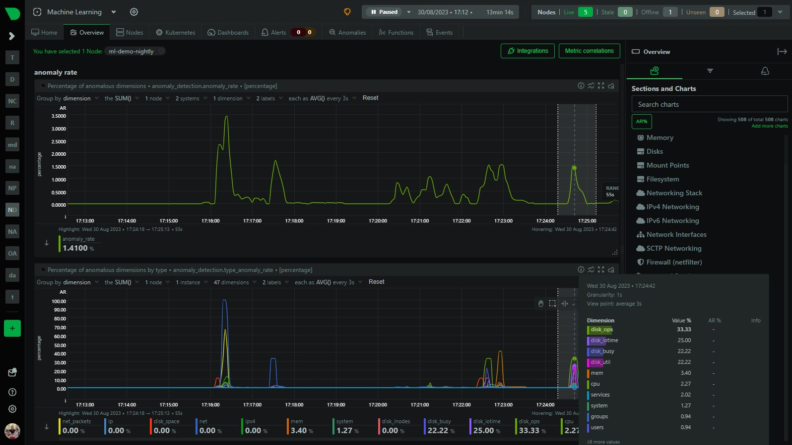

We have recently added a more detailed anomaly rate chart to Netdata that breaks out the overall node anomaly rate by type, this lets you more easily see what parts of your infrastructure might be experiencing an uptick in anomalies when you see the overall node anomaly rate increase.

<!--truncate-->

## What is `type`?

`type` is generally the prefix of the chart id in Netdata and controls where charts live within the menu on the overview page, for example the `mem.available` chart has a type of `mem` which in part controls why it lives under the "Memory" section of the menu.

:::note
You can read a bit more about `type` and chart id's and specifications in general in the [docs](https://learn.netdata.cloud/docs/data-collection/external-plugins/#chart) on Netdata Learn.
:::

So having anomaly rates by type can let you quickly get a feel for what "physical" parts of your infrastructure are experiencing an uptick in anomalies when you see the overall node anomaly rate increase.

## Anomaly rate by `type`

Since every metric in Netdata also has a corresponding [`anomaly-bit`](https://learn.netdata.cloud/docs/ml-and-troubleshooting/machine-learning-ml-powered-anomaly-detection#anomaly-bit---100--anomalous-0--normal), its easy to calculate anomaly rates on any subset of metrics across your infrastructure. This is what we are doing here, we are simply calculating the anomaly rate over all metrics that have a given `type` and then collecting that as a "synthetic" or "derived" metric.

### Example 1 - spike in `net` anomalies

Here is an example of how you might find this useful. In the below screenshot we can see that within the highlighted area, the overall node anomaly rate has suddenly increased to around 3%. You can clearly see this in the `anomaly_detection.anomaly_rate` chart. This gives us an idea there is something going on, but not much more than that.

Now with the addition of the `anomaly_detection.type_anomaly_rate` chart just below, we can see that this spike is mostly made up of spikes within the `net` and `net_packets` `type`'s.

If we quickly navigate to the network related parts of the dashboard, sure enough we can see some anomalies in the `net` and `net_packets` charts where we have increases `sent` and `received` traffic that has been flagged as anomalous.

### Example 2 - some `disk` anomalies

Similarly, in the period following our initial anomaly i was doing some troubleshooting on my disks and so we also see a little spike in the node anomaly rate but this time the `anomaly_detection.type_anomaly_rate` chart is suggesting its something related to various `disk` related `type`'s.

And, sure enough, looking at some of my `disk` charts i can see the activity that has been flagged as anomalous.

Both of the examples above illustrate how you can easily use the `anomaly_detection.type_anomaly_rate` chart to quickly see what might be "underneath" the overall node anomaly rate when it increases.

## Next steps - `app` and `user` anomaly rates

This is our first step in providing lower level anomaly rates below the summary node anomaly rate. We are planning on adding anomaly rates by `app` and `user` soon so that you can easily see what applications and users are experiencing an uptick in anomalies. You can follow along in [this GitHub issue](https://github.com/netdata/netdata/issues/14788) which is just part of our wider "[Machine Learning Roadmap](https://github.com/orgs/netdata/projects/54)" project which is also publicly available on GitHub.

Of course you can always also use the [Anomaly Advisor](https://learn.netdata.cloud/docs/ml-and-troubleshooting/anomaly-advisor) to get a more detailed bottom up view of all anomalies in a highlighted window. Likewise, you can use the ["AR%" button](https://blog.netdata.cloud/anomaly-rates-in-the-menu/) to surface the highest chart anomaly rates within each menu section. Really this is just another quick way to view things that might come in useful.
