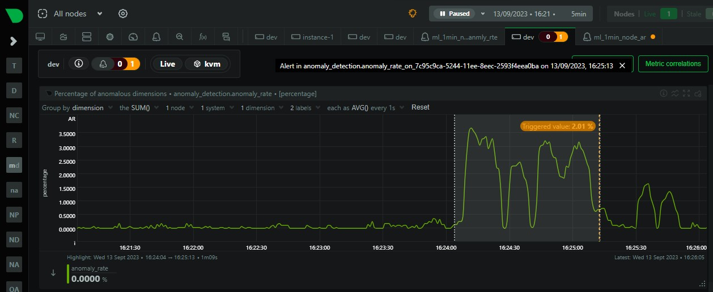
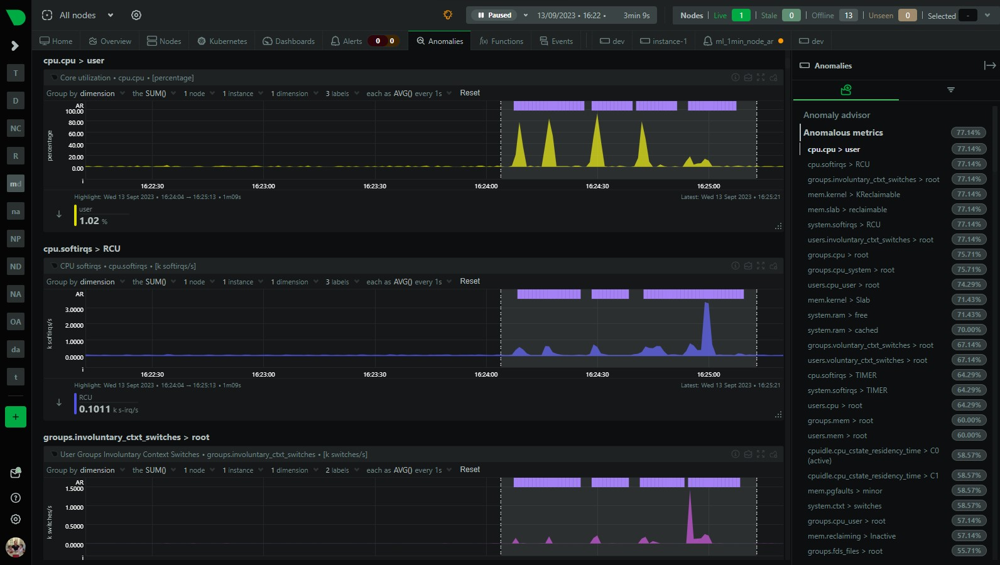
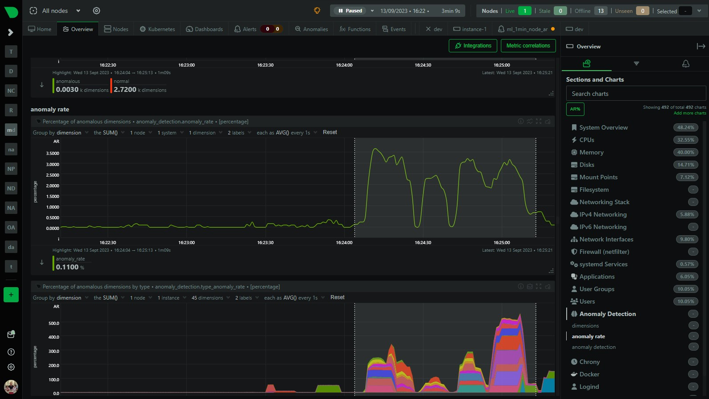
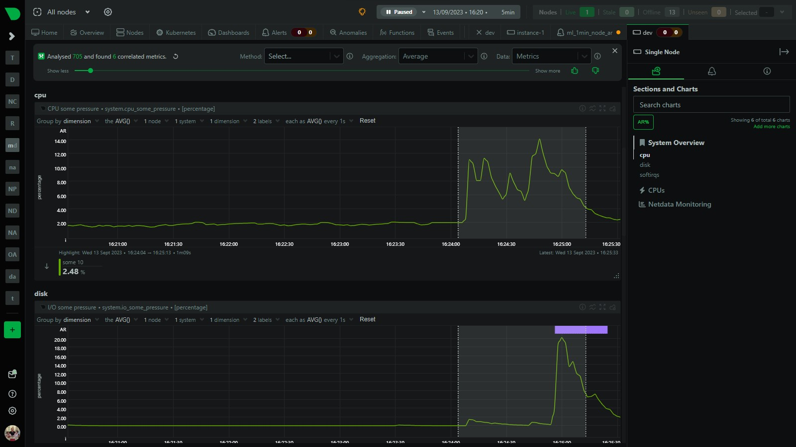

Over the last few years we have slowly and methodically been building out the [ML based capabilities](https://learn.netdata.cloud/docs/ml-and-troubleshooting/) of the Netdata agent, dogfooding and iterating as we go. To date, these features have mostly been somewhat reactive and tools to aid once you are already troubleshooting.

Now we feel we are ready to take a first gentle step into some more proactive use cases, starting with a [simple node level anomaly rate alert](https://github.com/netdata/netdata/pull/14687).

<!--truncate-->

:::note
You can read a bit more about our ML journey in our [ML related blog posts](https://blog.netdata.cloud/tags/machine-learning/).
:::

<!--truncate-->

## What is the `ml_1min_node_ar` alert?

This alert is triggered when the [node anomaly rate](https://learn.netdata.cloud/docs/ml-and-troubleshooting/machine-learning-ml-powered-anomaly-detection#node-anomaly-rate) exceeds the threshold defined in the [alert configuration](https://github.com/netdata/netdata/blob/master/health/health.d/ml.conf) over the most recent 1 minute window evaluated.

```ini title='health/health.d/ml.conf'
# node level anomaly rate
# https://learn.netdata.cloud/docs/agent/ml#node-anomaly-rate
# if node level anomaly rate is above 1% then warning.
 template: ml_1min_node_ar
       on: anomaly_detection.anomaly_rate
    class: Workload
     type: System
component: ML
       os: *
    hosts: *
   lookup: average -1m of anomaly_rate
    units: %
    every: 30s
     warn: $this > 1
     info: rolling 1min node level anomaly rate
       to: silent
```

For example, with the default of `warn: $this > 1`, when triggered this means that 1% or more of the metrics collected on the node have across the most recent 1 minute window been flagged as [anomalous](https://learn.netdata.cloud/docs/ml-and-troubleshooting/machine-learning-ml-powered-anomaly-detection) by Netdata.

## Example

In the example below we can see that the node anomaly rate spikes to around X% and shortly after the `ml_1min_node_ar` alert is triggered at a 1 min rolling node anomaly rate of X%.


## Troubleshoot the alert

This alert is a signal that some significant percentage of metrics within your infrastructure have been flagged as anomalous according to the ML based anomaly detection models the Netdata agent continually trains and re-trains for each metric.

This tells us something somewhere might look strange in some way. The next step is to try drill in and see what metrics are actually driving this and if its something you need or want to investigate further.

:::note
It is of course entirely possible that the anomaly itself could be a symptom of something that is not actually a problem in and of itself. For example, doing some rare but routine maintenance on a node could cause a spike in the anomaly rate. This is why we have made this alert a warning only with no critical state and it is set with `to: silent` so it will not send any notifications by default.
:::

1. **Filter for the node or nodes relevant**: First we need to reduce as much noise as possible by filtering for just those nodes that have the elevated node anomaly rate. Look at the `anomaly_detection.anomaly_rate` chart and group by `node` to see which nodes have an elevated anomaly rate. Filter for just those nodes since this will reduce any noise as much as possible.

2. **Highlight the area of interest**: Highlight the timeframe of interest where you see an elevated anomaly rate.

3. **Check the anomalies tab**: Check the [Anomaly Advisor](https://learn.netdata.cloud/docs/ml-and-troubleshooting/anomaly-advisor) ("Anomalies" tab) to see an ordered list of what metrics were most anomalous in the highlighted window.



4. **Press the AR% button on Overview**: You can also press the "[AR%](https://blog.netdata.cloud/anomaly-rates-in-the-menu/)" button on the Overview or single node dashboard to see what parts of the menu have the highest chart anomaly rates. Pressing the AR% button should add some "pills" to each menu item and if you hover over it you will see that chart within each menu section that was most anomalous during the highlighted timeframe.



5. **Use Metric Correlations**: Use [metric correlations](https://learn.netdata.cloud/docs/ml-and-troubleshooting/metric-correlations) to see what metrics may have changed most significantly comparing before to the highlighted timeframe.



## Useful resources

1. Additional ML based alert examples (e.g. chart based or individual dimension based) can be found in [`health/health.d/ml.conf`](https://github.com/netdata/netdata/blob/master/health/health.d/ml.conf). Or you can see them in action in our [ML demo room](https://app.netdata.cloud/spaces/netdata-demo/rooms/machine-learning/alerts), the configuration code for which lives in [netdata/community](https://github.com/netdata/community/blob/main/configuration-management/ansible-ml-demo/templates/netdata/health.d/ml.conf.j2)
1. [Machine learning (ML) powered anomaly detection](https://learn.netdata.cloud/docs/ml-and-troubleshooting/machine-learning-ml-powered-anomaly-detection)
1. [Anomaly Advisor](https://learn.netdata.cloud/docs/ml-and-troubleshooting/anomaly-advisor)
1. [Metric Correlations](https://learn.netdata.cloud/docs/ml-and-troubleshooting/metric-correlations)
1. [Anomaly Rates in the Menu!](https://blog.netdata.cloud/anomaly-rates-in-the-menu/)

## Feedback

We would love to hear your feedback on this alert and any other ML related features you would like to see in Netdata. Please join the conversation on any of our [community platforms](https://www.netdata.cloud/community).
