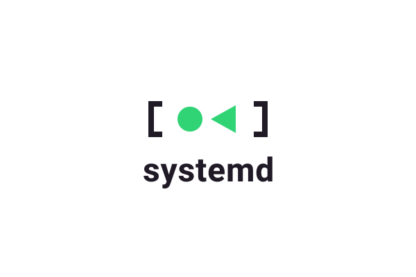
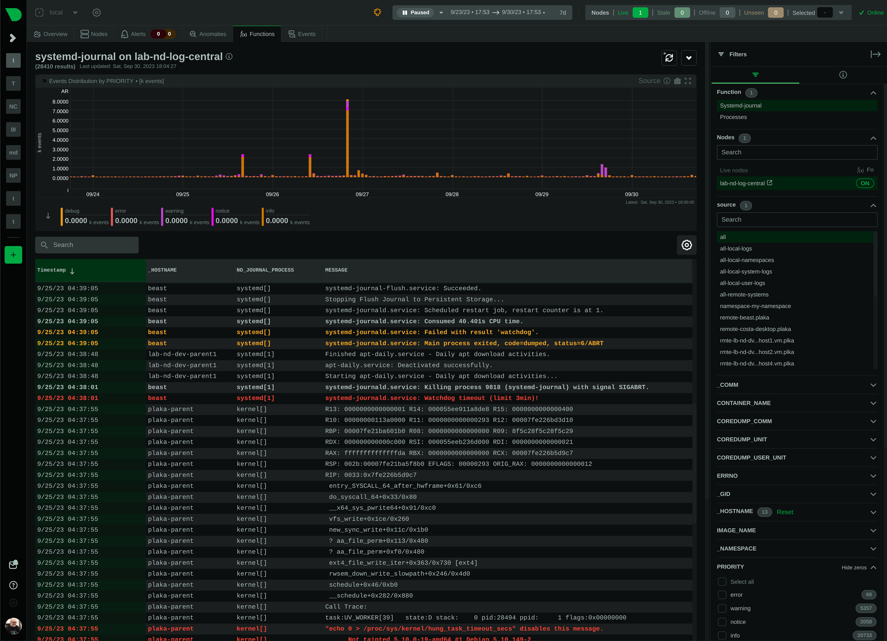

*“Why bother with it? I let it run in the background and focus on more important DevOps work.”*
&mdash; a random DevOps Engineer at Reddit r/devops

In an era where technology is evolving at breakneck speeds, it's easy to overlook the tools that are right under our noses. One such underutilized powerhouse is the **`systemd` journal**. For many, it's a mere tool to check the status of systemd service units or to tail the most recent events (journalctl -f). Others who do mainly container work, ignore even its existence.

## What is the purpose of systemd-journal?

However, the **systemd journal** includes very important information. **Kernel errors, application crashes, out of memory process kills, storage related anomalies, crucial security intel like `ssh` or `sudo` attempts and security audit logs, connection / disconnection errors, network related problems**, and a lot more. 
The system journal is brimming with data that can offer deep insights into the health and security of our systems and still many professional system and devops engineers tend to ignore it.

<!--truncate-->

Of course we use logs management systems, like Loki, Elastic, Splunk, DataDog, etc. But do we really go through the burden to configure our logs pipeline (and accept the additional cost) to push **systemd journal logs** to them? We usually don’t.

On top of this, what if I told you that there's an untapped reservoir of potential within the **[systemd journal](https://learn.netdata.cloud/docs/data-collection/systemd-journal?utm_source=blog1systemd&utm_medium=blog_systemd&utm_campaign=blog)**? A potential that could revolutionize the way **developers, sysadmins**, and **DevOps** professionals approach **logging, troubleshooting, and monitoring**.

### But how does systemd-journal work?

**`systemd` journal** isn't just a logging tool; it's an intricate system that offers dynamic fields for every **log entry**. Yes, you read right. Each log line may have its own unique fields, annotating and tagging it with any number of additional name-value pairs (and the value part can be even binary data). This is unlike what most **log management** systems do. Most of them are optimized for **logs** that are uniform, like a table, with common fields among all the entries. `systemd` journal on the other hand, is optimized for managing an arbitrary number of fields on each **log** entry, without any uniformity. 
This feature gives this tool amazing power.

Check for example coredumps. `systemd` developers have annotated all applications crashes with a plethora of information, including environment variables, mount info, process status information, open files, signals, and everything that was available at the time the application crashed.

Now, imagine a world where application developers don't just log errors, but annotate those logs with rich information: the request path, internal component states, source and destination details, and everything related to identify the exact case and state this log line appeared. How much time such error logging would save? It would be a game-changer, enabling faster troubleshooting, precise error tracking, and efficient service maintenance.

All this power is hidden behind a very cryptic **journalctl** command. So, at [Netdata](https://app.netdata.cloud/) we decided to reveal this power and make it accessible to everyone.

Try it for yourself in one of our Netdata demo rooms [here](https://app.netdata.cloud/spaces/netdata-demo/rooms/all-nodes/functions?oauth=google&#after=-21600&before=0&d8a4e0c5-7c79-4145-900e-83a9f06fcb6a-fn-selectedFn-arr=systemd-journal&d8a4e0c5-7c79-4145-900e-83a9f06fcb6a-fn-selectedNodeIds-arr=e3b4cd99-19a7-467b-841a-09314dcafc51&selectedFn-arr=systemd-journal&selectedNodeIds-arr=d8e944dd-d061-4bc9-a850-0ac2ee4ff87f&d8a4e0c5-7c79-4145-900e-83a9f06fcb6a-systemd-journalFilters-source-arr=all).

