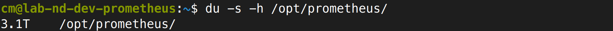
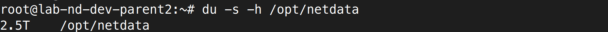
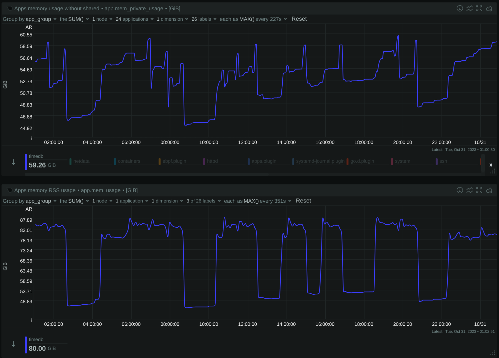
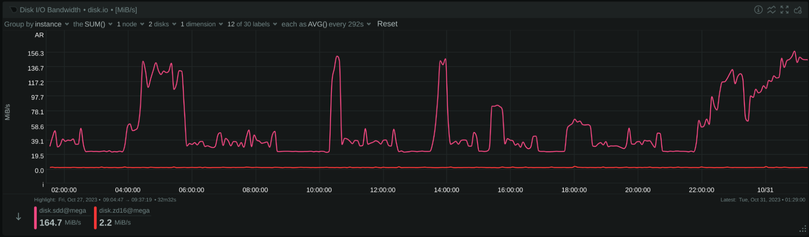
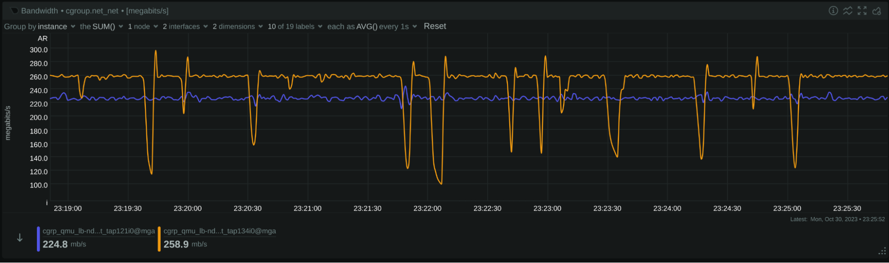
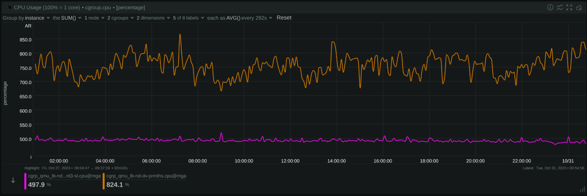

In an era dominated by data-driven decision making, monitoring tools play an indispensable role in ensuring that our systems run efficiently and without interruption. When considering tools like **Netdata and Prometheus**, performance isn't just a number; it's about empowering users with **real-time insights** and enabling them to act with agility.

There's a genuine need in the community for tools that are not only comprehensive in their offerings but also **swift and scalable**. This desire stems from our evolving digital landscape, where the ability to swiftly detect, diagnose, and rectify anomalies has direct implications on user experiences and business outcomes. Especially as infrastructure grows in complexity and scale, there's an increasing demand for **monitoring tools** to keep up and provide clear, timely insights.

Our ambition is to be the simplest, fastest and most scalable solution in this domain. However, it's essential to approach it with modesty. A performance **comparison between Netdata and Prometheus** is not a race for the top spot but an exploration of where we stand today and where improvements can be made. Through this, we hope to drive innovation, ensure optimal performance, and ultimately deliver better value to our users.
<!--truncate-->

## The Configuration

We are primarily interested in data collection performance. So, we wanted Netdata and Prometheus to have exactly the same dataset.


### Source dataset

**500** **nodes** running Netdata, all collecting **system and application metrics**, per second. In total there are **40k** **containers** running. Since Netdata agents can expose their metrics in the Prometheus format (OpenMetrics), we used them as a data-source for both the Netdata Parent under test, and Prometheus.


In total, these nodes collect about **2.7 million metrics, all per-second**.


All these nodes were running on VMs hosted on separate hardware from the centralization points (Netdata Parent and Prometheus) and were connected to the physical server running the test via 2 bonded 20 Gbps network cards.

In this test we are interested in data ingestion performance, so the servers were not running any queries during the test.


### Netdata Parent

The Netdata Parent was receiving all metrics in real-time from the 500 nodes, via Netdata streaming (they were pushing metrics to Netdata Parent).

To emulate the functionality offered by a plain Prometheus installation, we disabled ML (machine learning based anomaly detection) and Health (alerts) in `netdata.conf`.

We allowed the Netdata Parent to run with its default 3 tiers of storage, to showcase the difference in retention between the 2 systems. This also enabled automatic back-filling of the higher tiers, from data available in the lower tiers, which may have affected the CPU utilization of the Netdata Parent.

We also allowed streaming run with replication enabled, to avoid having any gaps on the data.

Other than the above, Netdata was running with default settings.


### Prometheus

Prometheus was scraping the same 500 Netdata instances, every second, in `as-collected` source type (so that the original data are exposed to Prometheus in their native form).


We configured retention to 7 days. Other than this, Prometheus was running with default settings.


## Hardware

Both Netdata Parent and Prometheus were running on a dedicated VM each, with 100GB RAM, 24 CPU Cores, and a dedicated 4TB SSD disk.
Both VMs were hosted on the same physical server having 2x AMD EPYC 7453 CPUs (28-Core Processors - 112 threads total), 512GB RAM, and separate dedicated SSDs for each of them. The host server was configured to run each VM on a separate NUMA node.

Other than the above, this physical server was idle, so that nothing outside this test can influence the comparison.

Screenshots were taken from a Netdata running at the host O/S of this server, using CGROUPs and other system metrics.


## CPU Utilization



_Image: 3 hours of CPU utilization: Netdata is the purple line. Prometheus is the brown line._

On average, Netdata was using 5.1 cores (510% of a single core), while Prometheus was using 7.3 cores (730% of a single CPU core).

Per million of metrics per second:


* Netdata needs 1.9 CPU cores
* Prometheus needs 2.7 CPU cores

Based on these observations, Netdata appears to use around 30% less CPU resources than Prometheus, or Prometheus to use 43% more CPU resources than Netdata.

In the test duration, Prometheus exhibited fluctuating CPU consumption. A closer examination of the last 5 minutes reveals periodic (every 2 minutes) spikes in Prometheus's CPU usage, often exceeding 14 CPU cores. These might be attributed to periodic operations like internal garbage collection or other maintenance tasks.


_Image: 5 minutes of CPU utilization: Netdata is the purple line. Prometheus is the brown line._

We also noticed an interval (at 17:00 of the original 3-hour chart) where Prometheus seemed to have a brief pause (25 seconds) in scraping sources. In contrast, Netdata showed consistent performance during this interval:


_Image: 5 minutes of CPU utilization at 17:00:
Netdata is the purple line. Prometheus is the brown line._

The observed spikes in Netdata's usage are potentially due to containers being started and stopped. This can lead to replication requests between Netdata nodes and backfilling of higher database tiers from lower tiers, which might result in a temporary increase in consumption until data streams stabilize.


## Network Bandwidth


_Image: 3 hours network bandwidth: Netdata is the blue line. Prometheus is the brown line._

During our observation, Netdata utilized on average 230 Mbps of bandwidth, while Prometheus utilized 258 Mbps.

The Netdata streaming protocol, although text-based, is designed to be compact, while Prometheus uses the OpenMetrics protocol, which is more “chatty”. However, the Gzip/Deflate compression used when Prometheus scrapes its sources is generally providing a superior compression ratio compared to the ZSTD compression employed by Netdata in this test.

Nevertheless, our data indicates that Netdata utilizes about 11% less bandwidth than Prometheus.

Upon closer inspection of the last 5 minutes, we noticed some fluctuations in Prometheus's bandwidth usage. This could suggest that there were moments when Prometheus might not have scraped all 500 nodes every second, though the exact reasons would need further investigation:





_Image: 5 minutes network bandwidth: Netdata is the blue line. Prometheus is the brown line._

When Grafana sources data from Prometheus, it fills in missing points from adjacent data points, which can make certain inconsistencies less noticeable in visualizations.

In terms of Netdata's functionality, it is designed for consistent data ingestion. If communication is interrupted (though it was uninterrupted during our test), Netdata includes a replication feature. This allows the system receiving the samples to negotiate and backfill any missed data on reconnection, ensuring that there are no gaps in the time-series.


## Memory Consumption

We used `top` to see the memory of each application within its VM.

Netdata:




Prometheus:




Check the `RES` (resident size) column:


* Netdata needs 36.5 GB or RAM
* Prometheus needs 68.0 GB or RAM

Netdata needs 46% less memory than Prometheus, or Prometheus needs 86% more memory than Netdata.


## Storage Footprint

Prometheus was configured to keep the metrics for 7 days, which results in 3.1 TB of storage:


Netdata was configured to have 3 TB of space, which gives us a variable retention depending on how much data can fit in this storage space. This is what it currently uses:




Netdata provides the API `/api/v2/node_instances`, at the end of which we can find a break down of the storage used by it:

```bash
   "db_size":[{
            "tier":0,
            "disk_used":1677443553144,
            "disk_max":1677721600000,
            "disk_percent":99.9834271,
            "from":1697514184,
            "to":1698339754,
            "retention":825570,
            "expected_retention":825706
         },{
            "tier":1,
            "disk_used":838006961012,
            "disk_max":838860800000,
            "disk_percent":99.8982145,
            "from":1694616720,
            "to":1698339754,
            "retention":3723034,
            "expected_retention":3726827
         },{
            "tier":2,
            "disk_used":193843384704,
            "disk_max":419430400000,
            "disk_percent":46.2158643,
            "from":1679670000,
            "to":1698339754,
            "retention":18669754,
            "expected_retention":40396851
         }],
```

This is what these numbers mean:


<table>
  <tr>
   <td><strong>Tier
(<code>tier</code>)</strong>
   </td>
   <td><strong>Capacity
(<code>disk_max</code>)</strong>
   </td>
   <td><strong>Used
(<code>disk_percent</code>)</strong>
   </td>
   <td><strong>Retention
(<code>expected_retention</code>)</strong>
   </td>
  </tr>
  <tr>
   <td>Tier 0
   </td>
   <td>1.5 TiB
   </td>
   <td>100%
   </td>
   <td>9.6 days
   </td>
  </tr>
  <tr>
   <td>Tier 1
   </td>
   <td>763 GiB
   </td>
   <td>100%
   </td>
   <td>43.1 days
   </td>
  </tr>
  <tr>
   <td>Tier 2
   </td>
   <td>381 GiB
   </td>
   <td>46%
   </td>
   <td>467.5 days
   </td>
  </tr>
</table>


Netdata used 1.5 TiB for almost 10 days of high resolution data, while Prometheus used 3.1 TiB for 7 days of high resolution data.

Based on these data, we can estimate the average number of bytes on disk, per data collection sample:


* Prometheus collects 2.7 million metrics per second. Over the span of 7 days, it accumulated approximately 1.6 trillion samples. Its storage efficiency can be determined as:
   3.1 TiB / 1.6 trillion samples = **2.13 bytes per sample**.
   
   It's worth noting an earlier observation, that there might be occasions when Prometheus doesn't scrape all endpoints every second. This can affect the calculated efficiency If the points collected are significantly less. 
   Prometheus provides a way to get the typical size of a sample on disk:

   `(rate(prometheus_tsdb_compaction_chunk_size_bytes_sum[7d])) / rate(prometheus_tsdb_compaction_chunk_samples_sum[7d])`
   
   In our case, this reports 2.14 bytes per sample, which verifies our estimation.

* Netdata, on the other hand, also collects 2.7 million metrics per second. Over 9.6 days, it ingested about 2.2 trillion samples. The storage efficiency for Netdata is:
1.5 TiB / 2.2 trillion samples = **0.75 bytes per sample.**


Based on these data, Netdata uses 75% less storage than Prometheus, or Prometheus uses 280% more storage than Netdata for the same dataset.

Additionally, it's pertinent to mention that Netdata used the saved storage space to support over a year of data retention, albeit at a reduced resolution.


## Disk I/O


### Disk Writes


_Image: 3 hours of **disk writes**: Netdata is red line, Prometheus is pink line_

* Netdata has a consistent write speed of approximately 2 MiB per second.
* Prometheus shows a varied write speed, ranging from 20 to 100 MiB per second.


### Disk Reads




_Image: 3 hours of **disk reads**: Netdata is red line, Prometheus is pink line_


* Netdata registers minimal to no disk reads.
* Prometheus, on the other hand, consistently records reads exceeding 50 MiB per second.

From the data, it can be inferred that Netdata primarily writes data directly to their final position, given its steady write speed. Prometheus exhibits variable write and read patterns, possibly suggesting mechanisms like Write-Ahead Logging (WAL) or other data reorganization strategies.


## Summary

Netdata, renowned as a distributed monitoring solution, emphasizes the importance of not being confined to centralization. In our relentless pursuit to enhance and optimize our offerings, we sought to understand how Netdata stands in terms of performance and scalability, especially when juxtaposed with other industry-leading systems.

Here's a concise overview of our insights:


|                                               | **Netdata Parent**                                               | **Prometheus**                                                |
|-----------------------------------------------|:----------------------------------------------------------------:|:-------------------------------------------------------------:|
| **Version**                                   | v1.43.0-105-ga84213ca3 (nightly of Oct 29, 2023)                | 2.44.0 (branch: HEAD, revision: 1ac5131f698ebc60f13fe2727f89b115a41f6558) |
| **Configuration**<br/>(changes to the defaults)| 3 TiB storage in 3 tiers<br/>Disabled ML<br/>Disabled Health       | Retention 7 days<br/>Per Second data collection                |
| Hardware<br/>(VMs on the same physical server)| 24 CPU cores<br/>100 GB RAM<br/>4 TB SSD                           | 24 CPU cores<br/>100 GB RAM<br/>4 TB SSD                        |
| Metrics offered<br/>(approximately,<br/> concurrently collected)| 2.7 million per second                                          | 2.7 million per second                                        |
| **CPU Utilization**<br/>(average)             | 4.8 CPU cores<br/>(spikes at 8 cores)<br/><strong>-35%</strong>    | 7.3 CPU cores<br/>(spikes at 14 cores)<br/><strong>+52%</strong>|
| **Memory Consumption**<br/>(snapshot)         | 36.5 GiB<br/><strong>-46%</strong>                               | 68 GiB<br/><strong>+86%</strong>                               |
| **Network Bandwidth**                        | 230 Mbps<br/><strong>-11%</strong>                               | 258 Mbps<br/><strong>+12%</strong>                             |
| **Disk I/O**                                 | no reads<br/>2 MB/s writes<br/><strong>-97%</strong>              | 50 MB/s reads<br/>20 - 100 MB/s writes<br/><strong>+3500%</strong>|
| **Disk Footprint**                           | 3 TiB                                                           | 3 TiB                                                         |
| **Metrics Retention**                        | 9.6 days (per-sec)<br/>43 days (per-min)<br/>467 days (per-hour)<br/><strong>+37% (per-sec)</strong>| 7 days (per-sec)<br/><strong>-28% (per-sec)</strong>           |
| Unique time-series on disk                   | 8 million                                                       | 5 million                                                     |
| **Bytes per sample on disk**<br/>(per-sec tier)| 0.75 bytes / sample<br/><strong>-75%</strong>                    | 2.1 bytes / sample<br/><strong>+280%</strong>                  |
| **Potential data loss**<br/>(network issues, maintenance, etc)| No<br/>(missing samples are replicated from the source on reconnection)| Yes<br/>(missing samples are filled from adjacent ones at query time)|
| **Clustering**                               | Yes<br/>(active-active Parents)                                  | No<br/>(not natively,<br/>possible with more tools)             |


Other notable differences between Netdata and Prometheus:


### Protection from server failures

**Prometheus:** Implements data commitment to disk every 2 hours and utilizes a write-ahead log for continuous disk writing, safeguarding against data loss during crashes or server failures. The management of this write-ahead log is probably the primary reason Prometheus performs such intense disk I/O consistently.

**Netdata:** Commits data to disk every 17 minutes with even distribution across metrics and time. This results in minimal disk I/O during metric ingestion. To counter potential data loss from server failures, it employs replication for missing data recovery and re-streaming of received data to another Netdata server (grand-parent, or a sibling in a cluster).


### Resource Consumption and Features

The following features of Netdata were disabled during this test:

Netdata’s Machine Learning (ML) feature provides unsupervised anomaly detection. It performs queries on all metrics to learn their behavior by training mathematical models, which are then used for detecting if any given sample is an anomaly or not. This requires higher CPU, memory, and disk I/O usage.

Netdata’s Health feature for alerting with the plethora of predefined alerts that are shipped with Netdata, adds to the CPU consumption and disk I/O.

Re-streaming metrics to a grand-parent or a clustered sibling with compression, adds more CPU consumption (this delta is insignificant if compression on restreaming is disabled).

Generally, enabling all these features will double the CPU consumption and especially for the ML case, Netdata will also perform constant disk reads.


### Data and Metadata Design

**Prometheus:** Organizes its data and metadata in 2-hour intervals, dividing its database accordingly. Depending on the query time-frame, it then accesses these 2-hour segments.

**Netdata:** Operates with a continuous rolling design. To support a fully automated UI, it maintains an all-encompassing view of metadata available instantaneously across extended retention periods (e.g., months or years). However, in highly transient environments, this can consume significant memory. Improvements have been made, like utilizing a single pointer for any label name-value pair, but challenges remain with extreme transiency paired with lengthy retention.


## Conclusion

The relentless dedication of the Netdata team has birthed significant advancements across all facets of our platform. The extensive rework of the dbengine, our time-series database, stands testament to this progress, ensuring enhanced performance and resilience. As we further innovated, the introduction of advanced ML capabilities, the use of more sophisticated compression algorithms, a revamped SSL layer, and a notably reduced memory footprint have added to Netdata's prowess. Our commitment to the community shines through in our new UI, equipped with innovative features that simplify monitoring and boost its clarity.

Netdata's open-source nature isn't just a technical classification; it's a philosophy. We view our software as a gift to the global community, underscoring our commitment to democratizing advanced monitoring solutions.

Writing in C has undeniably posed challenges, especially given the unforgiving nature of the language. Yet, this hurdle has only pushed us to exceed our boundaries. Over the past few years, our dedication has led to the restructuring of our entire codebase, resulting in improved performance and unparalleled stability.

Recognition, while not our sole driver, does inspire us further. Leading the observability category in the CNCF landscape in terms of stars showcases the immense trust and appreciation we've garnered. This palpable user love propels us forward, driving us to continually meet and surpass expectations.

Our mission goes beyond mere development; it's about trust. We've tirelessly worked to ensure that user data is not just stored, but managed with the utmost reliability by Netdata. Our pursuit of performance isn't just a benchmark to achieve, but a core tenet of our goal to make monitoring straightforward, affordable, and accessible for everyone.

In the ever-evolving realm of monitoring, Netdata remains unwavering in its commitment to innovation, excellence, and community.
