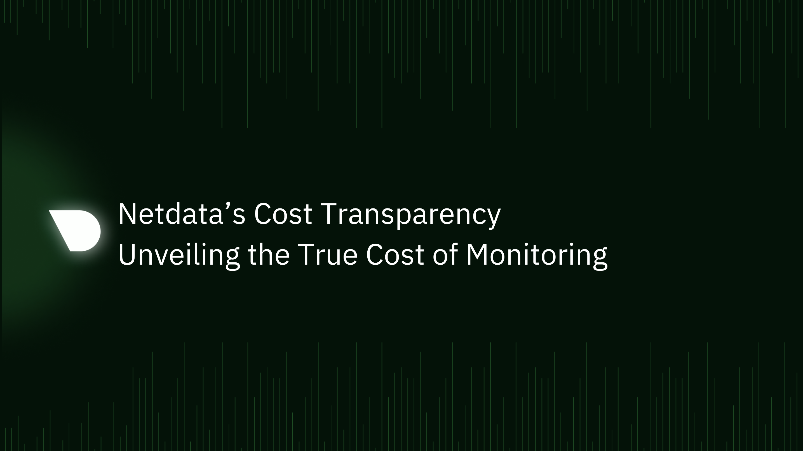

import ReactPlayer from 'react-player'

Businesses are increasingly reliant on monitoring tools to ensure the seamless performance and reliability of their systems. However, the true cost of implementing and maintaining these tools is often obscured by hidden expenses. Our previous blog delved into the concealed costs associated with various monitoring solutions, such as Prometheus & Grafana (Open Source Monitoring) and commercial platforms like Datadog, Dynatrace, and NewRelic. These costs can manifest in various forms - from complex setups and maintenance to additional charges for advanced features.

Unlike its counterparts, Netdata is engineered with transparency and efficiency at its core, ensuring that organizations can monitor their systems effectively without incurring unexpected expenses. This blog will explore how Netdata stands out in the crowded field of monitoring tools by eliminating hidden costs, providing a detailed analysis of its unique features and advantages.

Let us explore how Netdata’s user-friendly approach, unlimited metrics collection, decentralized architecture, and comprehensive capabilities make it a holistic solution for cost-effective monitoring.

<!--truncate-->

## Ease of Setup and Use: Simplifying Monitoring

Infrastructure monitoring is often tangled in complex setup procedures and steep learning curves, leading to significant time and financial investments. This is where Netdata fundamentally transforms the experience. 

**Time to Value:** Organizations can have Netdata up and running in minutes, not days. Unlike other monitoring tools that require extensive configuration and technical expertise, Netdata offers out-of-the-box dashboards that are ready to deploy with a [kickstart script.](https://learn.netdata.cloud/docs/installing/) This immediacy in setup not only accelerates the implementation process but also dramatically cuts down the costs associated with lengthy and complicated setups. 

<ReactPlayer controls width='100%' url='https://www.youtube.com/embed/PCyNLdo6lzI&t=11s'/>

**No expectation of expertise:** The out of the box, opinionated dashboards and alerts combined with auto-discovery of all crucial infrastructure components, make it possible for individuals with varied levels of technical expertise to monitor and understand their systems effectively. This means that organizations do not need to rely on highly experienced, dedicated senior engineers for day-to-day monitoring tasks. As a result, there's a substantial reduction in the need for specialized training and the costs associated with it.

**Automated Insights:** Netdata is engineered to provide automated insights, which further eases the monitoring process. Users receive AI assisted real-time alerts and performance metrics that are critical for their systems, without the need for constant manual oversight. 

The ease of setup and use that Netdata offers is a cornerstone of its appeal. By minimizing the learning curve and reducing the dependency on specialized skills, Netdata not only makes monitoring accessible to a broader range of users but also significantly **cuts down the hidden costs associated with the setup and maintenance of monitoring systems**.

## Unlimited Metrics at No Extra Cost

One of the most compelling advantages of Netdata is its ability to monitor unlimited metrics without incurring additional costs. This marks a significant departure from the norm in the observability landscape, where **escalating costs are often tied to the volume of data being monitored.**

**Monitor without Limits:** Traditional monitoring solutions typically operate on a pricing model that scales with the number of metrics collected, leading to increasing costs as an organization's monitoring needs grow. Netdata disrupts this model by allowing users to collect as many metrics as they need, without worrying about escalating costs. This unlimited access democratizes data monitoring, making it** accessible and affordable for businesses of all sizes.**

**Comprehensive Monitoring:** With no limits on metrics collection, organizations using Netdata can delve deeper into their data analytics. They can monitor a wide array of metrics that provide insights into every aspect of their operations, from system performance to user experience. This comprehensive data coverage empowers businesses to make more informed, data-driven decisions without the fear of additional costs.

## Netdata's Decentralized Architecture: Keeping Data On-prem

Netdata's approach to keeping data local is a defining feature that sets it apart from other monitoring tools. At the heart of this capability lies its decentralized architecture, a design choice that not only enhances performance but also enables unlimited data retention without reliance on external cloud services.

**Decentralized Architecture for Enhanced Performance:** Netdata's architecture is fundamentally decentralized, meaning that data processing and storage are decentralized. This design allows for high efficiency and performance, as data is processed and stored locally on the user's infrastructure. This local processing reduces latency and ensures faster access to data, a critical factor in real-time monitoring.

**Unlimited Data Retention Without Extra Costs:** The most significant advantage of this architecture is the ability to retain unlimited amounts of data on-premises. Unlike other cloud-based solutions that **often charge based on data storage volume and retention duration,** Netdata allows users to **store as much data as their local infrastructure can handle**, for as long as they need. This feature is particularly beneficial for organizations that require long-term data retention for compliance, historical analysis, or trend monitoring.

**Elimination of Egress Costs:** In the world of cloud services, egress fees – the costs associated with transferring data out of a cloud environment – can be a major hidden cost. Netdata's architecture ensures that data is processed and stored locally, eliminating these egress costs entirely. By keeping data within the user's own infrastructure, Netdata ensures that organizations **are not penalized financially for accessing their own data**.

**Enhanced Data Security and Privacy:** Keeping data on-premises offers added benefits in terms of security and compliance. **With Netdata, sensitive data is never stored outside the local environment (and queried ephemerally on demand), reducing the risk of data breaches** that could be a concern with cloud-based storage. This local retention is particularly crucial for organizations that operate under strict data privacy regulations and need to maintain complete control over their data.

**Ability to Work in Low Bandwidth Environment:** By avoiding the need to continuously send data to the cloud, Netdata reduces an organization's dependency on internet bandwidth. This is especially beneficial for businesses operating in locations with limited or costly internet access. 

**Real-time Data Access:** Keeping data local also means that Netdata can offer real-time access to monitoring insights. There are no delays inherent in transferring data to a remote cloud solution, allowing for immediate analysis and response. This is crucial for timely decision-making and swift issue resolution in dynamic IT environments.

## No Extra Cost for Advanced Features

Netdata comes with an all inclusive subscription without additional charges for advanced features. This approach stands in sharp contrast to many other tools in the market, where advanced features often come with extra costs.

**All-Inclusive Feature Set:** Netdata is designed to be a complete monitoring solution out of the box. Once you opt for a Business subscription, you get full access to all the features and capabilities including unlimited metrics, unlimited retention, systemd-journal logs, realtime functions, Anomaly detection, Alerts Configuration Manager, Audit events and more.

**APM and other Advanced Features:** Unlike many other monitoring solutions that operate on a tiered pricing model, where advanced features are locked behind higher payment tiers, Netdata provides all its capabilities in its comprehensive Business plan. This means features like Application Performance Monitoring (APM), Synthetic Monitoring, Container Monitoring, Database Monitoring, Network Monitoring, Logs Monitoring, Cloud Monitoring and much more available on our [all inclusive subscription](https://www.netdata.cloud/pricing/).

**Continuous Innovation and Updates:** Netdata is committed to continuous innovation, regularly updating and adding new features to its platform. These updates are made available to all subscribed users without additional costs, ensuring that everyone benefits from the latest advancements in monitoring technology. This commitment to continuous improvement means that users always have access to cutting-edge tools.

## Conclusion

Throughout this exploration, we've uncovered the various ways in which Netdata sets itself apart, offering a solution that is both powerful and economical.

Netdata simplifies the monitoring process with an easy setup and intuitive dashboards that require no complex configuration or specialized training. This ease of use translates into significant savings in both time and resources, making advanced monitoring accessible to a wider range of users.

The ability to offer unlimited metrics collection without additional costs is a game-changer, breaking away from the traditional cost models of monitoring tools. This feature allows businesses to scale their monitoring needs without worrying about escalating costs, fostering a more data-driven approach to operations.

Netdata’s decentralized architecture allows data to be retained and processed on-premises and not only enhances performance and security but also eliminates the costs associated with cloud storage and data retention, a common hidden expense in many other solutions. By keeping data local, Netdata eliminates egress costs, ensuring that businesses are not burdened with unexpected expenses for data access.
