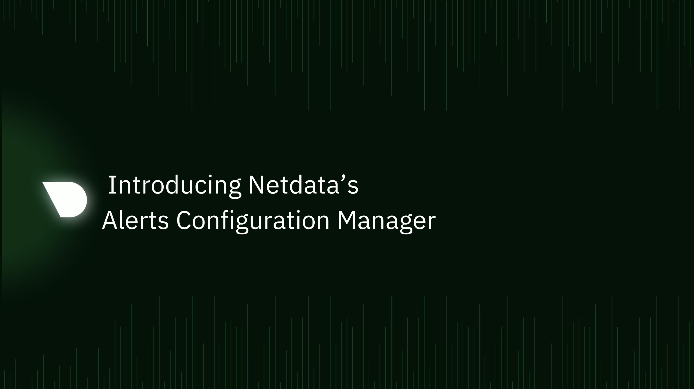

---
slug: introducing-netdata-alerts-configuration-manager
title: "Introducing Netdata’s Alerts Configuration Manager"
description: |
  Discover the power of Netdata's new Alerts Configuration Manager, a user-friendly UI wizard for creating and managing alerts directly from your Netdata Dashboard.
authors: satya
tags: [netdata, alerts-configuration-manager, UI-dashboard, alert-management]
keywords: [netdata, alerts configuration, UI wizard, dashboard, alert management]
date: 2023-12-21
image: ./img/alert-config-manager.png
---

Netdata introduces its latest feature, the Alerts Configuration Manager, transforming the way users configure and manage alerts in their Netdata environment. This powerful tool integrates directly into the Netdata Dashboard, offering a streamlined and intuitive interface for both novice and experienced users.

<!--truncate-->

## What is the Alerts Configuration Manager?

The Alerts Configuration Manager is an innovative feature available to users with Business subscriptions. It allows for the creation and customization of alerts directly from the Netdata Dashboard, employing a user-friendly UI wizard. This tool simplifies alert configuration, making it accessible and straightforward, even for those who are not deeply technical.

## Using Alerts Configuration Manager

- Go to the `Metrics` tab and navigate to the `chart` you want to alert on.

- Click the `Alert icon` on the top right corner of the chart.

- Alert Configuration Manager will open up with the `default` thresholds. Modify the configuration as required and the alert definition on the right will be updated dynamically.

- If you want more fine-grained control or access to more advanced settings, enable `Show advanced` 

- Copy the alert definition that is generated in the code box and add it to an existing [health configuration file](https://learn.netdata.cloud/docs/alerting/health-configuration-reference#edit-health-configuration-files) or a new custom file under `<path to netdata install>/etc/netdata/health.d/` on a `Parent Agent` or a `Standalone Child Agent`.

- Reload Netdata Alert Health checks `<path to netdata install>/usr/sbin/netdatacli reload-health` and the new alert is now configured.

For more details on the fields and how to use them, take a look at our [documentation](https://learn.netdata.cloud/docs/alerting/creating-alerts-with-the-alerts-configuration-manager).

## Conclusion

Netdata's Alerts Configuration Manager is a groundbreaking tool that simplifies the process of configuring and managing alerts. Its intuitive design, combined with advanced customization options, makes it an indispensable tool for anyone using Netdata for monitoring. Embrace this new feature and elevate your monitoring strategy with ease and efficiency.

