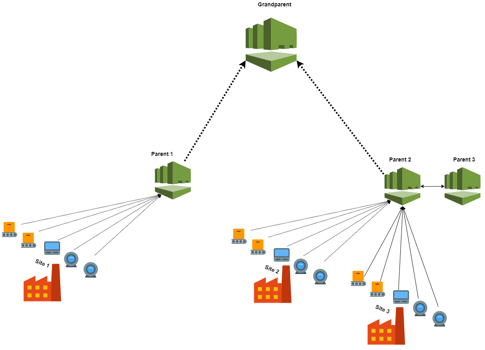
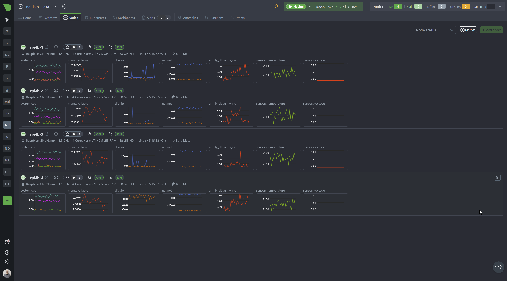

With the increasing prevalence of IoT devices, which are being used in a wide range of applications, from smart homes and cities to industrial and agricultural systems, monitoring thei performance and health is extremely important. However, it’s essential to remember that monitoring IoT devices involves more than just tracking device-level data. In addition, monitoring data from the IoT platform or application layer is equally important.

We’ll explore some of these topics in more detail and explain how Netdata can play an essential role in the monitoring of such devices, including some hints on how it can be set up for maximum performance in such scenarios.

<!--truncate-->

## IoT Monitoring Requirements and Restrictions?

Monitoring IoT devices comes with unique requirements that differ from traditional monitoring methods. Here are some of the key considerations when monitoring IoT infrastructures and devices.

**Limited power and bandwidth:** Many IoT devices have limited processing power, memory, and storage capacity, which can make monitoring a complex task.

**Importance of security:** IoT devices are often connected to sensitive systems and networks, making security a top priority when monitoring them. They can also be more vulnerable to cyberattacks and physical tampering.

**Centralising data**: IoT devices are often deployed in large numbers, making it difficult to manage them individually. Therefore, it is common to centralize the data from a group of devices onto a single server, making it easier to monitor and setup the monitoring infrastructure.

**Infrastructure diversity:** IoT infrastructure often combines different protocols and tools. This is because IoT devices may use specialized communication protocols such as Zigbee, Z-Wave, LoraWAN, or Bluetooth Low Energy, which may not be compatible with traditional IT monitoring tools.

**Types of metrics to monitor:** When monitoring IoT devices, there are several key metrics to focus on, such as device temperature, power consumption, and network activity. There are also case-by-case specific metrics that may be relevant depending on the type of device and its use case. Here are a few examples:
   * Smart home devices: metrics like usage patterns and battery life may be important to monitor. For example, tracking usage patterns can help identify opportunities for energy savings, while monitoring battery life can help prevent devices from running out of power and becoming unresponsive.
   * Industrial sensors: metrics like vibration, pressure, and flow rate may be important to monitor. These metrics can help detect early signs of equipment failure or inefficiencies in the manufacturing process, which can help prevent costly downtime and maintenance.
   * Healthcare devices: metrics like patient vital signs, medication adherence, and device uptime may be important to monitor. These metrics can help healthcare providers identify potential health risks, monitor patient progress, and ensure that devices are functioning properly.

**Huge data volumes:** IoT infrastructure can have hundreds, or even thousands of IoT devices, generating an enormous amount of data that requires efficient processing and analysis.

## Typical approaches to collect data from IoT Devices

**Message Queue Telemetry Transport (MQTT):** MQTT is a lightweight messaging protocol designed for low-bandwidth, high-latency networks like those commonly found in IoT environments. It uses a publish-subscribe model to transmit messages between devices and applications, making it an efficient and scalable solution for IoT communication.

When it comes to monitoring IoT devices, MQTT can be a useful tool for collecting data from a large number of devices simultaneously. Data from IoT devices can be published to a broker, and monitoring tools can subscribe to the broker to collect and analyze the data in near real-time.

One of the main advantages of MQTT for IoT monitoring is its low overhead. It has a small code footprint and minimal bandwidth requirements, making it ideal for use in resource-constrained environments. Additionally, MQTT provides mechanisms for securing data transmissions, including TLS encryption and authentication, ensuring the confidentiality and integrity of IoT data.

However, it’s important to note that MQTT may not be the best choice for all IoT monitoring use cases. For example, or monitoring devices that require immediate responses, such as critical medical equipment, or for applications that require high throughput, such as monitoring large industrial systems.

**Simple Network Management Protocol (SNMP):** SNMP is a protocol used for network management and monitoring. It allows network administrators to manage devices on the network, including IoT devices, by collecting and monitoring various metrics such as device status, resource utilization, and network traffic.

To collect data from IoT devices using SNMP, an SNMP collector needs to be installed on the device. The SNMP collector retrieves data about the device and makes it available to the SNMP manager. The SNMP manager then collects the data from the agent and stores it in a database or other monitoring system.

SNMP is a valuable tool for monitoring IoT devices because it is widely supported and provides a standard interface for collecting data. This means that SNMP-enabled IoT devices can be monitored using a wide range of tools and platforms. SNMP also supports remote monitoring, which is important for IoT devices that may be deployed in remote locations or areas that are difficult to access.

**RESTful APIs:** RESTful APIs provide a simple and standard way for applications to interact with IoT devices. The devices expose APIs that can be used to retrieve data and perform actions. RESTful APIs use HTTP(S) as the underlying transport protocol, making it easy to integrate them with web applications.

To use RESTful APIs for IoT monitoring, the device needs to be configured to support this communication method. Once the device is configured, the monitoring tool can use HTTP requests to retrieve data from the device, such as sensor readings or status information.

One advantage of using RESTful APIs for IoT monitoring is that they are flexible and can be used with various programming languages and platforms. Additionally, RESTful APIs allow for easy scaling and integration with other applications and services.

**Scraping Prometheus Metrics:** Prometheus is a popular open-source monitoring solution widely used in the cloud-native ecosystem for its ability to scrape metrics from services and systems. The Prometheus server uses a pull-based mechanism to collect and store time-series data, making it easy to query and visualize metrics.

When it comes to IoT monitoring, Prometheus can be a valuable tool for scraping metrics from IoT devices that expose their metrics via an HTTP endpoint. The Prometheus server can be configured to scrape these metrics at regular intervals and store them in a time-series database.

One potential challenge with using Prometheus for IoT monitoring is that the Prometheus server may not be able to handle large volumes of data or handle real-time data processing. Additionally, some IoT devices may not be able to expose their metrics via an HTTP endpoint, making it difficult to use Prometheus for monitoring.

**StatsD:** StatsD is a popular open-source daemon that receives custom metrics over UDP and forwards them to a back-end monitoring system. StatsD is commonly used for collecting performance metrics from various sources, including web applications, network infrastructure, and, in this case, IoT devices.

StatsD works by listening for metric data sent over UDP, then aggregating and flushing that data to a back-end monitoring system. The data can include any custom metric you define, such as device temperature, power consumption, or network activity.

One advantage of using StatsD is that it is lightweight and can be easily integrated into your IoT device. With minimal configuration, StatsD can start collecting metrics and forwarding them to your monitoring system. Additionally, StatsD can support multiple languages and frameworks, making it a flexible option for IoT devices that may use different programming languages or protocols.

## Why Netdata for IoT monitoring?

Netdata is designed with key aspects that make it a lightweight and efficient monitoring tool that is optimized for large-scale distributed systems, including IoT infrastructure.

   **Decentralized architecture:** Netdata is designed to be highly scalable and adaptable to any setup you require since it allows for any combination of the [following configurations](https://learn.netdata.cloud/docs/deployment-in-production/streaming-and-replication/streaming-configuration-reference?#basic-use-cases):

   * Remote collectors
   * Headless collectors
   * Data collection centralization points (can act as hubs)
   * High availability on reporting nodes, ensuring continuous monitoring even in the event of failures

   

   With Netdata you can easily scale your monitoring infrastructure as your IoT environment grows, without worrying about data overload or processing bottlenecks.

   **Lightweight operation:** is another critical aspect that makes Netdata ideal for IoT monitoring. It is designed to run efficiently on low-power devices with limited resources, such as Raspberry Pi or other microcomputers, making it ideal for monitoring IoT devices that typically have limited power and bandwidth. This ensures that Netdata can collect and process data from IoT devices without adding any significant overhead, allowing for real-time monitoring and analysis without compromising performance.

   In more demanding scenarios, where even the OS of devices is compiled and built specifically for them, you are also able to compile your own Netdata Agent. With this possibility you can disabled unended components and make even lighter, e.g. you could compile Netdata Agent it without dbengine, with ML components disabled or disabling non-required plugins.

   **High data volume and velocity capabilities:** these key characteristics allow Netdata to handle large volumes of data from a vast number of devices in real-time, providing insights into system performance and identifying issues quickly.

   **Metrics collection options:** Netata’s ability to integrate with a variety of data collection methods, including SNMP, RESTful APIs, scraping Prometheus metrics, and StatsD provides a flexibility that allows it to work seamlessly with a range of IoT devices, regardless of the communication protocol used.

   So, Netdata is capable of collecting a vast number of metrics from various devices or data sources. This includes device temperature, power consumption, network activity, and many other custom metrics. Netdata’s ability to collect a wide range of metrics allows you to monitor the health and performance of your IoT devices comprehensively as well as the IoT infrastructure that supports them.

   

## Troubleshoot faster with Netdata

**Health Monitoring and Alerts:** Netdata uses a distributed health engine to monitor the health of performance metrics, running health checks close to each service. The health engine supports fixed threshold alerts, dynamic threshold alerts, rolling windows, and anomaly rate information. Numerous alert notification methods are available, including PagerDuty, Opsgenie, Slack, Email, and more.
Machine Learning: Netdata trains a machine learning model for every collected metric, predicting the expected range of values in the next data collection. This allows for anomaly detection based on the trained model and stores the anomaly rate alongside collected metric values.

**Faster Troubleshooting:** Netdata offers powerful tools to optimize troubleshooting and resolve issues faster:

   **[Metrics Correlations:](https://learn.netdata.cloud/docs/troubleshooting-and-machine-learning/metric-correlations)** This tool scans all metrics to find correlations within a specific time-frame. Highlight an area with a spike or dive on a chart, and Netdata will find other metrics that changed similarly at the same time.

   **[Anomaly Advisor:](https://learn.netdata.cloud/docs/troubleshooting-and-machine-learning/anomaly-advisor)** This tool scans all metrics for anomalies during a specific time-frame. Highlight an area with a spike or dive on a chart, and Netdata will find detected anomalies across your infrastructure during that time-frame.

By using [Netdata](https://app.netdata.cloud/) for IoT monitoring and troubleshooting, you can easily scale your IoT infrastructure being sure of its capabilities to handle high volumes and velocity of data which provide insights into your IoT infrastructure and devices and allows you to identify issues quickly.
