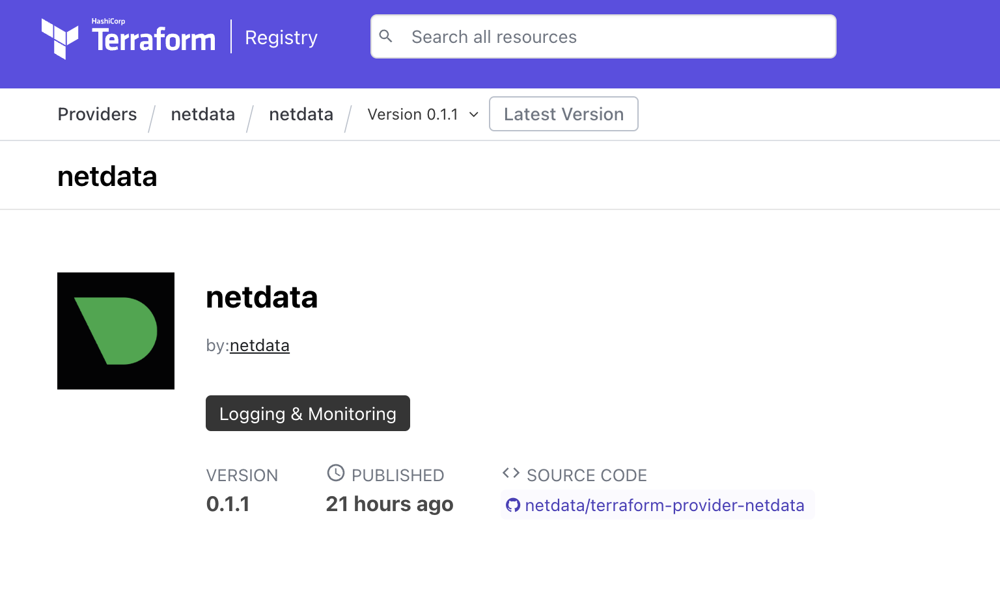

We proudly announce the release of the [Netdata Cloud Terraform Provider](https://registry.terraform.io/providers/netdata/netdata/latest). 
<!--truncate-->

It's a step forward to make our platform more automated and compliant with the modern Infrastructure as Code approach. Terraform is one of the leaders in the IaC tools with a rich ecosystem of providers and modules, now you can put a puzzle with Netdata Cloud to your stack. 

The initial iteration of the Netdata Cloud Terraform Provider supports the following resources:

* spaces
* rooms
* account memberships
* notifications, currently: Discord, Slack, Pagerduty

To get started issue the [API Token](https://learn.netdata.cloud/docs/netdata-cloud/api-tokens) with `scope:all` and present it to the provider as a configuration option or environment variable, more info about it [here](https://registry.terraform.io/providers/netdata/netdata/latest/docs).
The complete example which covers all the presented resources is available [here](https://github.com/netdata/terraform-provider-netdata/blob/master/examples/complete/main.tf).

Feel free to use it.
